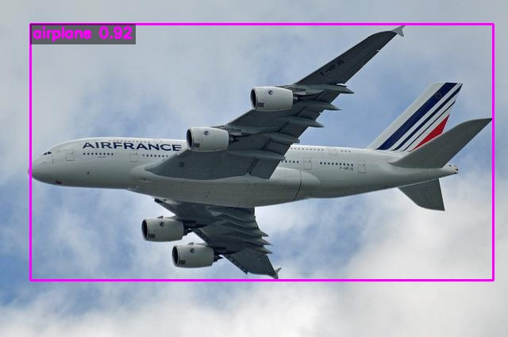
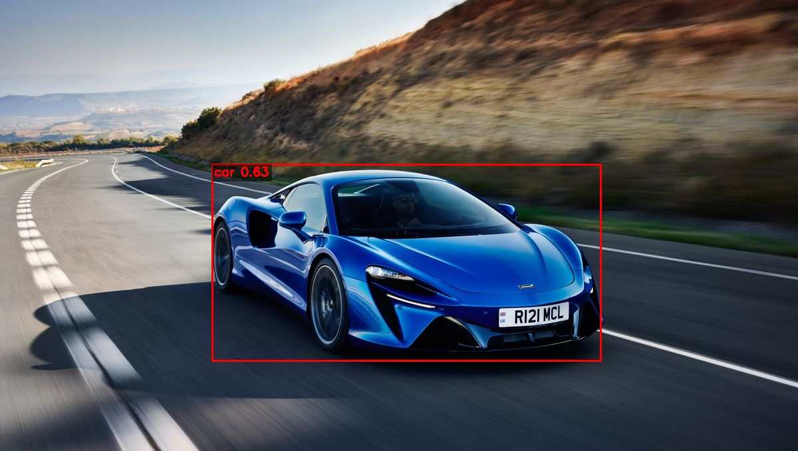
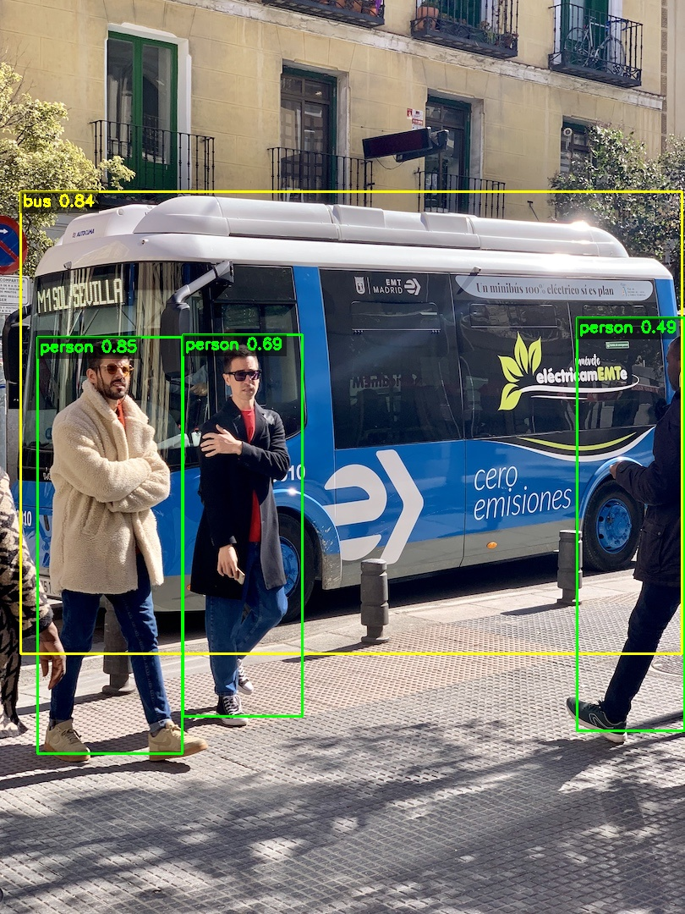
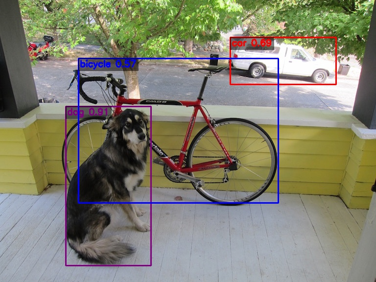

# OriginDL: 完全从零开始构建的深度学习框架

OriginDL 是一个**完全从零开始构建**的深度学习框架，采用 C++ 实现。OriginDL 不仅实现了高层的自动微分系统，更从最底层的矩阵运算开始，使用 CUDA 手写了 GPU 加速的矩阵计算核心，并在此基础上构建了完整的自动求导引擎和神经网络模块。

OriginDL 提供了类似 PyTorch 的 API 接口，并配有[详细的设计文档和用户指南](#-文档)，帮助开发者深入理解深度学习框架的底层实现原理。

OriginDL 是本人在业余时间实现的深度学习框架。本人并非深度学习框架领域的专业人士，但对深度学习训练和推理的底层原理抱有浓厚兴趣，希望通过亲手实现一个完整的框架来深入理解其设计与实现细节。通过手写底层矩阵计算核心，本人也希望借此机会深入学习 CUDA 高性能编程，拓宽技术视野。

由于个人能力和时间有限，OriginDL 中难免存在一些不足之处和待完善的功能。非常欢迎大家一起学习交流，如果您在使用过程中发现问题或有改进建议，欢迎提交 Issue 或 Pull Request！

## 🎯 项目成果展示

### 线性回归训练

使用自动求导功能实现简单的线性回归 y = wx + b，快速收敛到目标参数（w≈2.0, b≈5.0）：

```
jinbo@JinboBook:~/gitme/C_OriginDL$ export ORIGIN_LOG_LEVEL=trace
jinbo@JinboBook:~/gitme/C_OriginDL$ ./build/bin/example/example_nn_linear -d 0
CUDA devices available: 1
Device 0: NVIDIA GeForce RTX 4060 Ti
  Compute capability: 8.9
  Memory: 8187 MB
  Multiprocessors: 34
  Max threads per block: 1024
Using GPU device: 0
JinboBook 2026-02-08 23:20:00.114 D 24466 24466 [optimizer.cpp:collect_parameters:16]    Optimizer::collect_parameters: collected 2 parameters
JinboBook 2026-02-08 23:20:00.117 I 24466 24466 [nn_linear.cpp:main:131] iter0: loss = 28.374, w = 0.7082845, b = 1.003354
JinboBook 2026-02-08 23:20:00.123 I 24466 24466 [nn_linear.cpp:main:131] iter10: loss = 0.31666496, w = 1.905682, b = 4.5844355
JinboBook 2026-02-08 23:20:00.128 I 24466 24466 [nn_linear.cpp:main:131] iter20: loss = 0.012503343, w = 1.9954802, b = 4.968631
JinboBook 2026-02-08 23:20:00.136 I 24466 24466 [nn_linear.cpp:main:131] iter30: loss = 0.009107459, w = 2.0021834, b = 5.0098596
JinboBook 2026-02-08 23:20:00.141 I 24466 24466 [nn_linear.cpp:main:131] iter40: loss = 0.009068941, w = 2.0026805, b = 5.014285
JinboBook 2026-02-08 23:20:00.146 I 24466 24466 [nn_linear.cpp:main:131] iter50: loss = 0.0090685, w = 2.002717, b = 5.0147595
JinboBook 2026-02-08 23:20:00.153 I 24466 24466 [nn_linear.cpp:main:131] iter60: loss = 0.009068494, w = 2.0027194, b = 5.01481
JinboBook 2026-02-08 23:20:00.161 I 24466 24466 [nn_linear.cpp:main:131] iter70: loss = 0.009068492, w = 2.0027194, b = 5.014816
JinboBook 2026-02-08 23:20:00.167 I 24466 24466 [nn_linear.cpp:main:131] iter80: loss = 0.009068492, w = 2.0027194, b = 5.014816
JinboBook 2026-02-08 23:20:00.172 I 24466 24466 [nn_linear.cpp:main:131] iter90: loss = 0.009068492, w = 2.0027194, b = 5.014816
JinboBook 2026-02-08 23:20:00.177 I 24466 24466 [nn_linear.cpp:main:131] iter100: loss = 0.009068492, w = 2.0027194, b = 5.014816
JinboBook 2026-02-08 23:20:00.182 I 24466 24466 [nn_linear.cpp:main:131] iter110: loss = 0.009068492, w = 2.0027194, b = 5.014816
JinboBook 2026-02-08 23:20:00.188 I 24466 24466 [nn_linear.cpp:main:131] iter120: loss = 0.009068492, w = 2.0027194, b = 5.014816
JinboBook 2026-02-08 23:20:00.193 I 24466 24466 [nn_linear.cpp:main:131] iter130: loss = 0.009068492, w = 2.0027194, b = 5.014816
JinboBook 2026-02-08 23:20:00.199 I 24466 24466 [nn_linear.cpp:main:131] iter140: loss = 0.009068492, w = 2.0027194, b = 5.014816
JinboBook 2026-02-08 23:20:00.205 I 24466 24466 [nn_linear.cpp:main:131] iter150: loss = 0.009068492, w = 2.0027194, b = 5.014816
JinboBook 2026-02-08 23:20:00.211 I 24466 24466 [nn_linear.cpp:main:131] iter160: loss = 0.009068492, w = 2.0027194, b = 5.014816
JinboBook 2026-02-08 23:20:00.217 I 24466 24466 [nn_linear.cpp:main:131] iter170: loss = 0.009068492, w = 2.0027194, b = 5.014816
JinboBook 2026-02-08 23:20:00.222 I 24466 24466 [nn_linear.cpp:main:131] iter180: loss = 0.009068492, w = 2.0027194, b = 5.014816
JinboBook 2026-02-08 23:20:00.229 I 24466 24466 [nn_linear.cpp:main:131] iter190: loss = 0.009068492, w = 2.0027194, b = 5.014816
JinboBook 2026-02-08 23:20:00.234 I 24466 24466 [nn_linear.cpp:main:131] iter199: loss = 0.009068492, w = 2.0027194, b = 5.014816
```

### YOLOv5 目标检测

```shell
$ ./build/bin/example/example_yolov5 -i data/imgs/ -o data/outputs/ -p model/pnnx/yolo/yolov5n_small.pnnx.param -b model/pnnx/yolo/yolov5n_small.pnnx.bin 
air.jpg: airplane 0.92
bus.jpg: person 0.85
bus.jpg: bus 0.84
bus.jpg: person 0.69
bus.jpg: person 0.49
car.jpg: car 0.63
dog.jpg: car 0.75
dog.jpg: dog 0.64
Processed 4 images in total, Input resolution: 320x320, Batch size: 4
Total inference time: 0.1189 seconds, Average FPS: 33.65
```


<table>
<tr>
<td width="50%"></td>
<td width="50%"></td>
</tr>
<tr>
<td width="50%"></td>
<td width="50%"></td>
</tr>
</table>
### MNIST 手写数字识别

## ✨ 特性

- 🚀 **自动求导** - 支持动态计算图和反向传播，自动构建计算图
- 📦 **简洁 API** - 类似 PyTorch 的直观接口，降低学习成本
- 🎯 **教育友好** - 从零构建，代码清晰，便于理解深度学习框架原理
- 🧪 **完整测试** - 包含单元测试和与 PyTorch 的对比验证
- 🧠 **神经网络模块** - 支持 Module、Layer、Sequential 等模块化设计
- ⚡ **高性能推理** - 集成 PNNX 静态图推理，YOLOv5 推理性能优化至 59 毫秒
- 🔧 **多后端支持** - 支持 LibTorch 和 OriginMat（CPU/CUDA）后端，可灵活切换
  - OriginMat CUDA：重点优化的自研 GPU 后端，支持 CUDA 加速，用于锻炼 CUDA 编程能力
  - OriginMat CPU：原生实现，用于快速验证和开发
  - LibTorch：作为多后端架构的验证，目前仅支持基础算子

## 📁 项目结构

```
OriginDL/
├── include/origin/          # 头文件
│   ├── core/               # 核心模块（Tensor、Operator、Parameter）
│   ├── nn/                 # 神经网络模块
│   ├── optim/              # 优化器
│   ├── data/               # 数据处理
│   ├── io/                 # 模型 IO
│   ├── mat/                # 矩阵计算抽象层
│   ├── operators/          # 算子实现
│   └── pnnx/               # PNNX 静态图推理
├── src/                    # 源文件
├── tests/                  # 测试和示例
│   ├── unit_test/         # 单元测试
│   ├── benchmark/         # 性能测试
│   └── example/            # 应用示例
│       ├── linear_regression/  # 线性回归训练
│       ├── mnist/             # MNIST 数据集训练（MLP 和 CNN）
│       ├── resnet/            # ResNet 分类推理
│       └── yolo/              # YOLOv5 目标检测推理
├── docs/                   # 文档
│   ├── design/            # 设计文档
│   └── user_guide/        # 用户指南
└── CMakeLists.txt         # 构建配置
```

## 📚 文档

详细的文档请参考 [docs/](docs/) 目录：

- **[设计文档](docs/design/)** - 系统架构设计、实现原理
  - [架构设计文档](docs/design/architecture.md) - 完整的系统架构设计
    - [1. 架构总览与设计理念](docs/design/architecture.md#1-架构总览与设计理念)
    - [2. Tensor 系统架构](docs/design/architecture.md#2-tensor-系统架构)
    - [3. 动态计算图构建](docs/design/architecture.md#3-动态计算图构建)
    - [4. 反向传播实现](docs/design/architecture.md#4-反向传播实现)
    - [5. 算子系统架构](docs/design/architecture.md#5-算子系统架构)
    - [6. 神经网络模块架构](docs/design/architecture.md#6-神经网络模块架构)
    - [7. 优化器架构](docs/design/architecture.md#7-优化器架构)
    - [8. 数据处理架构](docs/design/architecture.md#8-数据处理架构)
    - [9. IO 模块架构](docs/design/architecture.md#9-io-模块架构)
    - [10. PNNX 推理架构](docs/design/architecture.md#10-pnnx-推理架构)
    - [11. 应用示例](docs/design/architecture.md#11-应用示例)
  - [算子设计理论](docs/design/operators_theory.md) - 算子数学原理详解
    - **数学运算算子**：Add, Sub, Mul, Div, MatMul, Pow, Exp, Log, Neg, Square, Sum, BroadcastTo, SumTo
    - **激活函数算子**：ReLU, Sigmoid, Softmax, SiLU
    - **卷积运算算子**：Conv2d
    - **池化运算算子**：MaxPool2d, AvgPool2d, AdaptiveAvgPool2d
    - **形状变换算子**：Cat, Split, Reshape, Transpose, Flatten
    - **神经网络层算子**：Dropout, Upsample, Identity
    - **归一化算子**：BatchNorm
    - **损失函数算子**：SoftmaxCrossEntropy
- **[用户指南](docs/user_guide/)** - API 文档和使用指南
  - [API 文档](docs/user_guide/api.md) - 完整的 API 参考
  - [与 PyTorch 对比](docs/user_guide/compare.md) - API 对比和迁移指南

## 🚀 快速开始

### 📦 下载数据和模型（可选）

运行某些示例程序（如 MNIST、YOLOv5、ResNet）需要下载数据集和模型文件：

```bash
# 使用自动下载脚本（推荐）
bash scripts/download_data.sh

# 或手动下载：访问 GitHub Releases 页面下载压缩包并解压
```

详细说明请参考：

- [数据下载说明](data/README.md)
- [模型下载说明](model/README.md)

### 编译项目

#### 基本编译命令

**使用 OriginMat 后端（默认，推荐）**

```bash
# 基本编译（自动检测 CUDA，如果系统有 CUDA 会自动启用）
bash ./build.sh

# 或显式指定后端和 CUDA 支持
bash ./build.sh origin --cuda

# 仅使用 CPU（禁用 CUDA）
bash ./build.sh origin
```

**使用 LibTorch 后端（可选）**

> **注意**：本项目支持 LibTorch 作为矩阵计算后端，主要用于展示 OriginDL 的多后端架构设计能力。但 LibTorch 后端的适配工作尚未完全完成，建议优先使用 OriginMat 后端。

如果希望使用 LibTorch 做矩阵计算后端（本项目本身不依赖 libtorch），需要先下载 LibTorch：

```bash
# 下载 LibTorch（CPU 版本）
cd 3rd
wget https://download.pytorch.org/libtorch/cpu/libtorch-cxx11-abi-shared-with-deps-2.1.0%2Bcpu.zip
unzip libtorch-cxx11-abi-shared-with-deps-2.1.0+cpu.zip
cd ..

# 使用 LibTorch 后端编译
bash ./build.sh torch
```

#### 其他编译选项

`build.sh` 脚本还支持以下可选参数：

- `--nvcc /path/to/nvcc`：指定 CUDA 编译器路径
- `--libtorch_path /path/to/libtorch`：指定 LibTorch 路径
- `--build_dir /path/to/build`：指定构建目录（默认：`build` 或 `torch_build`）

对于某些 example(如example_yolov5, example_resnet)，需要 opencv 的支持，没有 opencv 将不会编译

```shell
sudo apt install libopencv-dev -y
```

编译完成后，会在以下位置生成文件：

- `build/libs/origindl.so` - 主库文件
- `build/bin/` - 测试程序和示例程序

### 系统要求

以下为本人的编译环境，更低版本的 CMake 与 C++ 标准亦可支持。

- **编译器**：支持 C++20（GCC 9+、Clang 10+）
- **CMake**：3.25
- **CUDA**（可选）：使用 `--cuda` 编译时需安装 CUDA 工具链
- **OpenCV**（可选）：YOLOv5、ResNet 等图像示例需 `libopencv-dev`

## 📖 基本使用

### 创建张量

| 功能           | PyTorch 示例代码                         | OriginDL 示例代码                           | 备注                             |
| -------------- | ---------------------------------------- | ------------------------------------------- | -------------------------------- |
| 从数据创建张量 | `torch.tensor([[1.0, 2.0], [3.0, 4.0]])` | `Tensor({1.0, 2.0, 3.0, 4.0}, Shape{2, 2})` | OriginDL 使用 Shape 对象指定形状 |
| 创建全零张量   | `torch.zeros(3, 3)`                      | `Tensor::zeros(Shape{3, 3})`                | 语法高度相似                     |
| 创建全一张量   | `torch.ones(2, 2)`                       | `Tensor::ones(Shape{2, 2})`                 | 语法高度相似                     |
| 创建随机张量   | `torch.randn(2, 2)`                      | `Tensor::randn(Shape{2, 2})`                | 语法高度相似                     |
| 创建标量张量   | `torch.tensor(5.0)`                      | `Tensor(5.0, Shape{1})`                     | OriginDL 需要显式指定形状        |

### 基本运算

| 功能       | PyTorch 示例代码              | OriginDL 示例代码      | 备注                     |
| ---------- | ----------------------------- | ---------------------- | ------------------------ |
| 张量加法   | `a + b`                       | `a + b`                | 语法完全一致             |
| 张量减法   | `a - b`                       | `a - b`                | 语法完全一致             |
| 元素级乘法 | `a * b`                       | `a * b`                | 语法完全一致             |
| 张量除法   | `a / b`                       | `a / b`                | 语法完全一致             |
| 指数函数   | `torch.exp(a)`                | `exp(a)`               | OriginDL 使用函数形式    |
| 平方运算   | `torch.square(a)`             | `square(a)`            | OriginDL 使用函数形式    |
| 幂运算     | `a ** 2` 或 `torch.pow(a, 2)` | `a ^ 2` 或 `pow(a, 2)` | OriginDL 使用 `^` 运算符 |

### 自动求导

| 功能     | PyTorch 示例代码           | OriginDL 示例代码          | 备注                  |
| -------- | -------------------------- | -------------------------- | --------------------- |
| 前向传播 | `z = x * y + torch.exp(x)` | `auto z = x * y + exp(x);` | 语法高度相似          |
| 反向传播 | `z.backward()`             | `z.backward()`             | 语法完全一致          |
| 获取梯度 | `x.grad`                   | `x.grad()`                 | OriginDL 使用函数调用 |
| 打印梯度 | `print(x.grad)`            | `x.grad().print("dx: ")`   | OriginDL 使用成员函数 |

## 📝 示例代码

### 线性回归示例

```cpp
#include "originDL.h"
using namespace origin;

int main() {
    // 创建训练数据
    auto x = Tensor::randn(Shape{100, 1});
    auto y = 2.0 * x + 1.0 + Tensor::randn(Shape{100, 1}) * 0.1;
    
    // 模型参数
    auto w = Tensor::randn(Shape{1, 1});
    auto b = Tensor::zeros(Shape{1, 1});
    
    // 训练循环
    for (int epoch = 0; epoch < 100; ++epoch) {
        // 前向传播
        auto pred = x * w + b;
        auto loss = sum(square(pred - y));
        
        // 反向传播
        loss.backward();
        
        // 更新参数
        w = w - 0.01 * w.grad();
        b = b - 0.01 * b.grad();
        
        // 清除梯度
        w.clear_grad();
        b.clear_grad();
        
        if (epoch % 10 == 0) {
            std::cout << "Epoch " << epoch << ", Loss: " << loss.item() << std::endl;
        }
    }
    
    return 0;
}
```

## 🧪 运行测试

### 单元测试

项目包含完整的单元测试，可以验证功能正确性：

```bash
# 运行所有单元测试
bash run_unit_test.sh

# 运行 CUDA 单元测试（如果支持）
bash run_unit_test.sh --cuda
```

### 性能测试

运行性能对比测试，对比 OriginDL 与 PyTorch 的性能：

```bash
# 运行所有 benchmark 测试
python3 run_benchmark.py

# 运行特定算子的 benchmark
python3 run_benchmark.py -f add
python3 run_benchmark.py -f conv2d

# 运行多个算子的 benchmark（逗号分隔）
python3 run_benchmark.py -f add,sub,mul,div
python3 run_benchmark.py -f relu,sigmoid,softmax

# 指定设备运行（CPU 或 CUDA）
python3 run_benchmark.py -f add -d cpu
python3 run_benchmark.py -f add -d cuda:0

# 指定特定的 shape 进行测试
python3 run_benchmark.py -f add -d cuda:0 -s 1000,1000

# 自定义预热和重复次数
python3 run_benchmark.py -f add -w 5 -r 50

# 测试就地操作（inplace operations）
python3 run_benchmark.py -f add --inplace

# 导出性能数据到 Excel 文件
python3 run_benchmark.py -f add -d cuda:0 -o ./benchmark_results
python3 run_benchmark.py -f add,sub,mul,div -d cuda:0 -o ./benchmark_results
python3 run_benchmark.py -d cuda:0 -o ./benchmark_results  # 测试所有算子并导出

# 组合使用多个参数
python3 run_benchmark.py -f conv2d,relu -d cuda:0 -w 2 -r 10 -o ./results
```

**Excel 输出说明：**

- `-o` 参数指定输出目录，文件会自动生成
- 单算子测试：生成 `benchmark_{operator}_{timestamp}.xlsx`
- 多算子测试：生成 `benchmark_{operator1}_{operator2}_{timestamp}.xlsx`，包含每个算子的独立 Sheet 和统一的汇总 Sheet
- 全部测试：生成 `benchmark_all_{timestamp}.xlsx`
- Excel 文件包含颜色标记：红色（Speedup ≤ 0.6）、黄色（0.6 < Speedup ≤ 0.8）、绿色（0.8 < Speedup ≤ 0.9）

### 示例程序

编译成功后，可以在 `build/bin/` 目录下找到各种示例程序：

更多示例请参考 `tests/example/` 目录：

- `linear_regression/` - 线性回归训练
- `mnist/` - MNIST 数据集训练（MLP 和 CNN）
- `resnet/` - ResNet 分类推理
- `yolo/` - YOLOv5 目标检测推理

## ❓ 常见问题

### Q: 如何添加新的算子？

A: 参考现有算子的实现，继承 `Operator` 类并实现 `forward` 和 `backward` 方法。详细说明请参考 [算子设计理论](docs/design/operators_theory.md)。

### Q: 如何从 PyTorch 迁移代码？

A: OriginDL 提供了与 PyTorch 高度相似的 API，大部分代码可以直接迁移。详细对比请参考 [与 PyTorch 对比](docs/user_guide/compare.md) 文档。

### Q: 如何选择计算后端？

A: 默认使用 OriginMat 后端（自研实现），如需使用 LibTorch 后端，编译时使用 `bash build.sh torch`。两种后端 API 完全兼容。

### Q: 是否支持 GPU 加速？

A: 是的，OriginMat 后端支持 CUDA 加速。编译时启用 CUDA 支持：`bash build.sh --cuda`。

### Q: 如何贡献代码？

A: 欢迎提交 Issue 和 Pull Request。请参考 [代码规范](CODE_STYLE.md) 确保代码风格一致。

## 📈 项目状态

查看 [MILESTONES.md](MILESTONES.md) 了解项目开发里程碑和计划。

## 📄 许可证

本项目采用 BSD 3-Clause 许可证，详见 [LICENSE](LICENSE) 文件。
