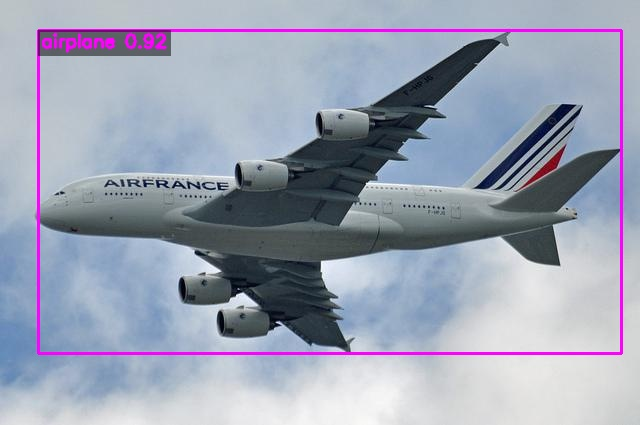
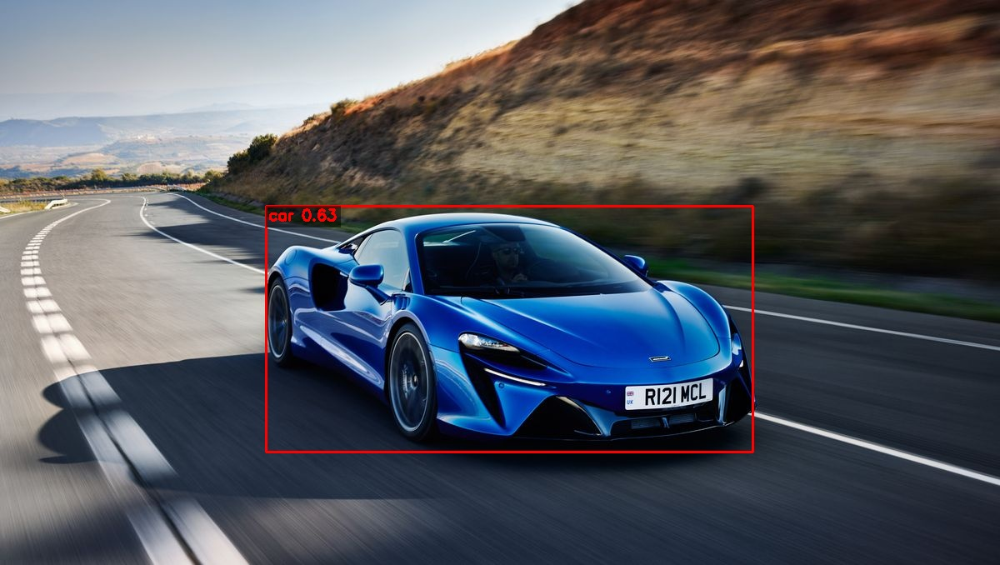
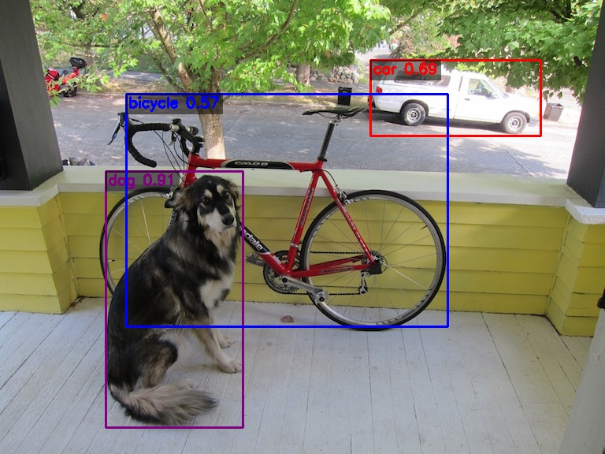

 <p align="center" style="line-height:0; font-size:0">
   
 </p>


# OriginDL: 完全从零开始构建的深度学习框架

OriginDL 是一个**完全从零开始构建**的深度学习框架，采用 C++ 实现。OriginDL 不仅实现了高层的自动微分系统，更从最底层的矩阵运算开始，使用 CUDA 手写了 GPU 加速的矩阵计算核心，并在此基础上构建了完整的自动求导引擎和神经网络模块。目前已在框架上实现了线性回归与 MNIST 手写数字识别的训练示例，以及基于 PNNX 的 YOLOv5 目标检测推理，用于验证自动求导与推理链路。

OriginDL 提供了类似 PyTorch 的 API 接口，并配有[详细的设计文档和用户指南](#-文档)，帮助对框架底层实现感兴趣的朋友深入理解深度学习框架的底层实现原理。

OriginDL 是本人在业余时间实现的深度学习框架。本人并非深度学习框架领域的专业人士，但对深度学习训练和推理的底层原理抱有浓厚兴趣，希望通过亲手实现一个完整的框架来深入理解其设计与实现细节。通过手写底层矩阵计算核心，本人也希望借此机会深入学习 CUDA 高性能编程，拓宽技术视野。

由于个人能力和时间有限，OriginDL 中难免存在一些不足之处和待完善的功能。非常欢迎大家一起学习交流，如果您在使用过程中发现问题或有改进建议，欢迎提交 Issue 或 Pull Request！

## 🎯 项目成果展示

### 线性回归训练

使用自动求导功能实现简单的线性回归 y = wx + b，快速收敛到目标参数（w≈2.0, b≈5.0）：

```shell
$ ./build/bin/example/example_nn_linear 
CUDA devices available: 1
Device 0: NVIDIA GeForce RTX 4060 Ti
  Compute capability: 8.9
  Memory: 8187 MB
  Multiprocessors: 34
  Max threads per block: 1024
Use Device: cuda:0
iter0: loss = 28.650475, w = 0.14491756, b = 0.9844595
iter10: loss = 0.41739, w = 1.698714, b = 4.542575
iter20: loss = 0.014293473, w = 1.9443718, b = 4.9402785
iter30: loss = 0.008061945, w = 1.9816686, b = 4.985405
iter40: loss = 0.007958472, w = 1.9871883, b = 4.990613
......
iter180: loss = 0.007956621, w = 1.9881259, b = 4.9913087
iter190: loss = 0.007956621, w = 1.9881259, b = 4.9913087
iter199: loss = 0.007956621, w = 1.9881259, b = 4.9913087
```

### YOLOv5 目标检测

```shell
# 使用的设备为 Device 0: NVIDIA GeForce RTX 4060 Ti
$ ./build/bin/example/example_yolov5 -i data/imgs/ -o data/outputs/ -p model/pnnx/yolo/yolov5n_small.pnnx.param -b model/pnnx/yolo/yolov5n_small.pnnx.bin 
air.jpg: airplane 0.92
bus.jpg: person 0.85
bus.jpg: bus 0.84
bus.jpg: person 0.69
bus.jpg: person 0.49
car.jpg: car 0.63
dog.jpg: car 0.75
dog.jpg: dog 0.64
Processed 4 images in total, Input resolution: 320x320, Batch size: 4
Total inference time: 0.1189 seconds, Average FPS: 33.65
```

<table>
<tr>
<td width="50%"></td>
<td width="50%"></td>
</tr>
<tr>
<td width="50%"></td>
<td width="50%"></td>
</tr>
</table>

### MNIST 手写数字识别

```shell
$ export ORIGIN_LOG_LEVEL=trace
$ ./build/bin/example/example_mlp_mnist -e 5 -b 512 -l 0.001 -p ./data/mnist -d 0
JinboBook 2026-02-12 00:18:16.991 I 198450 198450 [mlp_mnist.cpp:main:206] Device: cuda:0
CUDA devices available: 1
Device 0: NVIDIA GeForce RTX 4060 Ti
  Compute capability: 8.9
  Memory: 8187 MB
  Multiprocessors: 34
  Max threads per block: 1024
JinboBook 2026-02-12 00:18:16.991 I 198450 198450 [mlp_mnist.cpp:main:214] === MNIST Handwritten Digit Recognition Demo (MLP) ===
JinboBook 2026-02-12 00:18:16.991 I 198450 198450 [mlp_mnist.cpp:print:36] === Training Configuration ===
JinboBook 2026-02-12 00:18:16.991 I 198450 198450 [mlp_mnist.cpp:print:37] Max epochs: 10
JinboBook 2026-02-12 00:18:16.991 I 198450 198450 [mlp_mnist.cpp:print:38] Batch size: 512
JinboBook 2026-02-12 00:18:16.991 I 198450 198450 [mlp_mnist.cpp:print:39] Hidden size: 1000
JinboBook 2026-02-12 00:18:16.991 I 198450 198450 [mlp_mnist.cpp:print:40] Learning rate: 0.001
JinboBook 2026-02-12 00:18:16.991 I 198450 198450 [mlp_mnist.cpp:print:41] Weight decay: 0.0001
JinboBook 2026-02-12 00:18:16.991 I 198450 198450 [mlp_mnist.cpp:print:42] Log interval: 50
JinboBook 2026-02-12 00:18:16.991 I 198450 198450 [mlp_mnist.cpp:print:43] Model path: model/mnist_mlp_model.odl
JinboBook 2026-02-12 00:18:16.991 I 198450 198450 [mlp_mnist.cpp:print:44] Checkpoint dir: model/checkpoints
JinboBook 2026-02-12 00:18:16.991 I 198450 198450 [mlp_mnist.cpp:print:45] Checkpoint interval: 5 epochs
JinboBook 2026-02-12 00:18:16.991 I 198450 198450 [mlp_mnist.cpp:print:46] Random seed: 42
JinboBook 2026-02-12 00:18:16.991 I 198450 198450 [mlp_mnist.cpp:print:47] Data dir: ./data/mnist
JinboBook 2026-02-12 00:18:16.991 I 198450 198450 [mlp_mnist.cpp:print:48] Device id: 0 (-2=auto -1=CPU >=0=GPU)
JinboBook 2026-02-12 00:18:16.991 I 198450 198450 [mlp_mnist.cpp:print:49] ==============================
JinboBook 2026-02-12 00:18:16.991 I 198450 198450 [mlp_mnist.cpp:main:217] Loading MNIST dataset...
JinboBook 2026-02-12 00:18:18.259 I 198450 198450 [mlp_mnist.cpp:main:221] Train dataset size: 60000
JinboBook 2026-02-12 00:18:18.259 I 198450 198450 [mlp_mnist.cpp:main:222] Test dataset size: 10000
JinboBook 2026-02-12 00:18:18.259 I 198450 198450 [mlp_mnist.cpp:main:227] Creating MLP model...
JinboBook 2026-02-12 00:18:18.310 I 198450 198450 [mlp_mnist.cpp:main:230] Model created with 6 parameters
JinboBook 2026-02-12 00:18:18.311 D 198450 198450 [optimizer.cpp:collect_parameters:16]    Optimizer::collect_parameters: collected 6 parameters
JinboBook 2026-02-12 00:18:18.311 I 198450 198450 [mlp_mnist.cpp:main:236] Starting training...
JinboBook 2026-02-12 00:18:18.311 I 198450 198450 [mlp_mnist.cpp:main:239] ========== Epoch 1/10 ==========
JinboBook 2026-02-12 00:18:18.787 I 198450 198450 [mlp_mnist.cpp:main:311] Epoch 1/10 Batch 50 Loss: 0.4744 Acc: 86.87%
JinboBook 2026-02-12 00:18:19.162 I 198450 198450 [mlp_mnist.cpp:main:311] Epoch 1/10 Batch 100 Loss: 0.3254 Acc: 90.85%
JinboBook 2026-02-12 00:18:19.302 I 198450 198450 [mlp_mnist.cpp:main:320] Epoch 1/10 Training Complete - Loss: 0.2974 Acc: 91.58%
JinboBook 2026-02-12 00:18:19.302 I 198450 198450 [mlp_mnist.cpp:main:324] Evaluating on test set...
JinboBook 2026-02-12 00:18:19.357 I 198450 198450 [mlp_mnist.cpp:main:386] ========== Epoch 1/10 Summary ==========
JinboBook 2026-02-12 00:18:19.357 I 198450 198450 [mlp_mnist.cpp:main:387]   Train Loss: 0.2974, Train Acc: 91.58%
JinboBook 2026-02-12 00:18:19.357 I 198450 198450 [mlp_mnist.cpp:main:388]   Test Loss:  0.1224, Test Acc:  96.49%
JinboBook 2026-02-12 00:18:19.357 I 198450 198450 [mlp_mnist.cpp:main:389] ===========================================
JinboBook 2026-02-12 00:18:19.357 I 198450 198450 [mlp_mnist.cpp:main:239] ========== Epoch 2/10 ==========
JinboBook 2026-02-12 00:18:19.719 I 198450 198450 [mlp_mnist.cpp:main:311] Epoch 2/10 Batch 50 Loss: 0.0999 Acc: 97.01%
JinboBook 2026-02-12 00:18:20.082 I 198450 198450 [mlp_mnist.cpp:main:311] Epoch 2/10 Batch 100 Loss: 0.0981 Acc: 97.05%
JinboBook 2026-02-12 00:18:20.224 I 198450 198450 [mlp_mnist.cpp:main:320] Epoch 2/10 Training Complete - Loss: 0.0974 Acc: 97.05%
JinboBook 2026-02-12 00:18:20.224 I 198450 198450 [mlp_mnist.cpp:main:324] Evaluating on test set...
JinboBook 2026-02-12 00:18:20.276 I 198450 198450 [mlp_mnist.cpp:main:386] ========== Epoch 2/10 Summary ==========
JinboBook 2026-02-12 00:18:20.277 I 198450 198450 [mlp_mnist.cpp:main:387]   Train Loss: 0.0974, Train Acc: 97.05%
JinboBook 2026-02-12 00:18:20.277 I 198450 198450 [mlp_mnist.cpp:main:388]   Test Loss:  0.0849, Test Acc:  97.29%
JinboBook 2026-02-12 00:18:20.277 I 198450 198450 [mlp_mnist.cpp:main:389] ===========================================
# 省略中间训练的过程
JinboBook 2026-02-12 00:18:26.842 I 198450 198450 [mlp_mnist.cpp:main:239] ========== Epoch 10/10 ==========
JinboBook 2026-02-12 00:18:27.211 I 198450 198450 [mlp_mnist.cpp:main:311] Epoch 10/10 Batch 50 Loss: 0.0129 Acc: 99.64%
JinboBook 2026-02-12 00:18:27.578 I 198450 198450 [mlp_mnist.cpp:main:311] Epoch 10/10 Batch 100 Loss: 0.0122 Acc: 99.68%
JinboBook 2026-02-12 00:18:27.724 I 198450 198450 [mlp_mnist.cpp:main:320] Epoch 10/10 Training Complete - Loss: 0.0129 Acc: 99.65%
JinboBook 2026-02-12 00:18:27.724 I 198450 198450 [mlp_mnist.cpp:main:324] Evaluating on test set...
JinboBook 2026-02-12 00:18:27.781 I 198450 198450 [mlp_mnist.cpp:main:386] ========== Epoch 10/10 Summary ==========
JinboBook 2026-02-12 00:18:27.781 I 198450 198450 [mlp_mnist.cpp:main:387]   Train Loss: 0.0129, Train Acc: 99.65%
JinboBook 2026-02-12 00:18:27.781 I 198450 198450 [mlp_mnist.cpp:main:388]   Test Loss:  0.0595, Test Acc:  98.29%
JinboBook 2026-02-12 00:18:27.781 I 198450 198450 [mlp_mnist.cpp:main:389] ===========================================
JinboBook 2026-02-12 00:18:27.828 I 198450 198450 [mlp_mnist.cpp:main:412] Checkpoint saved to model/checkpoints/checkpoint_epoch_10.ckpt
JinboBook 2026-02-12 00:18:27.828 I 198450 198450 [mlp_mnist.cpp:main:421] Training completed!
JinboBook 2026-02-12 00:18:27.828 I 198450 198450 [mlp_mnist.cpp:main:423] Saving model to model/mnist_mlp_model.odl...
JinboBook 2026-02-12 00:18:27.863 I 198450 198450 [mlp_mnist.cpp:main:429] Model saved successfully to model/mnist_mlp_model.odl
```

# OriginDL 项目介绍

## ✨ 特性

- 🚀 **自动求导** - 支持动态计算图和反向传播，自动构建计算图
- 📦 **简洁 API** - 类似 PyTorch 的直观接口，降低学习成本
- 🎯 **教育友好** - 从零构建，代码清晰，便于理解深度学习框架原理
- 🧪 **完整测试** - 包含单元测试和与 PyTorch 的对比验证
- 🧠 **神经网络模块** - 支持 Module、Layer、Sequential 等模块化设计
- ⚡ **高性能推理** - 集成 PNNX 静态图推理，YOLOv5 推理性能优化至 59 毫秒
- 🔧 **多后端支持** - 支持 LibTorch 和 OriginMat（CPU/CUDA）后端，可灵活切换
  - OriginMat CUDA：重点优化的自研 GPU 后端，支持 CUDA 加速，用于锻炼 CUDA 编程能力
  - OriginMat CPU：原生实现，用于快速验证和开发
  - LibTorch：作为多后端架构的验证，目前仅支持基础算子

## 📁 项目结构

```
OriginDL/
├── include/origin/          # 头文件
│   ├── core/               # 核心模块（Tensor、Operator、Parameter）
│   ├── nn/                 # 神经网络模块
│   ├── optim/              # 优化器
│   ├── data/               # 数据处理
│   ├── io/                 # 模型 IO
│   ├── mat/                # 矩阵计算抽象层
│   ├── operators/          # 算子实现
│   └── pnnx/               # PNNX 静态图推理
├── src/                    # 源文件，结构与头文件相同，不再赘述
├── tests/                  # 测试和示例
│   ├── unit_test/         # 单元测试
│   ├── benchmark/         # 性能测试
│   └── example/            # 应用示例
│       ├── linear_regression/  # 线性回归训练
│       ├── mnist/             # MNIST 数据集训练（MLP 和 CNN）
│       ├── resnet/            # ResNet 分类推理
│       └── yolo/              # YOLOv5 目标检测推理
├── docs/                   # 文档
│   ├── design/            # 设计文档
│   └── user_guide/        # 用户指南
└── CMakeLists.txt         # 构建配置
```

## 📚 文档

详细的文档请参考 [docs/](docs/) 目录：

- **[设计文档](docs/design/)** - 系统架构设计、实现原理
  - [架构设计文档](docs/design/architecture.md) - 完整的系统架构设计
    - [1. 架构总览与设计理念](docs/design/architecture.md#1-架构总览与设计理念)
    - [2. Tensor 系统架构](docs/design/architecture.md#2-tensor-系统架构)
    - [3. 动态计算图构建](docs/design/architecture.md#3-动态计算图构建)
    - [4. 反向传播实现](docs/design/architecture.md#4-反向传播实现)
    - [5. 算子系统架构](docs/design/architecture.md#5-算子系统架构)
    - [6. 神经网络模块架构](docs/design/architecture.md#6-神经网络模块架构)
    - [7. 优化器架构](docs/design/architecture.md#7-优化器架构)
    - [8. 数据处理架构](docs/design/architecture.md#8-数据处理架构)
    - [9. IO 模块架构](docs/design/architecture.md#9-io-模块架构)
    - [10. PNNX 推理架构](docs/design/architecture.md#10-pnnx-推理架构)
    - [11. 应用示例](docs/design/architecture.md#11-应用示例)
  - [算子设计理论](docs/design/operators_theory.md) - 算子数学原理详解
    - **数学运算算子**：Add, Sub, Mul, Div, MatMul, Pow, Exp, Log, Neg, Square, Sum, BroadcastTo, SumTo
    - **激活函数算子**：ReLU, Sigmoid, Softmax, SiLU
    - **卷积运算算子**：Conv2d
    - **池化运算算子**：MaxPool2d, AvgPool2d, AdaptiveAvgPool2d
    - **形状变换算子**：Cat, Split, Reshape, Transpose, Flatten
    - **神经网络层算子**：Dropout, Upsample, Identity
    - **归一化算子**：BatchNorm
    - **损失函数算子**：SoftmaxCrossEntropy
- **[用户指南](docs/user_guide/)** - API 文档和使用指南
  - [API 文档](docs/user_guide/api.md) - 完整的 API 参考
  - [与 PyTorch 对比](docs/user_guide/compare.md) - API 对比和迁移指南

## 🚀 快速开始

### 📦 下载数据和模型（可选）

运行某些示例程序（如 MNIST、YOLOv5、ResNet）需要下载数据集和模型文件：

```bash
# 使用脚本下载 MNIST 数据（默认保存到 ./data/mnist）
bash scripts/download_mnist.sh

# 使用脚本下载模型（默认保存到 ./model），或手动从 GitHub Releases 下载压缩包并解压
bash scripts/download_model.sh
```

详细说明请参考：

- [数据下载说明](data/README.md)
- [模型下载说明](model/README.md)

### 编译项目

#### 基本编译命令

**使用 OriginMat 后端（默认，推荐）**

```bash
# 基本编译（自动检测 CUDA，如果系统有 CUDA 会自动启用）
bash ./build.sh

# 或显式指定后端和 CUDA 支持
bash ./build.sh origin --cuda

# 仅使用 CPU（禁用 CUDA）
bash ./build.sh origin
```

**使用 LibTorch 后端（可选）**

> **注意**：本项目支持 LibTorch 作为矩阵计算后端，主要用于展示 OriginDL 的多后端架构设计能力。但 LibTorch 后端的适配工作尚未完全完成，建议优先使用 OriginMat 后端。

如果希望使用 LibTorch 做矩阵计算后端（本项目本身不依赖 libtorch），需要先下载 LibTorch：

```bash
# 下载 LibTorch
cd 3rd
wget https://download.pytorch.org/libtorch/cpu/libtorch-cxx11-abi-shared-with-deps-2.1.0%2Bcpu.zip
unzip libtorch-cxx11-abi-shared-with-deps-2.1.0+cpu.zip
cd ..

# 使用 LibTorch 后端编译
bash ./build.sh torch
```

#### 其他编译选项

`build.sh` 脚本还支持以下可选参数：

- `--nvcc /path/to/nvcc`：指定 CUDA 编译器路径
- `--libtorch_path /path/to/libtorch`：指定 LibTorch 路径
- `--build_dir /path/to/build`：指定构建目录（默认：`build` 或 `torch_build`）

对于某些 example(如example_yolov5, example_resnet)，需要 opencv 的支持，没有 opencv 将不会编译

```shell
sudo apt install libopencv-dev -y
```

编译完成后，会在以下位置生成文件：

- `build/libs/origindl.so` - 主库文件
- `build/bin/` - 测试程序和示例程序

### 系统要求

以下为本人的编译环境，更低版本的 CMake 与 C++ 标准亦可支持。

- **编译器**：支持 C++20（GCC 9+、Clang 10+）
- **CMake**：3.25
- **CUDA**（可选）：使用 `--cuda` 编译时需安装 CUDA 工具链
- **OpenCV**（可选）：YOLOv5、ResNet 等图像示例需 `libopencv-dev`

## 📖 基本使用

### 创建张量

| 功能           | PyTorch 示例代码                         | OriginDL 示例代码                           | 备注                             |
| -------------- | ---------------------------------------- | ------------------------------------------- | -------------------------------- |
| 从数据创建张量 | `torch.tensor([[1.0, 2.0], [3.0, 4.0]])` | `Tensor({1.0, 2.0, 3.0, 4.0}, Shape{2, 2})` | OriginDL 使用 Shape 对象指定形状 |
| 创建全零张量   | `torch.zeros(3, 3)`                      | `Tensor::zeros(Shape{3, 3})`                | 语法高度相似                     |
| 创建全一张量   | `torch.ones(2, 2)`                       | `Tensor::ones(Shape{2, 2})`                 | 语法高度相似                     |
| 创建随机张量   | `torch.randn(2, 2)`                      | `Tensor::randn(Shape{2, 2})`                | 语法高度相似                     |
| 创建标量张量   | `torch.tensor(5.0)`                      | `Tensor(5.0, Shape{1})`                     | OriginDL 需要显式指定形状        |

### 运算

| 类别     | PyTorch 示例代码                         | OriginDL 示例代码                            | 备注                     |
| -------- | ------------------------------- | ----------------------------------- | ------------------------ |
| 数学运算 | `a + b`、`torch.exp(a)`、`a @ b` | `a + b`、`exp(a)`、`matmul(a, b)`   | 运算符一致，函数用全局形式 |
| 形状运算 | `x.reshape(s)`、`x.T`、`flatten(x)` | `reshape(x, s)`、`transpose(x)`、`flatten(x)` | 函数式调用               |
| 激活运算 | `F.relu(x)`、`F.sigmoid(x)`      | `relu(x)`、`sigmoid(x)`             | 全局函数形式             |
| 卷积运算 | `F.conv2d(x, w, stride, pad)`    | `conv2d(x, w, stride, pad)`         | 参数顺序一致             |

### 自动求导

| 功能     | PyTorch 示例代码           | OriginDL 示例代码          | 备注                  |
| -------- | -------------------------- | -------------------------- | --------------------- |
| 前向传播 | `z = x * y + torch.exp(x)` | `auto z = x * y + exp(x);` | 语法高度相似          |
| 反向传播 | `z.backward()`             | `z.backward()`             | 语法完全一致          |
| 获取梯度 | `x.grad`                   | `x.grad()`                 | OriginDL 使用函数调用 |
| 打印梯度 | `print(x.grad)`            | `x.grad().print("dx: ")`   | OriginDL 使用成员函数 |

### nn 模块

| 类别   | PyTorch 示例代码                          | OriginDL 示例代码                             | 备注           |
| ------ | -------------------------------- | ------------------------------------ | -------------- |
| 模型   | `nn.Sequential(Linear(...), ...)` | `nn::MLP({784, 100, 10})`            | 预置 MLP 等    |
| 前向   | `model(x)`                       | `model.forward(x)`                   | 需显式 forward |
| 模式   | `model.train()` / `model.eval()` | `model.train(true)` / `model.train(false)` | 接口相近       |

### 优化器与损失

| 类别   | PyTorch 示例代码                     | OriginDL 示例代码                         | 备注           |
| ------ | --------------------------- | -------------------------------- | -------------- |
| 优化器 | `optim.Adam(model.parameters(), lr)` | `Adam optimizer(model, lr)`       | 传入 Module    |
| 步进   | `optimizer.step()`、`optimizer.zero_grad()` | 同左                              | 用法一致       |
| 损失   | `F.cross_entropy(logits, target)`   | `softmax_cross_entropy(x, target)` | 函数式调用     |

### 数据加载

| 类别 | PyTorch 示例代码                        | OriginDL 示例代码                         | 备注           |
| ---- | ------------------------------ | -------------------------------- | -------------- |
| 加载 | `DataLoader(dataset, batch_size)` | `DataLoader(dataset, batch_size)` | 用法一致       |

## 📝 示例代码

### 线性回归（手写网络）

参考：`tests/example/linear_regression/linear_regression.cpp`

```cpp
#include "origin.h"
using namespace origin;
namespace F = origin::functional;

// 手写前向与损失
Tensor Predict(const Tensor &x, const Tensor &w, const Tensor &b)
{
    return F::mat_mul(x, w) + b;
}
Tensor MSE(const Tensor &x0, const Tensor &x1)
{
    auto diff = x0 - x1;
    auto sum_result = F::sum(F::pow(diff, Scalar(2.0f)));
    return sum_result / static_cast<float>(diff.elements());
}

float lr = 0.1f;
int iters = 200;
auto w = Tensor(0.0f, Shape{1, 1});
auto b = Tensor(0.0f, Shape{1, 1});
for (int i = 0; i < iters; ++i) {
    w.clear_grad(); b.clear_grad();
    auto y_pred = Predict(x, w, b);
    auto loss = MSE(y, y_pred);
    loss.backward();
    w = w - lr * w.grad();
    b = b - lr * b.grad();
}
```

### 线性回归（NN 模块）

参考：`tests/example/linear_regression/nn_linear.cpp`

```cpp
#include "origin.h"
using namespace origin;
namespace nn = origin::nn;

// Sequential + Linear，SGD 训练
float learning_rate = 0.1f;
int iters = 200;
Sequential model;
model.add(std::make_unique<nn::Linear>(1, 1, true));
SGD optimizer(model, learning_rate);
model.to(device);

model.train();
for (int i = 0; i < iters; ++i) {
    optimizer.zero_grad();
    auto y_pred = model(x);
    auto loss = F::sum(F::pow(y_pred - y, Scalar(2))) / y_pred.elements();
    loss.backward();
    optimizer.step();
}
```

### CNN 训练（MNIST + DataLoader）

参考：`tests/example/mnist/conv_mnist.cpp`

```cpp
#include "origin.h"
using namespace origin;
namespace F = origin::functional;

MNIST train_dataset("./data/mnist", true);
DataLoader train_loader(train_dataset, 256, true);

SimpleCNN model;  // 自定义 Module：Conv2d -> BN -> ReLU -> MaxPool -> Flatten -> Linear
model.to(device);
Adam optimizer(model, 0.0001f);
optimizer.register_hook(WeightDecay(1e-4f).hook());

for (int epoch = 0; epoch < 10; ++epoch) {
    model.train(true);
    train_loader.reset();
    while (train_loader.has_next()) {
        auto [x, t] = train_loader.next();
        x = x.to(device); t = t.to(device);
        auto y = model(x);
        auto loss = F::softmax_cross_entropy(y, t);
        optimizer.zero_grad();
        loss.backward();
        optimizer.step();
    }
}
```

### PNNX 模型推理（YOLOv5）

参考：`tests/example/yolo/yolov5_infer.cpp`

```cpp
#include "origin.h"
using namespace origin::pnnx;

std::string param_path = "model.pnnx.param";
std::string bin_path = "model.pnnx.bin";
int input_h = 640, input_w = 640;

Device device(DeviceType::kCPU);
if (cuda::is_available()) device = Device(DeviceType::kCUDA, 0);

PNNXGraph graph(param_path, bin_path);
graph.build();

Tensor input = create_test_input(device, 1, 3, input_h, input_w);

// 图像输入（需 OpenCV，letterbox + BGR2RGB + 归一化 -> NCHW）
Tensor input = preprocess_image(cv_image, device, input_h, input_w);

graph.set_inputs("pnnx_input_0", {input});
graph.forward();
auto outputs = graph.get_outputs("pnnx_output_0");
// 后处理：解析检测框、NMS、绘制等，见源码 process_and_save_detection
```

## 🧪 运行测试

### 单元测试

项目包含完整的单元测试，可以验证功能正确性：

```bash
# 运行所有单元测试
bash run_unit_test.sh

# 运行 CUDA 单元测试（如果支持）
bash run_unit_test.sh --cuda
```

### 性能测试

运行性能对比测试，对比 OriginDL 与 PyTorch 的性能：

```bash
# 运行所有 benchmark 测试，所有设备（CPU/CUDA）、所有算子的测试，不建议开启 cpu 的测试，因为 CPU 仅仅用于验证的目的，性能其实很慢
python3 run_benchmark.py
python3 run_benchmark.py -d cuda  # 最常用的测试方式，只测量 CUDA 设备的所有算子的性能

# 运行特定算子的 benchmark
python3 run_benchmark.py -f add
python3 run_benchmark.py -f conv2d

# 运行多个算子的 benchmark（逗号分隔）
python3 run_benchmark.py -f add,sub,mul,div
python3 run_benchmark.py -f relu,sigmoid,softmax

# 指定设备运行（CPU 或 CUDA）
python3 run_benchmark.py -f add -d cpu
python3 run_benchmark.py -f add -d cuda:0

# 指定特定的 shape 进行测试
python3 run_benchmark.py -f add -d cuda:0 -s 1000,1000

# 自定义预热和重复次数
python3 run_benchmark.py -f add -w 5 -r 50

# 测试就地操作（inplace operations）
python3 run_benchmark.py -f add --inplace

# 导出性能数据到 Excel 文件
python3 run_benchmark.py -f add -d cuda:0 -o ./benchmark_results
python3 run_benchmark.py -f add,sub,mul,div -d cuda:0 -o ./benchmark_results
python3 run_benchmark.py -d cuda:0 -o ./benchmark_results  # 测试所有算子并导出

# 组合使用多个参数
```shell
python3 run_benchmark.py -d cuda -f add,relu,matmul

===================================================================================
Add Operator Performance Comparison (OriginDL version: 1.0.1)
===================================================================================
Shape           Repeat   Device   Dtype     OriginDL(us)    PyTorch(us)     Speedup
-----------------------------------------------------------------------------------
{1,1}           100      cuda:0   float32   6.6900          12.6895         1.8968 
{10,10}         100      cuda:0   float32   6.6100          12.3876         1.8741 
{100,100}       100      cuda:0   float32   6.6300          12.6774         1.9121 
{1000,1000}     100      cuda:0   float32   9.1500          12.4897         1.3650 
{10000,10000}   100      cuda:0   float32   861.8800        862.3829        1.0006 
===================================================================================

===================================================================================
Relu Operator Performance Comparison (OriginDL version: 1.0.1)
===================================================================================
Shape           Repeat   Device   Dtype     OriginDL(us)    PyTorch(us)     Speedup
-----------------------------------------------------------------------------------
{1,1}           100      cuda:0   float32   5.4700          14.0560         2.5696 
{10,10}         100      cuda:0   float32   5.4600          14.0798         2.5787 
{100,100}       100      cuda:0   float32   5.4800          14.0724         2.5680 
{1000,1000}     100      cuda:0   float32   8.1000          14.1888         1.7517 
{10000,10000}   100      cuda:0   float32   581.1400        574.8681        0.9892 
===================================================================================

=================================================================================================
Matmul Operator Performance Comparison (OriginDL version: 1.0.1)
=================================================================================================
Shape                         Repeat   Device   Dtype     OriginDL(us)    PyTorch(us)     Speedup
-------------------------------------------------------------------------------------------------
{1,1}:{1,1}                   100      cuda:0   float32   7.3100          19.4638         2.6626 
{10,10}:{10,10}               100      cuda:0   float32   7.3400          20.9251         2.8508 
{100,100}:{100,100}           100      cuda:0   float32   14.6800         20.6223         1.4048 
{1000,1000}:{1000,1000}       100      cuda:0   float32   700.6300        125.1442        0.1786 
{10000,10000}:{10000,10000}   100      cuda:0   float32   175444.4500     107067.1132     0.6103 
=================================================================================================

================================================================================
Summary: 3 succeeded, 0 failed
```

**Excel 输出说明：**

- `-o` 参数指定输出目录，文件会自动生成
- 单算子测试：生成 `benchmark_{operator}_{timestamp}.xlsx`
- 多算子测试：生成 `benchmark_{operator1}_{operator2}_{timestamp}.xlsx`，包含每个算子的独立 Sheet 和统一的汇总 Sheet
- 全部测试：生成 `benchmark_all_{timestamp}.xlsx`
- Excel 文件包含颜色标记：红色（Speedup ≤ 0.6）、黄色（0.6 < Speedup ≤ 0.8）、绿色（0.8 < Speedup ≤ 0.9）

### 示例程序

编译成功后，可以在 `build/bin/` 目录下找到各种示例程序：

更多示例请参考 `tests/example/` 目录：

- `linear_regression/` - 线性回归训练
- `mnist/` - MNIST 数据集训练（MLP 和 CNN）
- `resnet/` - ResNet 分类推理
- `yolo/` - YOLOv5 目标检测推理

## ❓ 常见问题

### Q: 如何添加新的算子？

A: 参考现有算子的实现，继承 `Operator` 类并实现 `forward` 和 `backward` 方法。详细说明请参考 [算子设计理论](docs/design/operators_theory.md)。

### Q: 如何从 PyTorch 迁移代码？

A: OriginDL 提供了与 PyTorch 高度相似的 API，大部分代码可以直接迁移。详细对比请参考 [与 PyTorch 对比](docs/user_guide/compare.md) 文档。

### Q: 如何选择计算后端？

A: 默认使用 OriginMat 后端（自研实现），如需使用 LibTorch 后端，编译时使用 `bash build.sh torch`。两种后端 API 完全兼容。

### Q: 是否支持 GPU 加速？

A: 是的，OriginMat 后端支持 CUDA 加速。编译时启用 CUDA 支持：`bash build.sh --cuda`。

### Q: 如何贡献代码？

A: 欢迎提交 Issue 和 Pull Request。请参考 [代码规范](CODE_STYLE.md) 确保代码风格一致。

## 📈 项目状态

查看 [MILESTONES.md](MILESTONES.md) 了解项目开发里程碑和计划。

## 📄 许可证

本项目采用 BSD 3-Clause 许可证，详见 [LICENSE](LICENSE) 文件。
