# 架构总览与设计理念

## OriginDL 架构概览

OriginDL 是一个从零开始构建的深度学习框架，采用 C++ 实现，支持自动求导和多种计算后端。框架采用**分层架构设计**和**模块化组织**，将系统划分为多个清晰的层次和功能模块，每一层都有明确的职责，通过抽象接口实现层间解耦。

### OriginDL 整体架构设计

OriginDL 的整体架构由以下几个核心模块组成：

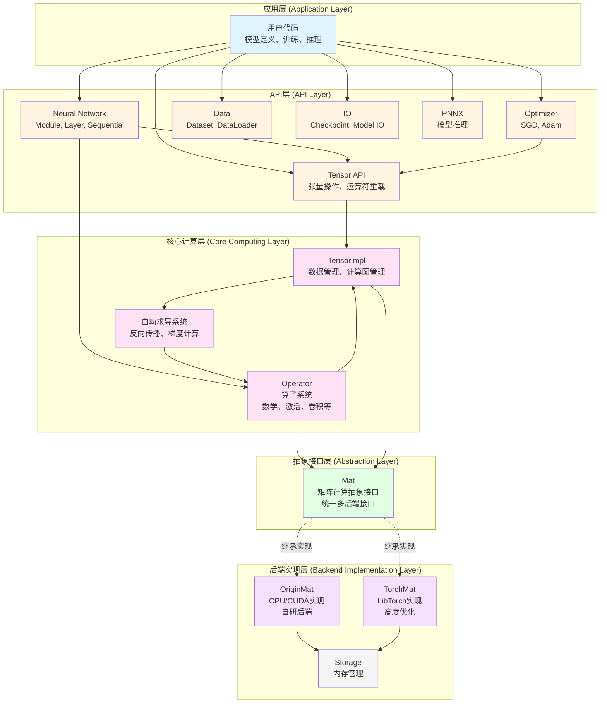

**架构层级说明：**

1. **应用层**：用户编写的模型定义、训练和推理代码
2. **API层**：提供面向用户的高级接口，包括张量操作、神经网络模块、优化器、数据处理、模型IO和推理功能
3. **核心计算层**：实现框架的核心功能，包括张量实现、算子系统、自动求导机制
4. **抽象接口层**：定义统一的矩阵计算接口，实现后端解耦
5. **后端实现层**：提供具体的计算后端实现和内存管理


### Tensor 的四层架构设计

在 OriginDL 的整体架构中，**Tensor 系统**是核心计算层的基础，它采用了四层架构设计，体现了分层架构的核心思想：**职责分离**和**依赖倒置**。每一层只依赖下层提供的接口，不依赖具体实现，从而实现解耦。

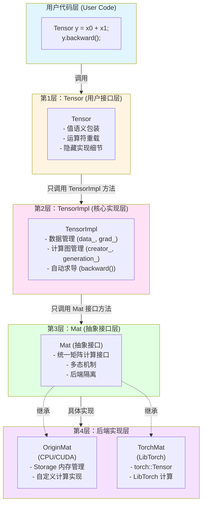


**第1层：Tensor（用户接口层）**

**设计原理：**

- **值语义设计**：让 Tensor 对象可以像普通值一样传递，符合直觉
- **轻量级包装**：Tensor 对象只包含一个 `shared_ptr<TensorImpl>`，开销极小
- **不可变接口**：大部分操作返回新的 Tensor，不修改原对象

**类设计：**

```cpp
class Tensor {
private:
    TensorImplPtr impl_;  // 唯一的成员：shared_ptr<TensorImpl>
    
public:
    // 值语义：浅拷贝
    Tensor(const Tensor& other) : impl_(other.impl_) {}
    
    // 运算符重载（返回新对象）
    Tensor operator+(const Tensor& other) const;
    Tensor operator*(const Tensor& other) const;
    
    // 工厂方法
    static Tensor zeros(const Shape& shape);
    static Tensor ones(const Shape& shape);
    static Tensor randn(const Shape& shape);
};
```

**内存布局：**

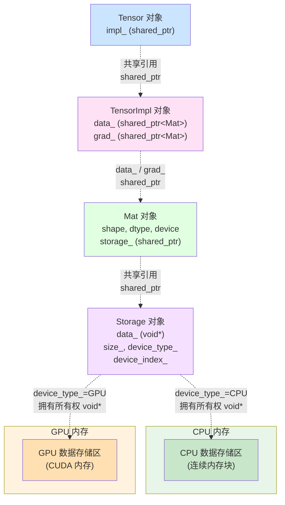

**内存布局特点：**

- **轻量级设计**：Tensor 采用轻量级值语义设计，通过智能指针管理实际数据。Tensor 对象仅包含一个智能指针，可高效传递和拷贝
- **分层存储**：数据通过 Mat 抽象层和 Storage 层管理，实现后端解耦和统一内存管理
- **多设备支持**：Storage 根据 `device_type_` 可以管理 CPU 或 GPU 内存

**第2层：TensorImpl（核心实现层）**

**设计原理：**

- **数据与计算图分离**：data_/grad_ 存储数据，creator_/generation_ 管理计算图
- **智能指针管理**：使用 shared_ptr 自动管理生命周期
- **自动求导核心**：backward() 方法实现反向传播

**类设计：**

```cpp
class TensorImpl {
public:
    std::shared_ptr<Mat> data_;      // 数据（通过 Mat 抽象层）
    std::shared_ptr<Mat> grad_;       // 梯度（通过 Mat 抽象层）
    FunctionPtr creator_;              // 创建者（Operator）
    int generation_;                  // 拓扑排序用
    
    void backward();                  // 反向传播入口
    void set_creator(const FunctionPtr& func);
    void clear_grad();
};
```

**数据流关系：**

```
TensorImpl
  ├─> data_ ──> Mat ──> Storage ──> void* (实际数据)
  ├─> grad_ ──> Mat ──> Storage ──> void* (梯度数据)
  └─> creator_ ──> Operator ──> 计算图连接
```

**第3层：Mat（抽象接口层）**

- **接口与实现分离**：Mat 只定义接口，不包含实现
- **多态机制**：通过虚函数实现运行时多态
- **类型擦除**：通过基类指针隐藏具体后端类型

**接口设计：**

```cpp
class Mat {
public:
    // 纯虚函数：强制子类实现
    virtual std::unique_ptr<Mat> add(const Mat& other) const = 0;
    virtual std::unique_ptr<Mat> mul(const Mat& other) const = 0;
    virtual std::unique_ptr<Mat> matmul(const Mat& other) const = 0;
    virtual std::unique_ptr<Mat> clone() const = 0;
    
    // 属性访问
    virtual Shape shape() const = 0;
    virtual DataType dtype() const = 0;
    virtual Device device() const = 0;
    
    virtual ~Mat() = default;
};
```

**第4层：后端实现层**

**OriginMat（自研后端）：**从零实现，CPU 实现用于快速验证，CUDA 实现会继续优化。

**TorchMat（LibTorch 后端）：**不完善，很多算子没有接通，有时间再做。

# Tensor 系统架构

## Tensor 分层架构设计

### Tensor 系统整体架构

Tensor 系统采用四层架构设计，从用户接口到数据存储，每一层都有明确的职责和清晰的边界。

#### 四层架构概览

**架构层次图：**


**类图（UML 风格）：**

TODO:补充 tensor 的类图

#### 为什么采用值语义？

值语义是指对象的行为像普通值（如 `int`、`double`）一样，拷贝时创建**逻辑上独立**的副本，修改一个对象**不会影响**另一个对象，直观易用，符合直觉。

虽然可以让用户通过智能指针指向 Tensor 实现，但这会导致用户代码中到处都是指针操作，使用起来不够直观。Tensor 是推理框架中大量使用的对象，OriginDL 希望提供与 PyTorch 类似的用户体验，让 Tensor 可以像普通变量一样自然地传递和使用，因此采用了值语义设计。

**用户视角（值语义）**：

```cpp
// OriginDL 采用**值语义 + 底层共享的设计策略：
Tensor x({1.0, 2.0}, {2});
Tensor y = x;  // 逻辑上创建了独立的副本
// x 和 y 在用户看来是两个独立的对象
```

**底层实现（浅拷贝 + 共享）**：

```cpp
// 实际上，x 和 y 共享同一个 TensorImpl
Tensor x ──┐
           ├─> 共享同一个 TensorImpl (shared_ptr)
Tensor y ──┘
```

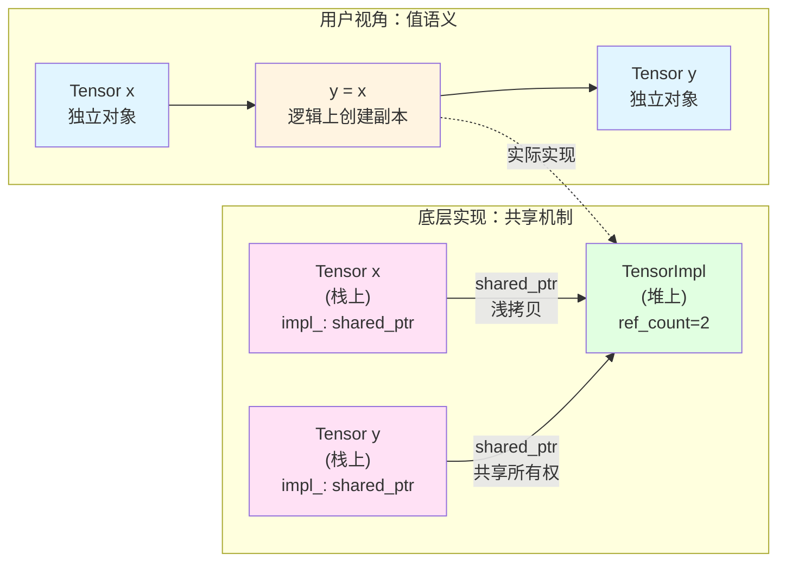

**Tensor 类的核心设计：**

```cpp
class Tensor {
private:
    std::shared_ptr<TensorImpl> impl_;  // 唯一的成员：智能指针
    
public:
    // 拷贝构造函数：浅拷贝，共享底层 TensorImpl
    Tensor(const Tensor &other) : impl_(other.impl_) {}
    
    // 赋值运算符：浅拷贝，共享底层 TensorImpl
    Tensor &operator=(const Tensor &other) {
        impl_ = other.impl_;
        return *this;
    }
    
    // 移动构造函数：转移所有权，高效
    Tensor(Tensor &&other) noexcept : impl_(std::move(other.impl_)) {}
    
    // 移动赋值运算符：转移所有权，高效
    Tensor &operator=(Tensor &&other) noexcept {
        impl_ = std::move(other.impl_);
        return *this;
    }
    
    // 运算符重载：返回新 Tensor（不可变设计）
    // 注意：实际实现通过算子层完成，这里仅为示意
    Tensor operator+(const Tensor& other) const;
    Tensor operator*(const Tensor& other) const;
};
```

#### 用户接口设计原则

OriginDL 的 Tensor 接口设计遵循以下核心原则：

**值语义与实现隐藏**

Tensor 采用值语义设计，对象可以像普通值一样传递和使用。Tensor 类仅包含一个 `shared_ptr<TensorImpl>` 成员，完全隐藏了 TensorImpl 的实现细节。用户只需要操作 Tensor 接口，无需关心底层实现，这大大降低了使用复杂度。

**不可变接口设计**

所有运算符返回新 Tensor（不可变），例如 `add()`, `transpose()`, `to()` 等方法都返回新实例，不修改原对象，除非显示的使用in-place方法，如以`_`结尾的方法，比如`add_()`。这种设计保证了数据安全，避免了意外修改。其实 Pytorch 也是这么做的。

**链式调用支持**

由于操作返回新的 Tensor，天然支持链式调用，提升代码可读性和表达力：
```cpp
auto y = x.reshape({2, 4}).transpose().to(device);
auto z = x.to(device).to(dtype);
```

**PyTorch 风格 API**

为了降低学习成本并便于从 PyTorch 迁移，OriginDL 提供了与 PyTorch 相似的 API 设计：
- **属性查询**：`shape()`, `dtype()`, `device()`
- **维度信息**：`numel()`, `nbytes()`, `element_size()`
- **梯度管理**：`backward()`, `grad()`, `detach()`, `requires_grad()`

**运算符重载通过算子层**

运算符重载（如 `operator+`, `operator*`）统一通过算子层实现，确保所有运算都能正确建立计算图，支持自动求导。例如 `x + y` 会创建 `Add` 算子，`x * y` 会创建 `Mul` 算子，实现了统一的计算图管理。

#### 运算符重载策略

**运算符重载架构：**

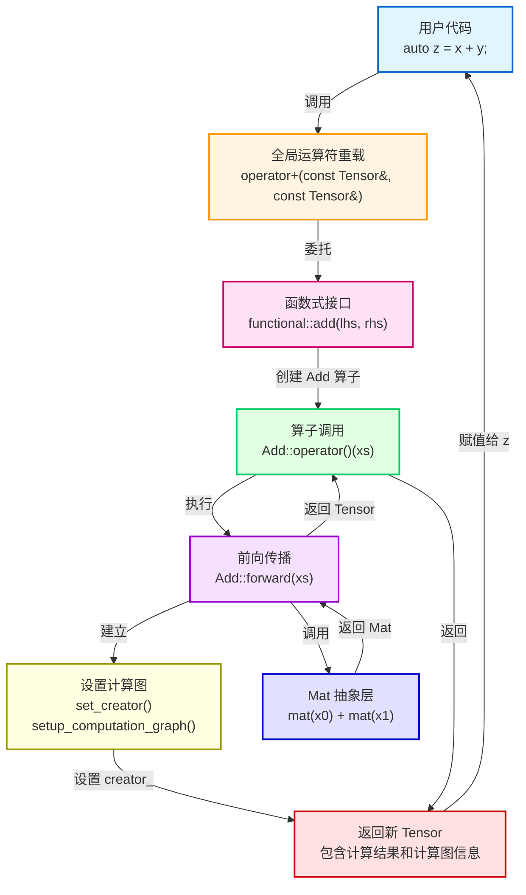

- **值语义接口**：用户代码 `x + y` 直观自然，无需关心底层实现
- **统一通过算子层**：所有运算符重载都创建对应的算子（如 `Add`, `Mul`），不直接操作底层 Mat
- **自动建立计算图**：算子自动设置 `creator_`，建立计算图连接，支持自动求导
- **不可变设计**：所有运算符返回新 Tensor，原对象保持不变
- **类型提升支持**：自动处理不同数据类型的运算，确保类型安全


### TensorImpl 层：核心实现

TensorImpl 是 Tensor 的核心实现层，负责管理张量的数据、梯度和计算图信息。

#### 职责定位

TensorImpl 是 Tensor 的核心实现层，承担数据管理、计算图管理和生命周期管理三大职责：

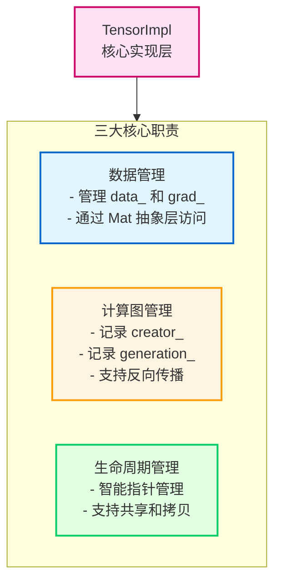

#### 数据成员设计

TensorImpl 的数据成员通过 Mat 抽象层管理数据，通过 Operator 管理计算图：

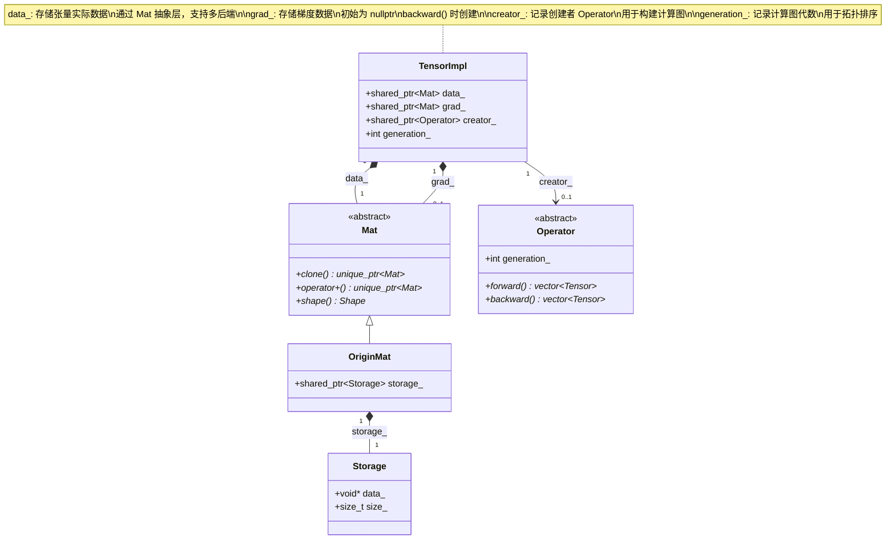

#### 核心方法架构

TensorImpl 的核心方法分为反向传播、计算图管理和张量操作三类：

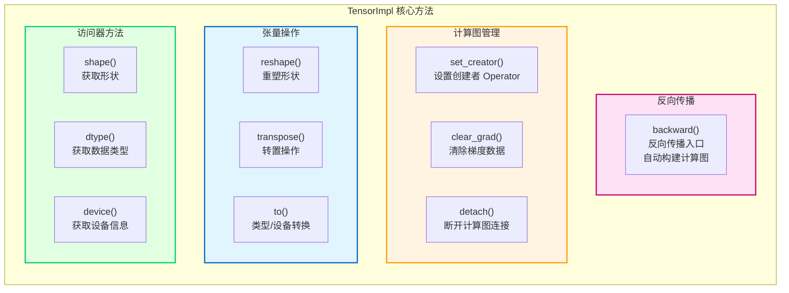

---

### Mat 抽象层

Mat 是矩阵计算的抽象接口层，隔离具体后端实现，支持多后端切换。

#### Mat 接口设计

- 


### Storage 层：数据拥有者

Storage 是数据的真正拥有者，管理原始内存，可以被多个 Mat 共享。


## 内存所有权设计

### 完整内存层次结构

OriginDL 的内存管理采用多层设计，每一层都有明确的职责：

```
Tensor (值语义包装)
    └─> TensorImplPtr (shared_ptr<TensorImpl>)
          └─> data_: shared_ptr<Mat>
                └─> OriginMat::storage_: shared_ptr<Storage>
                      └─> Storage::data_: void* (真正的数据)

          └─> grad_: shared_ptr<Mat>
                └─> OriginMat::storage_: shared_ptr<Storage>
                      └─> Storage::data_: void* (真正的数据)
```

**层次说明：**

1. **Tensor 层**
   - 值语义包装
   - 只包含一个 `shared_ptr<TensorImpl>`
   - 拷贝时共享 TensorImpl

2. **TensorImpl 层**
   - 管理 data_ 和 grad_
   - 管理计算图信息
   - 拷贝时深拷贝 data_ 和 grad_

3. **Mat 层**
   - 抽象接口，隐藏后端
   - 可以拥有 Storage 或作为视图
   - 拷贝时调用 clone()

4. **Storage 层**
   - 真正的数据拥有者
   - 管理原始内存
   - 可以被多个 Mat 共享

---

### Storage 与 Mat 的关系

#### 视图机制：reshape/transpose 创建视图，共享 Storage


---

- 

#### Mat 拷贝：clone() 方法

**实现：**
```cpp
virtual std::unique_ptr<Mat> clone() const = 0;
```

**行为：**
- 创建新的 Mat 对象
- 如果 Mat 拥有 Storage，创建新的 Storage 并拷贝数据
- 如果 Mat 是视图，创建新的视图（共享 Storage）

### 内存优化策略

#### 零拷贝视图（连续张量的 reshape）

**优化策略：**
```cpp
TensorImpl TensorImpl::reshape(const Shape &shape) const {
    if (data_->is_contiguous()) {
        // 创建视图，零拷贝
        auto view = data_->view(shape);
        return TensorImpl(std::move(view));
    } else {
        // 非连续，需要拷贝
        auto new_data = data_->clone();
        new_data->reshape(shape);
        return TensorImpl(std::move(new_data));
    }
}
```

**优势：**
- **性能**：避免数据拷贝，O(1) 时间复杂度
- **内存**：多个视图共享同一个 Storage
- **灵活性**：支持多种形状变换

#### 原地操作（add_inplace 用于梯度累加）

**优化策略：**
```cpp
// 梯度累加时使用原地操作
if (!x.impl_->grad_) {
    // 梯度为空，直接共享
    x.impl_->grad_ = gx.impl_->data_;
} else {
    // 梯度不为空，原地累加（避免创建新对象）
    x.impl_->grad_->add_inplace(*gx.impl_->data_);
}
```

**优势：**
- **性能**：避免创建新的 Mat 对象
- **内存**：复用现有内存，不分配新内存
- **效率**：直接修改现有数据


```cpp
// 梯度延迟分配
void TensorImpl::backward() {
    if (!grad_) {
        // 只在需要时分配梯度内存
        grad_ = std::shared_ptr<Mat>(Mat_t::zeros(shape(), options()));
    }
    // ...
}第5章：Tensor 构造函数与工厂方法
```

### 类型转换

#### to() 方法（dtype、device 转换）

**接口：**
```cpp
TensorImpl TensorImpl::to(const TensorOptions& options) const;
Tensor Tensor::to(const TensorOptions& options) const;
```

**功能：**
- 转换数据类型（float32 → float64）
- 转换设备（CPU → CUDA）
- 返回新的 Tensor（不修改原对象）

**实现：**
```cpp
TensorImpl TensorImpl::to(const TensorOptions& options) const {
    // 检查是否需要转换
    if (data_->dtype() == options.dtype() && 
        data_->device() == options.device()) {
        return *this;  // 无需转换
    }
    
    // 创建新的 Mat（转换类型或设备）
    auto new_mat = data_->to(options);
    return TensorImpl(std::move(new_mat));
}
```

#### 类型提升规则

**规则：**
- 低精度 → 高精度：自动提升
- 高精度 → 低精度：需要显式转换（可能丢失精度）
- 相同类型：无需转换

**示例：**
```cpp
auto x = Tensor::zeros({2, 3}, dtype("float32"));
auto y = x.to(dtype("float64"));  // float32 → float64
```

#### 设备迁移机制

**CPU ↔ CUDA 迁移：**
```cpp
// CPU → CUDA
auto cpu_tensor = Tensor::zeros({2, 3}, device("cpu"));
auto cuda_tensor = cpu_tensor.to(device("cuda:0"));

// CUDA → CPU
auto back_to_cpu = cuda_tensor.to(device("cpu"));
```

**实现细节：**
- 需要拷贝数据（不同设备）
- 异步传输（CUDA）
- 自动同步（确保数据一致性）

### 4. 张量打印系统设计

#### 4.1 设计目标

OriginDL的张量打印系统旨在提供清晰、直观的张量数据展示，同时保持与主流深度学习框架的一致性。


#### 打印格式设计

**格式层次：**

1. **标量张量 (0维)**

   ```
   (1.0)
   ```

2. **一维张量 (1维)**

   ```
   [1.0, 2.0, 3.0]
   ```

3. **二维张量 (2维)**

   ```
   [[1, 2, 3],
    [4, 5, 6]]
   ```

4. **高维张量 (3维及以上，如4维打印如下)**

   ```
   (0,0,.,.) = 
        0       1       2
        3       4       5
   (0,1,.,.) = 
        6       7       8
        9      10      11
   ```

不同的深度学习框架打印 shape(2,3,2,3) 的效果，裸数据均为数组[0, 1, 2, ..., 33, 34, 35]。

```
# pytorch 打印如下
tensor([[[[ 0.,  1.,  2.],
          [ 3.,  4.,  5.]],

         [[ 6.,  7.,  8.],
          [ 9., 10., 11.]],

         [[12., 13., 14.],
          [15., 16., 17.]]],


        [[[18., 19., 20.],
          [21., 22., 23.]],

         [[24., 25., 26.],
          [27., 28., 29.]],

         [[30., 31., 32.],
          [33., 34., 35.]]]])

# libtorch 打印如下：
(1,1,.,.) = 
  0  1  2
  3  4  5

(2,1,.,.) = 
  18  19  20
  21  22  23

(1,2,.,.) = 
   6   7   8
   9  10  11

(2,2,.,.) = 
  24  25  26
  27  28  29

(1,3,.,.) = 
  12  13  14
  15  16  17

(2,3,.,.) = 
  30  31  32
  33  34  35
[ CPUFloatType{2,3,2,3} ]
```

本人认为 libtorch 的切片风格，再高维张张量中可以更好的看到细节，因此采用了切片的方式，其次 libtorch 的打印内容存在跳跃，与内存布局0~35的连续顺序不合，此时 Pytorch 的打印风格与内存布局相符。 Origin 结合了这两者的风格，打印效果如下所示：

```
(0,0,.,.) = 
     0       1       2
     3       4       5
(0,1,.,.) = 
     6       7       8
     9      10      11
(0,2,.,.) = 
    12      13      14
    15      16      17
(1,0,.,.) = 
    18      19      20
    21      22      23
(1,1,.,.) = 
    24      25      26
    27      28      29
(1,2,.,.) = 
    30      31      32
    33      34      35

 OriginMat(shape=[2, 3, 2, 3], dtype=float32, device=cpu)
```

切片打印的顺序:

```
// LibTorch风格
(0,0,.,.) → (1,0,.,.) → (0,1,.,.) → (1,1,.,.) → (0,2,.,.) → (1,2,.,.)

// OriginDL 风格
(0,0,.,.) → (0,1,.,.) → (0,2,.,.) → (1,0,.,.) → (1,1,.,.) → (1,2,.,.)


内存布局: [0,1,2,3,4,5, 6,7,8,9,10,11, 12,13,14,15,16,17, 18,19,20,21,22,23, ...]
          ↑─────────↑  ↑─────────↑  ↑─────────↑  ↑─────────↑
          (0,0,.,.)   (0,1,.,.)   (0,2,.,.)   (1,0,.,.)


LibTorch风格的访问顺序：
- `(0,0,.,.)` → 内存地址 0-5
- `(1,0,.,.)` → 内存地址 18-23 (跳跃13个元素)
- `(0,1,.,.)` → 内存地址 6-11 (回跳17个元素)
从内存布局上看，OriginDL中打印的相邻切片在内存布局上是相邻的。
```

使用0-based索引，从编程习惯上，更符合符合C++/Python等主流编程语言的索引约定。

```cpp
// OriginDL采用0-based索引，第一个切片索引为 (0,0,.,.)
(0,0,.,.) = 
     0       1       2
     3       4       5

// 而不是LibTorch的1-based索引，第一个切片的索引为 (1,1,.,.)
(1,1,.,.) = 
     0       1       2
     3       4       5
```


# 动态计算图构建

## 动态计算图架构

动态计算图是 OriginDL 自动求导系统的核心数据结构，用于记录计算过程和依赖关系。计算图由**节点（Tensor）**和**边（Operator）**组成，在前向传播时自动构建。

### 计算图整体架构

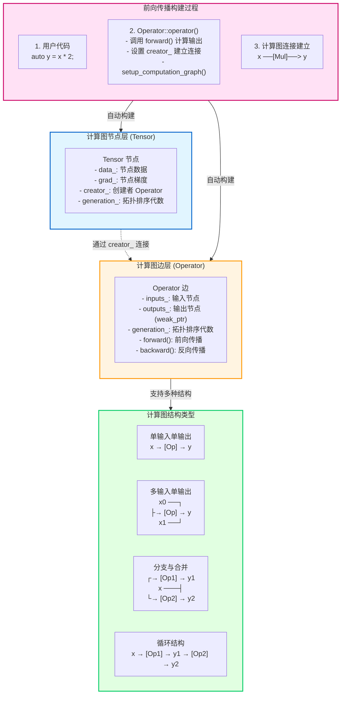

### 计算图节点与边的连接关系

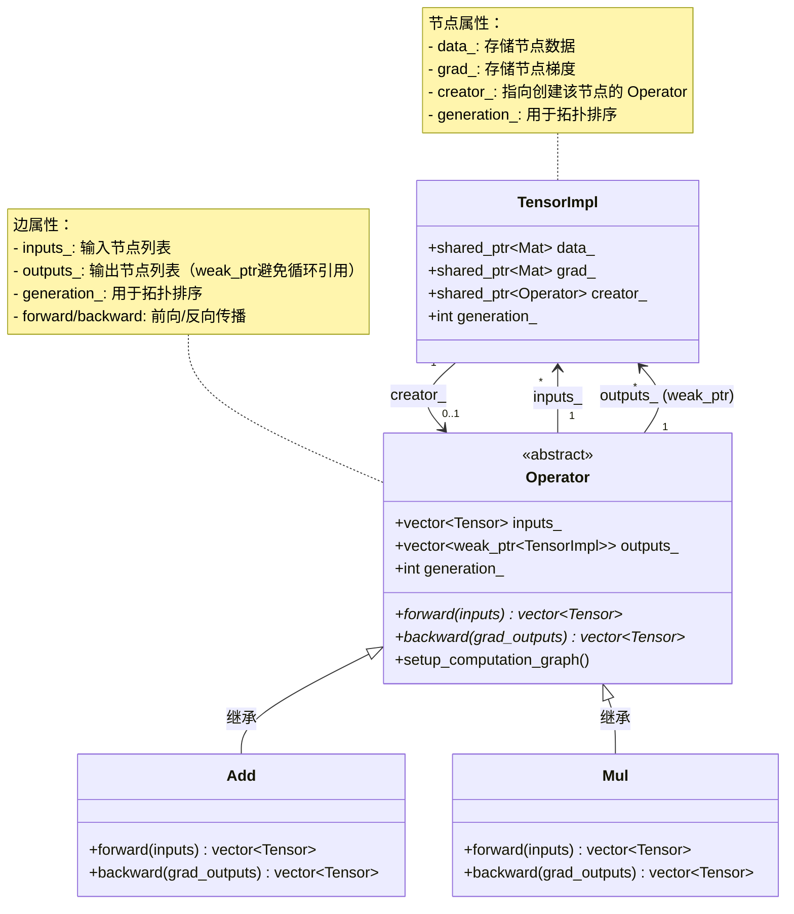

### 前向传播时自动构建计算图

在前向传播过程中，计算图会自动构建。当用户执行 `auto y = x * 2;` 时，系统会：

1. **创建算子**：运算符重载创建 `Mul` 算子
2. **执行前向传播**：调用 `Mul::forward()` 计算输出
3. **建立连接**：设置 `y.creator_ = Mul`，建立节点到边的连接
4. **保存信息**：在 `Mul` 中保存 `inputs_` 和 `outputs_`
5. **设置代数**：`y.generation_ = x.generation_ + 1`

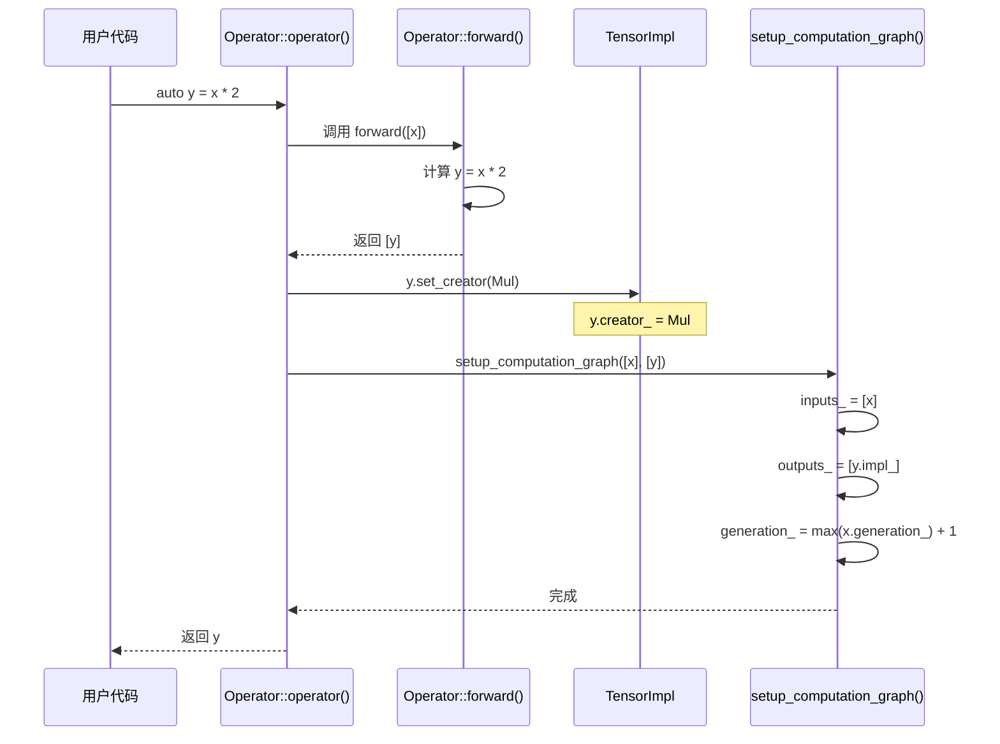

### 计算图连接机制

#### creator_ 字段的作用

`creator_` 字段建立了从节点（Tensor）到边（Operator）的连接，使得反向传播时可以从输出节点回溯到创建它的算子。

- **记录创建者**：每个 Tensor 记录创建它的 Operator
- **建立连接**：通过 `creator_` 建立节点到边的连接
- **反向回溯**：反向传播时从 `creator_` 开始回溯整个计算图

#### generation_ 的作用（拓扑排序）

`generation_` 用于拓扑排序，确保梯度计算的正确顺序：

- **输入节点**：`generation_ = 0`
- **中间节点**：`generation_ = 输入的最大 generation_ + 1`
- **反向传播顺序**：按 `generation_` 从大到小处理（输出端 → 输入端）

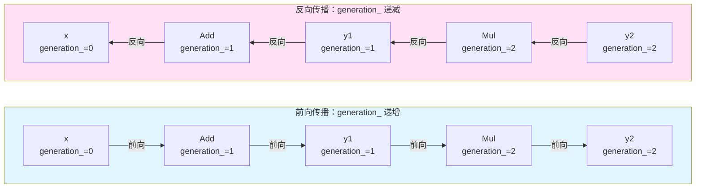

### 计算图结构类型

OriginDL 支持多种计算图结构：

1. **单输入单输出**：最简单的结构，如 `x → [ReLU] → y`
2. **多输入单输出**：多个输入合并，如 `x0, x1 → [Add] → y`
3. **分支与合并**：一个输入产生多个输出，需要梯度累积
4. **循环结构**：链式结构，多个算子串联

### 动态图的优势

- **灵活性**：计算图结构可以动态变化，支持条件分支、循环等控制流
- **易用性**：用户代码直观，不需要显式构建图
- **易调试**：可以打印中间结果，检查计算图结构


# 反向传播实现

## 反向传播架构

反向传播是自动求导系统的核心，通过遍历计算图从输出端向输入端传播梯度。OriginDL 采用拓扑排序算法确保梯度计算的正确顺序，并通过梯度累积机制处理多路径梯度传播。

### 反向传播整体流程

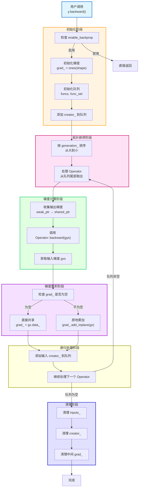

### 拓扑排序与梯度计算

```mermaid
flowchart LR
    subgraph Queue["待处理队列 (按 generation_ 排序)"]
        direction TB
        Op3["Operator (gen=3)<br/>输出端"]
        Op2["Operator (gen=2)<br/>中间层"]
        Op1["Operator (gen=1)<br/>中间层"]
        Op0["Operator (gen=0)<br/>输入端"]
    end
    
    subgraph Process["处理流程"]
        direction TB
        Step1["1. 从队列尾部取出<br/>（generation_ 最大）"]
        Step2["2. 收集输出梯度 gys<br/>weak_ptr → shared_ptr"]
        Step3["3. 调用 backward(gys)<br/>计算输入梯度 gxs"]
        Step4["4. 梯度累积<br/>直接共享或原地累加"]
        Step5["5. 添加输入 creator_<br/>递归处理"]
    end
    
    Queue -->|按序处理| Process
    Process -->|递归添加| Queue
    
    style Queue fill:#e1f5ff,stroke:#0066cc,stroke-width:2px
    style Process fill:#fff4e1,stroke:#ff9900,stroke-width:2px
```

### 梯度累积机制

梯度累积处理多路径梯度传播的情况。当一个 Tensor 被多个 Operator 使用时，需要将所有路径的梯度累加。

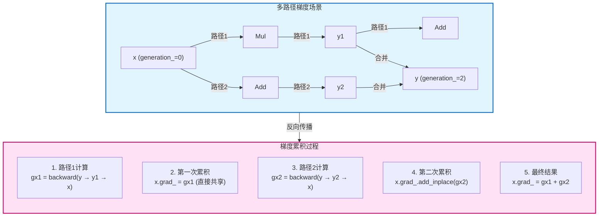

### 梯度累积策略

OriginDL 采用两种梯度累积策略，优化内存使用和性能：

1. **直接共享**：当 `grad_` 为空时，直接共享梯度数据，避免内存分配和拷贝
2. **原地累加**：当 `grad_` 不为空时，使用 `add_inplace()` 原地累加，避免创建新对象

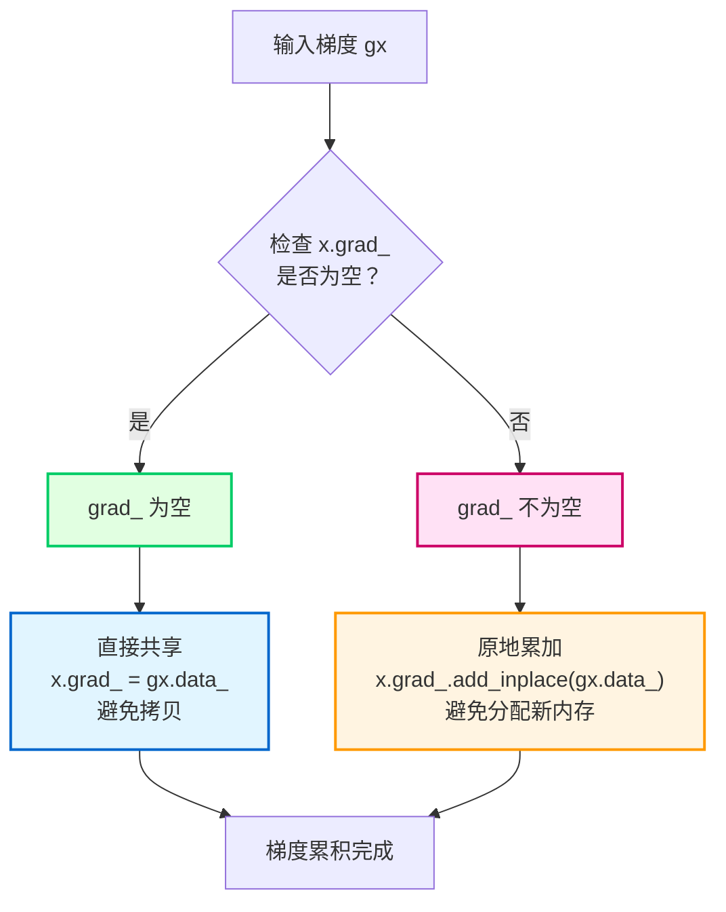

### 计算图清理机制

反向传播完成后，系统会自动清理计算图，释放内存并断开循环引用：

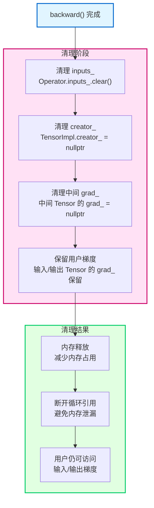

### 关键设计要点

1. **拓扑排序**：使用 `generation_` 确保梯度计算顺序正确，从输出端到输入端
2. **去重机制**：使用 `set` 避免重复处理同一个 Operator
3. **weak_ptr 管理**：`outputs_` 使用 `weak_ptr` 避免循环引用，在 `backward()` 时转换为 `shared_ptr`
4. **梯度累积优化**：直接共享和原地累加两种策略，优化内存使用和性能
5. **自动清理**：`backward()` 完成后自动清理计算图，释放内存并断开循环引用

### 反向传播示例

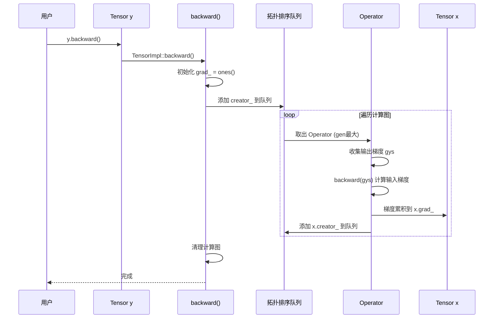


# 神经网络模块架构

# 静态图模块架构
