# 1. 架构总览与设计理念

## 1.1 OriginDL 架构概览

OriginDL 是一个从零开始构建的深度学习框架，采用 C++ 实现，支持自动求导和多种计算后端。框架采用分层架构设计和模块化组织，将系统划分为多个清晰的层次和功能模块，每一层都有明确的职责，通过抽象接口实现层间解耦。

OriginDL 的整体架构由以下几个核心模块组成：

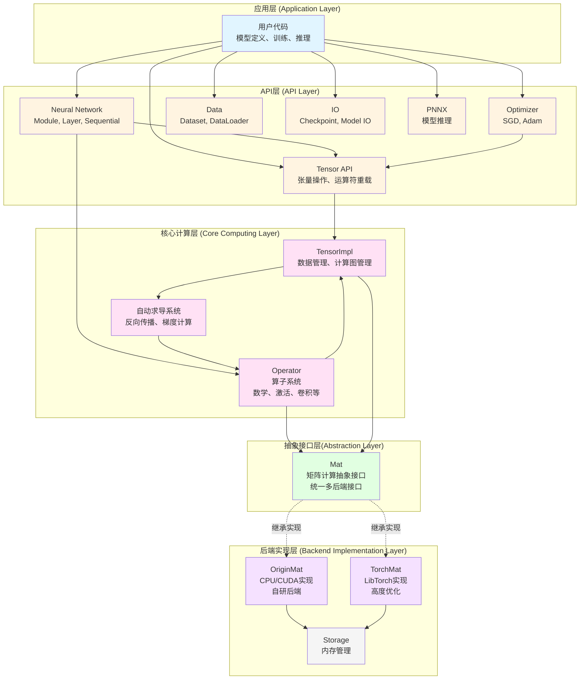
```mermaid
graph TB
    subgraph "应用层 (Application Layer)"
        UserCode["用户代码<br/>模型定义、训练、推理"]
    end
    
    subgraph "API层 (API Layer)"
        TensorAPI["Tensor API<br/>张量操作、运算符重载"]
        NNModule["Neural Network<br/>Module, Layer, Sequential"]
        Optim["Optimizer<br/>SGD, Adam"]
        DataModule["Data<br/>Dataset, DataLoader"]
        IOModule["IO<br/>Checkpoint, Model IO"]
        PNNXModule["PNNX<br/>模型推理"]
    end
    
    subgraph "核心计算层 (Core Computing Layer)"
        TensorImpl["TensorImpl<br/>数据管理、计算图管理"]
        Operator["Operator<br/>算子系统<br/>数学、激活、卷积等"]
        Autograd["自动求导系统<br/>反向传播、梯度计算"]
    end
    
    subgraph "抽象接口层(Abstraction Layer)"
        MatInterface["Mat<br/>矩阵计算抽象接口<br/>统一多后端接口"]
    end
    
    subgraph "后端实现层 (Backend Implementation Layer)"
        OriginMat["OriginMat<br/>CPU/CUDA实现<br/>自研后端"]
        TorchMat["TorchMat<br/>LibTorch实现<br/>高度优化"]
        Storage["Storage<br/>内存管理"]
    end
    
    UserCode --> TensorAPI
    UserCode --> NNModule
    UserCode --> Optim
    UserCode --> DataModule
    UserCode --> IOModule
    UserCode --> PNNXModule
    
    TensorAPI --> TensorImpl
    NNModule --> TensorAPI
    NNModule --> Operator
    Optim --> TensorAPI
    Operator --> TensorImpl
    Operator --> MatInterface
    TensorImpl --> Autograd
    TensorImpl --> MatInterface
    Autograd --> Operator
    
    MatInterface -.->|继承实现| OriginMat
    MatInterface -.->|继承实现| TorchMat
    OriginMat --> Storage
    TorchMat --> Storage
    
    style UserCode fill:#e1f5ff
    style TensorAPI fill:#fff4e1
    style NNModule fill:#fff4e1
    style Optim fill:#fff4e1
    style DataModule fill:#fff4e1
    style IOModule fill:#fff4e1
    style PNNXModule fill:#fff4e1
    style TensorImpl fill:#ffe1f5
    style Operator fill:#ffe1f5
    style Autograd fill:#ffe1f5
    style MatInterface fill:#e1ffe1
    style OriginMat fill:#f5e1ff
    style TorchMat fill:#f5e1ff
    style Storage fill:#f5f5f5
```

**架构层级说明：**

1. **应用层**：用户编写的模型定义、训练和推理代码
2. **API层**：提供面向用户的高级接口，包括张量操作、神经网络模块、优化器、数据处理、模型IO和推理功能
3. **核心计算层**：实现框架的核心功能，包括张量实现、算子系统、自动求导机制
4. **抽象接口层**：定义统一的矩阵计算接口，实现后端解耦
5. **后端实现层**：提供具体的计算后端实现和内存管理

**Tensor 系统**是核心计算层的基础，它采用了四层架构设计（Tensor → TensorImpl → Mat → 后端实现），体现了分层架构的核心思想：**职责分离**和**依赖倒置**。每一层只依赖下层提供的接口，不依赖具体实现，从而实现解耦。详细的 Tensor 系统架构设计请参见 [Tensor 系统架构](#tensor-系统架构) 章节。

OriginDL 框架遵循以下核心设计原则：

1. **分层架构**：采用清晰的分层设计，每一层都有明确的职责，通过抽象接口实现层间解耦
2. **职责分离**：每个模块只负责自己的核心功能，避免职责混乱
3. **依赖倒置**：上层依赖下层的抽象接口，不依赖具体实现，支持多后端切换
4. **值语义设计**：Tensor 采用值语义，提供直观的用户体验
5. **自动求导**：支持动态计算图，自动构建和反向传播

# 2. Tensor 系统架构

## 2.1 Tensor 分层架构设计

Tensor 系统采用四层架构设计，从用户接口到数据存储，每一层都有明确的职责和清晰的边界。

### 2.1.1 四层架构概览

**架构层次图：**

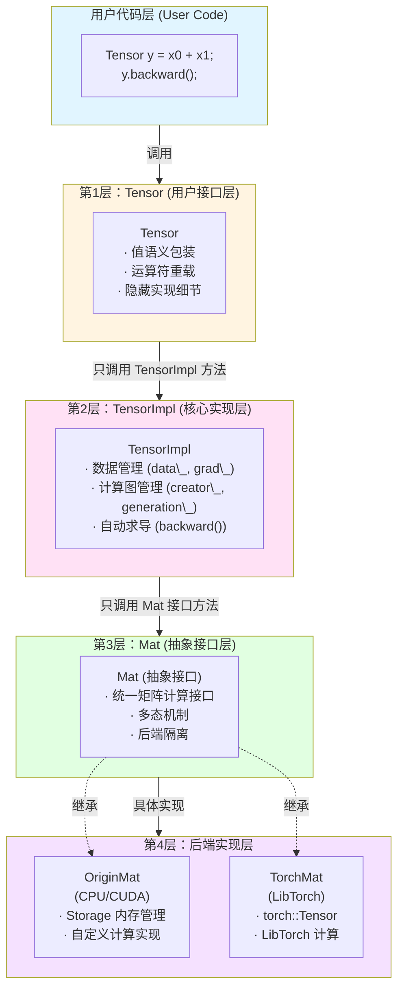
```mermaid
flowchart TB
    subgraph UserLayer["用户代码层 (User Code)"]
        UserCode["Tensor y = x0 + x1;<br/>y.backward();"]
    end
    
    subgraph Layer1["第1层：Tensor (用户接口层)"]
        Tensor["Tensor<br/>· 值语义包装<br/>· 运算符重载<br/>· 隐藏实现细节"]
    end
    
    subgraph Layer2["第2层：TensorImpl (核心实现层)"]
        TensorImpl["TensorImpl<br/>· 数据管理 (data\_, grad\_)<br/>· 计算图管理 (creator\_, generation\_)<br/>· 自动求导 (backward())"]
    end
    
    subgraph Layer3["第3层：Mat (抽象接口层)"]
        Mat["Mat (抽象接口)<br/>· 统一矩阵计算接口<br/>· 多态机制<br/>· 后端隔离"]
    end
    
    subgraph Layer4["第4层：后端实现层"]
        OriginMat["OriginMat<br/>(CPU/CUDA)<br/>· Storage 内存管理<br/>· 自定义计算实现"]
        TorchMat["TorchMat<br/>(LibTorch)<br/>· torch::Tensor<br/>· LibTorch 计算"]
    end
    
    UserLayer -->|调用| Layer1
    Layer1 -->|只调用 TensorImpl 方法| Layer2
    Layer2 -->|只调用 Mat 接口方法| Layer3
    Layer3 -->|具体实现| Layer4
    
    Mat -.->|继承| OriginMat
    Mat -.->|继承| TorchMat
    
    style UserLayer fill:#e1f5ff
    style Layer1 fill:#fff4e1
    style Layer2 fill:#ffe1f5
    style Layer3 fill:#e1ffe1
    style Layer4 fill:#f5e1ff
```

**四层架构说明：**

当前实现大致对应以下四层：

| 层次 | 类 | 职责 |
|------|-----|------|
| 第1层 | Tensor | 值语义、运算符重载、隐藏实现 |
| 第2层 | TensorImpl | 数据（`data_`/`grad_`）、计算图（`creator_`/`generation_`）、autograd |
| 第3层 | Mat | 抽象计算接口、多态、后端隔离 |
| 第4层 | OriginMat / TorchMat | 具体后端（CPU/CUDA 或 LibTorch） |

这样设计的目的是：

- **职责清晰**：每一层边界清楚，Tensor 只转发给 TensorImpl，TensorImpl 只通过 Mat 做计算。
- **后端可扩展**：Mat 抽象让新增后端（如 TorchMat）只需实现接口，无需改动上层。
- **计算图与数据分离**：TensorImpl 负责 autograd 和计算图，Mat 只负责数值计算。

**类图（UML 风格）：**

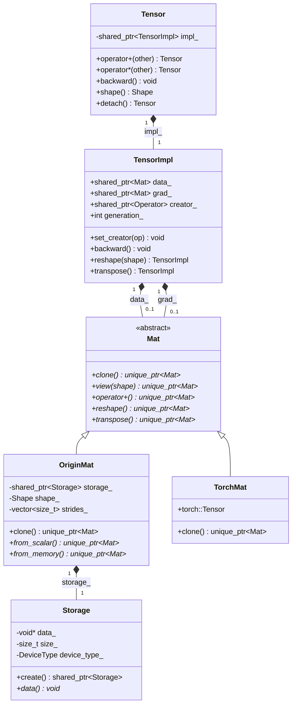
```mermaid
classDiagram
    class Tensor {
        -shared_ptr~TensorImpl~ impl_
        +operator+(other) Tensor
        +operator*(other) Tensor
        +backward() void
        +shape() Shape
        +detach() Tensor
    }
    
    class TensorImpl {
        +shared_ptr~Mat~ data_
        +shared_ptr~Mat~ grad_
        +shared_ptr~Operator~ creator_
        +int generation_
        +set_creator(op) void
        +backward() void
        +reshape(shape) TensorImpl
        +transpose() TensorImpl
    }
    
    class Mat {
        <<abstract>>
        +clone()* unique_ptr~Mat~
        +view(shape)* unique_ptr~Mat~
        +operator+()* unique_ptr~Mat~
        +reshape()* unique_ptr~Mat~
        +transpose()* unique_ptr~Mat~
    }
    
    class OriginMat {
        -shared_ptr~Storage~ storage_
        -Shape shape_
        -vector~size_t~ strides_
        +clone() unique_ptr~Mat~
        +from_scalar()* unique_ptr~Mat~
        +from_memory()* unique_ptr~Mat~
    }
    
    class TorchMat {
        +torch::Tensor
        +clone() unique_ptr~Mat~
    }
    
    class Storage {
        -void* data_
        -size_t size_
        -DeviceType device_type_
        +create() shared_ptr~Storage~
        +data() void*
    }
    
    Tensor "1" *-- "1" TensorImpl : impl_
    TensorImpl "1" *-- "0..1" Mat : data_
    TensorImpl "1" *-- "0..1" Mat : grad_
    Mat <|-- OriginMat
    Mat <|-- TorchMat
    OriginMat "1" *-- "1" Storage : storage_
```

## 2.2 第1层：Tensor (用户接口层)

### 2.2.1 为什么采用值语义？

值语义是指对象的行为像普通值（如 `int`、`double`）一样，拷贝时创建**逻辑上独立**的副本，修改一个对象**不会影响**另一个对象，直观易用，符合直觉。

虽然可以让用户通过智能指针指向 Tensor 实现，但这会导致用户代码中到处都是指针操作，使用起来不够直观。Tensor 是推理框架中大量使用的对象，OriginDL 希望提供与 PyTorch 类似的用户体验，让 Tensor 可以像普通变量一样自然地传递和使用，因此采用了值语义设计。

**用户视角（值语义）**：

```cpp
// OriginDL 采用值语义 + 底层共享的设计策略：
Tensor x({1.0, 2.0, 3.0, 4.0}, Shape({2, 2}), dtype("float32"));
Tensor y = x; // x 和 y 在用户看来是两个独立的对象，实际上底层是浅拷贝，x 和 y 共享同一个 TensorImpl
```

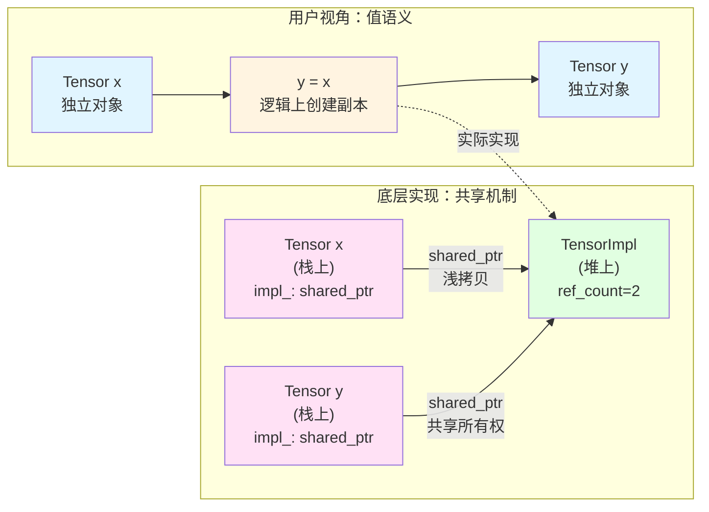
```mermaid
graph LR
    subgraph "用户视角：值语义"
        UserX["Tensor x<br/>独立对象"]
        UserY["Tensor y<br/>独立对象"]
        UserCopy["y = x<br/>逻辑上创建副本"]
        UserX --> UserCopy
        UserCopy --> UserY
    end
    
    subgraph "底层实现：共享机制"
        StackX["Tensor x<br/>(栈上)<br/>impl_: shared_ptr"]
        StackY["Tensor y<br/>(栈上)<br/>impl_: shared_ptr"]
        SharedImpl["TensorImpl<br/>(堆上)<br/>ref_count=2"]
        StackX -->|"shared_ptr<br/>浅拷贝"| SharedImpl
        StackY -->|"shared_ptr<br/>共享所有权"| SharedImpl
    end
    
    UserCopy -.->|"实际实现"| SharedImpl
    
    style UserX fill:#e1f5ff
    style UserY fill:#e1f5ff
    style UserCopy fill:#fff4e1
    style StackX fill:#ffe1f5
    style StackY fill:#ffe1f5
    style SharedImpl fill:#e1ffe1
```

**Tensor 类的核心设计：**

```cpp
class Tensor {
private:
    std::shared_ptr<TensorImpl> impl_;  // 唯一的成员：智能指针
    
public:
    // 拷贝构造函数：浅拷贝，共享底层 TensorImpl
    Tensor(const Tensor &other) : impl_(other.impl_) {}
    
    // 赋值运算符：浅拷贝，共享底层 TensorImpl
    Tensor &operator=(const Tensor &other) {
        impl_ = other.impl_;
        return *this;
    }
    
    // 移动构造函数：转移所有权，高效
    Tensor(Tensor &&other) noexcept : impl_(std::move(other.impl_)) {}
    
    // 移动赋值运算符：转移所有权，高效
    Tensor &operator=(Tensor &&other) noexcept {
        impl_ = std::move(other.impl_);
        return *this;
    }
    
    // 运算符重载：返回新 Tensor（不可变设计）
    Tensor operator+(const Tensor& other) const;
    Tensor operator*(const Tensor& other) const;
};
```

#### 用户接口设计原则

OriginDL 的 Tensor 接口设计遵循以下核心原则：

**值语义与实现隐藏**

Tensor 采用值语义设计，对象可以像普通值一样传递和使用。Tensor 类仅包含一个 `shared_ptr<TensorImpl>` 成员，完全隐藏了 TensorImpl 的实现细节。用户只需要操作 Tensor 接口，无需关心底层实现，这大大降低了使用复杂度。

**不可变接口设计**

所有运算符返回新 Tensor（不可变），例如 `add()`, `transpose()`, `to()` 等方法都返回新实例，不修改原对象，除非显示的使用in-place方法，如以`_`结尾的方法，比如`add_()`。这种设计保证了数据安全，避免了意外修改。其实 Pytorch 也是这么做的。

**链式调用支持**

由于操作返回新的 Tensor，天然支持链式调用，提升代码可读性和表达力：
```cpp
auto y = x.reshape({2, 4}).transpose().to(device);
auto z = x.to(device).to(dtype);
```

**PyTorch 风格 API**

为了降低学习成本并便于从 PyTorch 迁移，OriginDL 提供了与 PyTorch 相似的 API 设计：
- **属性查询**：`shape()`, `dtype()`, `device()`
- **维度信息**：`numel()`, `nbytes()`, `element_size()`
- **梯度管理**：`backward()`, `grad()`, `detach()`, `requires_grad()`

**运算符重载通过算子层**

运算符重载（如 `operator+`, `operator*`）统一通过算子层实现，确保所有运算都能正确建立计算图，支持自动求导。例如 `x + y` 会创建 `Add` 算子，`x * y` 会创建 `Mul` 算子，实现了统一的计算图管理。

#### 运算符重载策略

**运算符重载架构：**

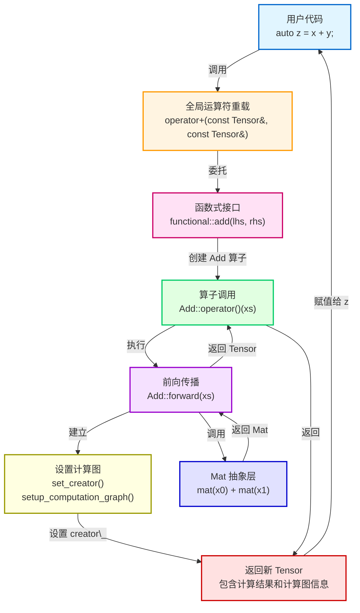
```mermaid
flowchart TD
    %% 用户代码层
    UserCode["用户代码<br/>auto z = x + y;"]
    
    %% 运算符重载层
    OperatorOverload["全局运算符重载<br/>operator+(const Tensor&, const Tensor&)"]
    
    %% 函数式接口层
    FunctionalAPI["函数式接口<br/>functional::add(lhs, rhs)"]
    
    %% 算子创建和调用层
    OperatorCall["算子调用<br/>Add::operator()(xs)"]
    
    %% 算子前向传播层
    Forward["前向传播<br/>Add::forward(xs)"]
    
    %% 计算图管理
    SetupGraph["设置计算图<br/>set_creator()<br/>setup_computation_graph()"]
    
    %% Mat 抽象层
    MatLayer["Mat 抽象层<br/>mat(x0) + mat(x1)"]
    
    %% 返回结果
    Result["返回新 Tensor<br/>包含计算结果和计算图信息"]
    
    %% 流程连接
    UserCode -->|调用| OperatorOverload
    OperatorOverload -->|委托| FunctionalAPI
    FunctionalAPI -->|创建 Add 算子| OperatorCall
    OperatorCall -->|执行| Forward
    Forward -->|调用| MatLayer
    Forward -->|建立| SetupGraph
    MatLayer -->|返回 Mat| Forward
    Forward -->|返回 Tensor| OperatorCall
    SetupGraph -->|设置 creator\_| Result
    OperatorCall -->|返回| Result
    Result -->|赋值给 z| UserCode
    
    %% 样式
    style UserCode fill:#e1f5ff,stroke:#0066cc,stroke-width:2px
    style OperatorOverload fill:#fff4e1,stroke:#ff9900,stroke-width:2px
    style FunctionalAPI fill:#ffe1f5,stroke:#cc0066,stroke-width:2px
    style OperatorCall fill:#e1ffe1,stroke:#00cc66,stroke-width:2px
    style Forward fill:#f5e1ff,stroke:#9900cc,stroke-width:2px
    style SetupGraph fill:#ffffe1,stroke:#999900,stroke-width:2px
    style MatLayer fill:#e1e1ff,stroke:#0000cc,stroke-width:2px
    style Result fill:#ffe1e1,stroke:#cc0000,stroke-width:2px
```

- **值语义接口**：用户代码 `x + y` 直观自然，无需关心底层实现
- **统一通过算子层**：所有运算符重载都创建对应的算子（如 `Add`, `Mul`），不直接操作底层 Mat
- **自动建立计算图**：算子自动设置 `creator_`，建立计算图连接，支持自动求导
- **不可变设计**：所有运算符返回新 Tensor，原对象保持不变
- **类型提升支持**：自动处理不同数据类型的运算，确保类型安全

## 2.3 第2层：TensorImpl (核心实现层)

TensorImpl 是 Tensor 的核心实现层，承担数据管理、计算图管理和自动求导三大核心职责，通过 Mat 抽象层管理数据，通过 Operator 管理计算图。

### 2.3.1 职责分解

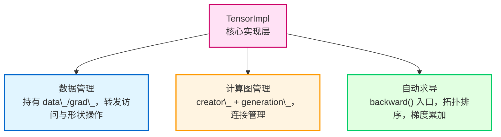
```mermaid
flowchart TD
    TensorImpl["TensorImpl<br/>核心实现层"]
    
    DataMgmt["数据管理<br/>持有 data\_/grad\_，转发访问与形状操作"]
    GraphMgmt["计算图管理<br/>creator\_ + generation\_，连接管理"]
    Autograd["自动求导<br/>backward() 入口，拓扑排序，梯度累加"]
    
    TensorImpl --> DataMgmt
    TensorImpl --> GraphMgmt
    TensorImpl --> Autograd
    
    style TensorImpl fill:#ffe1f5,stroke:#cc0066,stroke-width:2px
    style DataMgmt fill:#e1f5ff,stroke:#0066cc,stroke-width:2px
    style GraphMgmt fill:#fff4e1,stroke:#ff9900,stroke-width:2px
    style Autograd fill:#e1ffe1,stroke:#00cc66,stroke-width:2px
```

**职责说明：**

| 职责 | 数据成员 | 关键点 |
|------|----------|--------|
| 数据管理 | `data_`(shared_ptr\<Mat\>)、`grad_`(shared_ptr\<Mat\>)，深拷贝 | 前向数据与梯度；通过 Mat 抽象层访问；转发 `shape`/`index`/`data_ptr` 及 `reshape`/`transpose`/`to` 给 Mat |
| 计算图管理 | `creator_`(shared_ptr\<Operator\>)、`generation_`(int)，浅拷贝 | 创建者与拓扑排序代数；提供 `set_creator`/`detach`/`clear_grad` 管理连接 |
| 自动求导 | 使用 `creator_`、`grad_`、`generation_` | `backward()` 入口；按 `generation_` 拓扑排序并调用 `Operator::backward()`；梯度累加（`grad_` 为空则赋值，否则 `add_inplace` 原地累加）；完成后自动清理中间节点 |

### 2.3.2 数据转发与梯度管理

TensorImpl 将形状操作（`reshape`、`transpose` 等）转发给 `data_->reshape()` / `data_->transpose()`，用返回的 Mat 构造新 TensorImpl。Mat 层的视图设计详见 [2.5.5 视图设计：利用视图减少拷贝](#255-视图设计利用视图减少拷贝)。

**梯度累加：** `backward` 时，`grad_` 为空则直接共享；不为空则 `add_inplace` 原地累加，避免新分配。

**梯度延迟分配：** `grad_` 初始为 nullptr，仅在 `backward()` 需要时分配。

**计算图管理与自动求导：** 分别详见 [第 3 章 动态计算图构建](#3-动态计算图构建) 与 [第 4 章 反向传播实现](#4-反向传播实现)。

### 2.3.3 设备迁移

**接口：** `TensorImpl::to(options)` / `Tensor::to(options)` 用于 dtype 和 device 转换，返回新 Tensor（不修改原对象）。

**实现：** 若 dtype 与 device 已匹配则直接返回；否则调用 `data_->to(options)` 创建新 Mat 并包装为 TensorImpl。

**设备迁移：** 支持 CPU ↔ CUDA 迁移，需拷贝数据；CUDA 传输通常异步，`to()` 会确保数据一致性。示例：`x.to(device("cuda:0"))`、`x.to(device("cpu"))`。

## 2.4 第3层：Mat (抽象接口层)

Mat 是 OriginDL 中的矩阵计算抽象接口层，位于 Tensor 系统四层架构的第三层（Tensor → TensorImpl → Mat → 后端实现），对应 [2.1.1 四层架构概览](#211-四层架构概览)。它的核心作用是：

- **后端解耦**：上层（TensorImpl、Operator）只依赖 Mat 接口，不依赖具体实现
- **多后端支持**：同一接口可对应不同实现，例如 OriginMat（自研 CPU/CUDA 后端）、TorchMat（基于 LibTorch 的后端）
- **统一接口**：所有后端通过同一套 Mat 接口对外提供服务


```shell
# 在整体架构中的位置
Tensor (值语义) → TensorImpl (数据与计算图) → Mat (抽象接口) → OriginMat/TorchMat → Storage (内存)
```

Mat 是 TensorImpl 与具体后端之间的中间层，TensorImpl 通过 `shared_ptr<Mat>` 持有数据，不关心底层是 CPU 还是 GPU、自研还是 LibTorch。

从 `mat.h` 可见，Mat 接口大致包括：

| 类别 | 接口 |
|------|------|
| 拷贝与视图 | `clone()`（深拷贝）、`view()`（共享存储的视图） |
| 形状与连续性 | `reshape()`、`transpose()`、`is_contiguous()`、`contiguous()` |
| 算术运算 | `operator+`、`operator-`、`operator*` 及对应的 `*_inplace` |
| 矩阵运算 | `matmul()`、激活函数等（在子类中实现） |

Mat 与 Storage 的关系

- Mat 可以**拥有** Storage（持有数据），也可以作为**视图**共享 Storage
- 拷贝时通过 `clone()` 创建新的 Mat；若拥有 Storage，则同时创建新的 Storage 并拷贝数据
- 视图（如 `reshape`、`transpose`）通过 `view()` 共享同一 Storage，实现零拷贝

## 2.5 第4层：后端实现层

对应 [2.1.1 四层架构概览](#211-四层架构概览) 中的**第 4 层**，提供 Mat 接口的具体实现。

### 2.5.1 后端实现架构概览

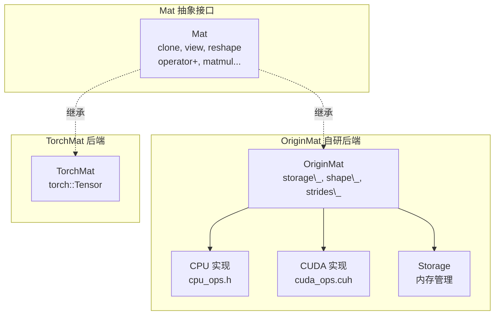
```mermaid
flowchart TB
    subgraph MatInterface["Mat 抽象接口"]
        Mat["Mat<br/>clone, view, reshape<br/>operator+, matmul..."]
    end
    
    subgraph OriginBackend["OriginMat 自研后端"]
        OriginMat["OriginMat<br/>storage\_, shape\_, strides\_"]
        CPUOps["CPU 实现<br/>cpu_ops.h"]
        CUDEOps["CUDA 实现<br/>cuda_ops.cuh"]
        Storage["Storage<br/>内存管理"]
        OriginMat --> CPUOps
        OriginMat --> CUDEOps
        OriginMat --> Storage
    end
    
    subgraph TorchBackend["TorchMat 后端"]
        TorchMat["TorchMat<br/>torch::Tensor"]
    end
    
    Mat -.->|继承| OriginMat
    Mat -.->|继承| TorchMat
```

### 2.5.2 OriginMat 设计

OriginMat 是 OriginDL 的自研矩阵计算后端，使用 Storage 进行内存管理，支持 CPU/CUDA 计算。

**核心数据成员：**

| 成员 | 类型 | 说明 |
|------|------|------|
| `storage_` | shared_ptr\<Storage\> | 数据存储，拥有原始内存 |
| `shape_` | Shape | 张量形状 |
| `strides_` | vector\<size_t\> | 步长信息，用于非连续视图 |
| `dtype_` | DataType | 数据类型 |

**工厂方法：**

| 方法 | 说明 |
|------|------|
| from_scalar(scalar, shape, options) | 从标量创建张量 |
| from_memory(data, dtype, shape, options) | 从内存创建张量 |

**实现分支：** OriginMat 根据 device 分发到 `cpu_ops` 或 `cuda_ops`，通过 `device_common` 共享模板逻辑，`type_dispatcher` 实现 dtype 分发。

**算子文件组织**

OriginMat 作为 Mat 接口的后端实现，其 CPU 和 CUDA 算子实现都采用相同的分层文件组织方式，具有清晰的职责划分和调用关系。以 CUDA 实现为例说明如下：

**文件组织架构（以 CUDA 实现为例）：**

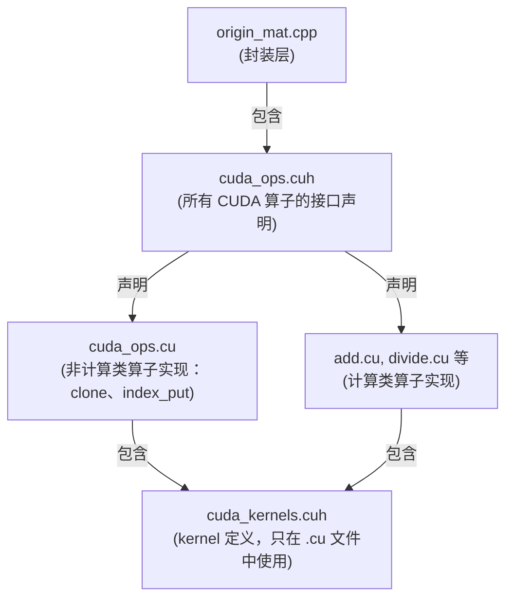
```mermaid
flowchart TD
    OriginMat["origin_mat.cpp<br/>(封装层)"]
    CudaOpsCuh["cuda_ops.cuh<br/>(所有 CUDA 算子的接口声明)"]
    CudaOpsCu["cuda_ops.cu<br/>(非计算类算子实现：clone、index_put)"]
    AddCu["add.cu, divide.cu 等<br/>(计算类算子实现)"]
    CudaKernelsCuh["cuda_kernels.cuh<br/>(kernel 定义，只在 .cu 文件中使用)"]
    
    OriginMat -->|包含| CudaOpsCuh
    CudaOpsCuh -->|声明| CudaOpsCu
    CudaOpsCuh -->|声明| AddCu
    CudaOpsCu -->|包含| CudaKernelsCuh
    AddCu -->|包含| CudaKernelsCuh
```

**调用顺序（以 CUDA 实现为例）：**

1. **封装层**：`origin_mat.cpp` 作为 OriginMat 的封装层，调用算子接口（CPU 调用 `cpu_ops.h`，CUDA 调用 `cuda_ops.cuh`）
2. **接口声明层**：统一接口声明文件（CPU 为 `cpu_ops.h`，CUDA 为 `cuda_ops.cuh`）声明所有算子的接口，供封装层调用
3. **实现层**：
   - 非计算类算子实现文件（CPU 为 `cpu_ops.cpp`，CUDA 为 `cuda_ops.cu`）：实现非计算类算子（如 `clone`、`index_put`），按功能分类组织
   - 计算类算子实现文件（CPU 为 `add.cpp`、`divide.cpp` 等，CUDA 为 `add.cu`、`divide.cu` 等）：实现计算类算子（如 `add`、`divide`），按算子分类组织
4. **Kernel 层**：基础操作定义文件（CPU 为 `cpu_kernels.h`，CUDA 为 `cuda_kernels.cuh`）定义所有基础操作函数，被所有实现文件包含

**设计原则：**

- **职责分离**：非计算类算子（数据操作）与计算类算子（数学运算）分开组织
- **接口统一**：所有算子通过统一的接口声明文件（`cpu_ops.h` / `cuda_ops.cuh`）统一声明，便于管理和维护
- **实现隔离**：基础操作定义集中在 kernel 文件（`cpu_kernels.h` / `cuda_kernels.cuh`），只在实现文件中使用，不暴露给上层

### 2.5.3 TorchMat 简要说明

TorchMat 是基于 LibTorch 的 Mat 实现，将 OriginDL 的 Mat 接口桥接到 `torch::Tensor`，用于复用 LibTorch 的高性能算子。编译时需启用 LibTorch 依赖。

### 2.5.4 Storage 与完整内存层次

Storage 是数据拥有者，管理原始内存 allocation/deallocation。从 Tensor 到物理内存的完整层次如下：

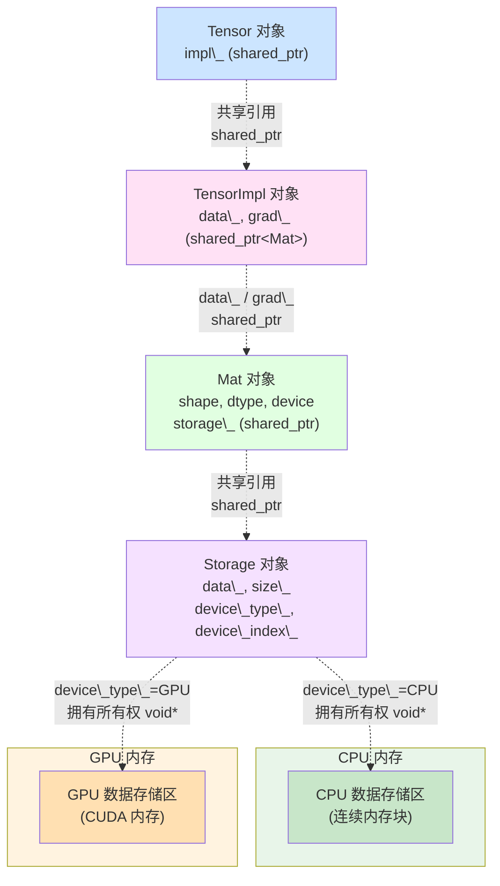
```mermaid
flowchart TB
    Tensor["Tensor 对象<br/>impl\_ (shared_ptr)"]
    
    TensorImpl["TensorImpl 对象<br/>data\_, grad\_ (shared_ptr&lt;Mat&gt;)"]
    
    Mat["Mat 对象<br/>shape, dtype, device<br/>storage\_ (shared_ptr)"]
    
    Storage["Storage 对象<br/>data\_, size\_<br/>device\_type\_, device\_index\_"]
    
    subgraph CPU["CPU 内存"]
        CPUData["CPU 数据存储区<br/>(连续内存块)"]
    end
    
    subgraph GPU["GPU 内存"]
        GPUData["GPU 数据存储区<br/>(CUDA 内存)"]
    end
    
    Tensor -.->|共享引用<br/>shared_ptr| TensorImpl
    TensorImpl -.->|data\_ / grad\_<br/>shared_ptr| Mat
    Mat -.->|共享引用<br/>shared_ptr| Storage
    Storage -.->|device\_type\_=CPU<br/>拥有所有权 void*| CPUData
    Storage -.->|device\_type\_=GPU<br/>拥有所有权 void*| GPUData
    
    style Tensor fill:#cce5ff
    style TensorImpl fill:#ffe1f5
    style Mat fill:#e1ffe1
    style Storage fill:#f5e1ff
    style CPU fill:#e8f5e9
    style GPU fill:#fff3e0
    style CPUData fill:#c8e6c9
    style GPUData fill:#ffe0b2
```

**层次职责：** Tensor 层值语义包装，仅含 `impl_`，拷贝时共享 TensorImpl；TensorImpl 层管理 `data_`、`grad_` 和计算图，拷贝时深拷贝 `data_` 和 `grad_`；Mat 层抽象接口，可拥有 Storage 或作为视图；Storage 层数据拥有者，管理原始内存，可被多个 Mat 共享。

**Storage 类图：**

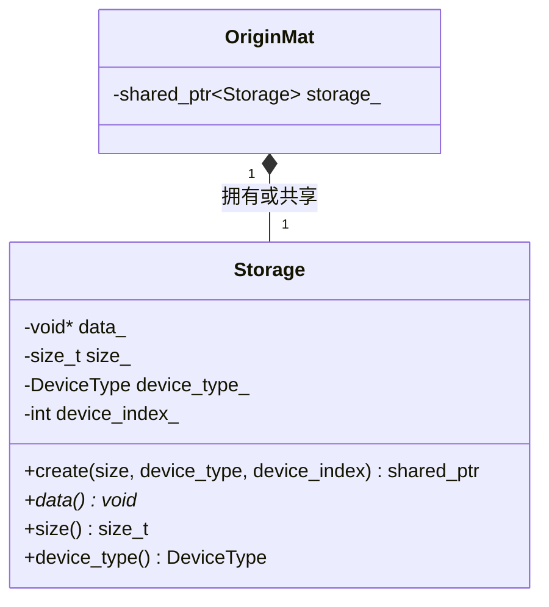
```mermaid
classDiagram
    class Storage {
        -void* data_
        -size_t size_
        -DeviceType device_type_
        -int device_index_
        +create(size, device_type, device_index) shared_ptr
        +data() void*
        +size() size_t
        +device_type() DeviceType
    }
    
    class OriginMat {
        -shared_ptr~Storage~ storage_
    }
    
    OriginMat "1" *-- "1" Storage : 拥有或共享
```

**设计要点：**

- Storage 禁用拷贝，仅支持移动；通过 `MemoryPool` 管理内存池
- OriginMat 拥有 Storage 或作为视图共享 Storage（通过 `view()` 创建的 Mat 共享同一 Storage）
- 支持 CPU 和 CUDA 设备，通过 `device_type_` 和 `device_index_` 区分

### 2.5.5 视图设计：利用视图减少拷贝

Mat 层的 `view`、`reshape`、`transpose` 等接口使用视图，在满足语义的前提下共享 Storage，避免使用 `clone` 重新分配内存并拷贝数据。

**设计思路：** 形状变换（reshape、transpose）优先返回视图，仅调整 shape/strides，不分配新 Storage；仅在无法形成合法视图时（如非连续数据 reshape）才 fallback 到 `clone`。

| 操作        | 实现方式                     | 是否拷贝     | 说明                                                         |
| ----------- | ---------------------------- | ------------ | ------------------------------------------------------------ |
| `view`      | 视图                         | 零拷贝       | 共享 Storage，仅改 shape/strides，O(1)                       |
| `reshape`   | 连续→视图；非连续→clone+view | 连续时零拷贝 | 连续数据直接 `view()`；非连续需先 `contiguous()`（内部 `clone`）再 `view()` |
| `transpose` | 当前为拷贝                   | 拷贝         | 分配新 Storage 并拷贝数据；未来可优化为视图转置              |

**与 clone 的对比：** `clone` 始终分配新 Storage 并深拷贝，用于需要独立副本的场景；`view`/`reshape`（连续时）则不分配、不拷贝，多个 Mat 共享同一块内存。

```cpp
// origin_mat.cpp: OriginMat::reshape — 优先视图，避免 clone
std::unique_ptr<Mat> OriginMat::reshape(const Shape &new_shape) const {
    if (new_shape.elements() != shape_.elements()) { /* 校验 */ }
    if (is_contiguous()) {
        return view(new_shape);  // 视图，零拷贝
    }
    auto contiguous_mat = contiguous();  // 非连续时不得已才 clone
    return contiguous_mat->view(new_shape);
}
```

## 2.6 内存所有权设计

### 2.6.1 完整内存层次结构

#### 内存所有权设计

OriginDL 采用分层所有权模型：每一层明确「谁拥有数据、谁共享引用」，避免悬空指针和内存泄漏。

**所有权层级与引用语义：**

| 层级 | 持有方式 | 拷贝语义 | 说明 |
|------|----------|----------|------|
| Tensor → TensorImpl | shared_ptr | 浅拷贝，共享 | 多个 Tensor 可共享同一 TensorImpl |
| TensorImpl → Mat (`data_`, `grad_`) | shared_ptr | 深拷贝（`clone`） | TensorImpl 拷贝时 `data_`、`grad_` 各自 `clone`，逻辑独立 |
| OriginMat → Storage | shared_ptr | 拥有或共享 | `clone()` 创建新 Storage；`view()` 共享原 Storage |
| Storage → void* | 独占 | 不可拷贝 | Storage 拥有原始内存，析构时通过 MemoryPool 释放 |

**拥有 vs 共享：**

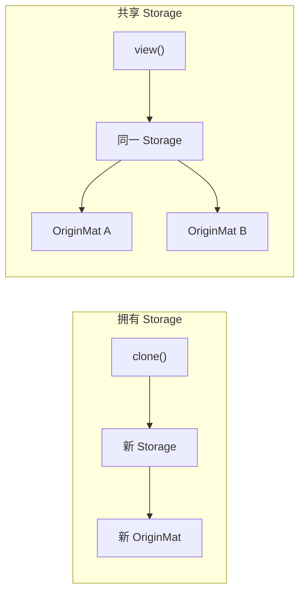
```mermaid
flowchart LR
    subgraph Own["拥有 Storage"]
        Clone["clone()"]
        NewStorage["新 Storage"]
        NewMat1["新 OriginMat"]
        Clone --> NewStorage --> NewMat1
    end
    
    subgraph Share["共享 Storage"]
        View["view()"]
        SameStorage["同一 Storage"]
        MatA["OriginMat A"]
        MatB["OriginMat B"]
        View --> SameStorage
        SameStorage --> MatA
        SameStorage --> MatB
    end
```

- **clone()**：分配新 Storage，拷贝数据，返回的 OriginMat 拥有该 Storage；ref_count = 1。
- **view()**：不分配新内存，新 OriginMat 共享原 Storage；shared_ptr 引用计数 +1，多视图共享同一块内存。

**TensorImpl 拷贝语义：** 拷贝构造函数对 `data_` 和 `grad_` 调用 `clone()`，保证 TensorImpl 拷贝后彼此独立；计算图信息（`creator_`、`generation_`）直接复制。

**梯度累积时的所有权：** `backward` 时，若 `grad_` 为空，则 `grad_ = gx.data_`（共享梯度 Mat，不分配新内存）；若 `grad_` 非空，则 `grad_->add_inplace(gx.data_)`（原地累加，不创建新对象）。二者都避免多余分配。

**Storage 与 MemoryPool：** Storage 构造时从 MemoryPool 申请内存，析构时归还；Storage 禁用拷贝、只支持移动，保证同一块内存仅由一个 Storage 实例管理生命周期。多个 OriginMat 通过 shared_ptr 共享同一 Storage，当最后一个 OriginMat 析构时，Storage 析构并释放内存。

**生命周期与释放顺序：** Tensor 析构 → `impl_` ref_count-1；TensorImpl 析构 → `data_`、`grad_` ref_count-1；OriginMat 析构 → `storage_` ref_count-1；Storage 析构 → 归还 MemoryPool。引用计数确保无悬空指针和重复释放。

## 2.6 张量打印系统设计

OriginDL的张量打印系统旨在提供清晰、直观的张量数据展示，同时保持与主流深度学习框架的一致性。

### 2.6.1 打印格式设计

**标量张量 (0维)**

```
(1.0)
```

**一维张量 (1维)**

```
[1.0, 2.0, 3.0]
```

**二维张量 (2维)**

```
[[1, 2, 3],
 [4, 5, 6]]
```

**高维张量 (3维及以上，如4维打印如下)**

```
(0,0,.,.) = 
     0       1       2
     3       4       5
(0,1,.,.) = 
     6       7       8
     9      10      11
```

不同的深度学习框架打印 shape(2,3,2,3) 的效果，裸数据均为数组[0, 1, 2, ..., 33, 34, 35]。

```
PyTorch 打印效果：
tensor([[[[ 0.,  1.,  2.],
          [ 3.,  4.,  5.]],

         [[ 6.,  7.,  8.],
          [ 9., 10., 11.]],

         [[12., 13., 14.],
          [15., 16., 17.]]],


        [[[18., 19., 20.],
          [21., 22., 23.]],

         [[24., 25., 26.],
          [27., 28., 29.]],

         [[30., 31., 32.],
          [33., 34., 35.]]]])

LibTorch 打印效果：
(1,1,.,.) = 
  0  1  2
  3  4  5

(2,1,.,.) = 
  18  19  20
  21  22  23

(1,2,.,.) = 
   6   7   8
   9  10  11

(2,2,.,.) = 
  24  25  26
  27  28  29

(1,3,.,.) = 
  12  13  14
  15  16  17

(2,3,.,.) = 
  30  31  32
  33  34  35
[ CPUFloatType{2,3,2,3} ]
```

本人认为 libtorch 的切片风格，再高维张张量中可以更好的看到细节，因此采用了切片的方式，其次 libtorch 的打印内容存在跳跃，与内存布局0~35的连续顺序不合，此时 Pytorch 的打印风格与内存布局相符。 Origin 结合了这两者的风格，打印效果如下所示：

```
(0,0,.,.) = 
     0       1       2
     3       4       5
(0,1,.,.) = 
     6       7       8
     9      10      11
(0,2,.,.) = 
    12      13      14
    15      16      17
(1,0,.,.) = 
    18      19      20
    21      22      23
(1,1,.,.) = 
    24      25      26
    27      28      29
(1,2,.,.) = 
    30      31      32
    33      34      35

 OriginMat(shape=[2, 3, 2, 3], dtype=float32, device=cpu)
```

切片打印的顺序:

```
// LibTorch风格
(0,0,.,.) → (1,0,.,.) → (0,1,.,.) → (1,1,.,.) → (0,2,.,.) → (1,2,.,.)

// OriginDL 风格
(0,0,.,.) → (0,1,.,.) → (0,2,.,.) → (1,0,.,.) → (1,1,.,.) → (1,2,.,.)


内存布局: [0,1,2,3,4,5, 6,7,8,9,10,11, 12,13,14,15,16,17, 18,19,20,21,22,23, ...]
          ↑─────────↑  ↑─────────↑  ↑─────────↑  ↑─────────↑
          (0,0,.,.)   (0,1,.,.)   (0,2,.,.)   (1,0,.,.)


LibTorch风格的访问顺序：
- `(0,0,.,.)` → 内存地址 0-5
- `(1,0,.,.)` → 内存地址 18-23 (跳跃13个元素)
- `(0,1,.,.)` → 内存地址 6-11 (回跳17个元素)
从内存布局上看，OriginDL中打印的相邻切片在内存布局上是相邻的。
```

使用0-based索引，从编程习惯上，更符合符合C++/Python等主流编程语言的索引约定。

```cpp
// OriginDL采用0-based索引，第一个切片索引为 (0,0,.,.)
(0,0,.,.) = 
     0       1       2
     3       4       5

// 而不是LibTorch的1-based索引，第一个切片的索引为 (1,1,.,.)
(1,1,.,.) = 
     0       1       2
     3       4       5
```


# 3. 动态计算图构建

## 3.1 计算图的基本概念

计算图是 OriginDL 自动求导系统的核心数据结构，由**节点（Tensor）**和**边（Operator）**组成，在前向传播时自动构建。

**计算图的核心作用：** 记录计算过程和依赖关系，支持反向传播时自动计算梯度。

OriginDL 采用**动态计算图**设计，计算图在前向传播时动态构建。与静态图相比，动态图在灵活性和易用性方面具有明显优势。

**动态图 vs 静态图对比：**

| 特性 | 动态图（OriginDL） | 静态图（TensorFlow 1.x, PNNX） |
|------|------------------|-------------------------------|
| **构建时机** | 运行时动态构建 | 编译时或加载时构建 |
| **图结构** | 每次前向传播可能不同 | 图结构固定不变 |
| **控制流** | 原生支持 if/for/while | 需要特殊算子（tf.cond, tf.while_loop） |
| **易用性** | 代码直观，Python 风格 | 需要显式构建图，代码复杂 |
| **调试** | 可以打印中间结果，易于调试 | 需要特殊工具（TensorBoard） |
| **性能** | 运行时开销，性能略低 | 编译优化，性能更高 |
| **适用场景** | 训练、研究、快速原型 | 推理、生产部署 |

**PNNX 的静态图特性：** OriginDL 的 PNNX 模块用于模型推理，采用静态图设计。PNNX 模型从 `.param` 和 `.bin` 文件加载后，通过 `build()` 构建固定的计算图结构，之后只执行 `forward()` 推理，图结构不再变化。这种设计适合推理场景，可以获得更好的性能。

**为什么 OriginDL 选择动态图：**

1. **开发效率优先**：动态图让用户代码更直观，无需显式构建图，降低学习成本，适合研究和快速原型开发
2. **灵活性需求**：支持条件分支、循环等控制流，适合复杂的模型结构。
3. **调试友好**：可以随时打印中间结果，检查计算过程，便于问题定位
4. **PyTorch 兼容**：与 PyTorch 的设计理念一致，便于从 PyTorch 迁移代码

**设计权衡：** 动态图牺牲了一定的性能（运行时构建），但换来了更好的灵活性和用户体验。对于需要极致性能的推理场景，OriginDL 通过 PNNX 模块支持静态图推理，以兼顾训练时的灵活性和推理时的性能。

## 3.2 计算图的数据结构设计

### 3.2.1 节点（TensorImpl）与边（Operator）的设计

计算图采用**节点-边模型**，节点表示数据（Tensor），边表示计算（Operator）。这种设计实现了**职责分离**：节点负责数据存储和梯度管理，边负责计算逻辑。

**节点（TensorImpl）的核心数据成员：**

| 成员 | 类型 | 作用 |
|------|------|------|
| `data_` | `shared_ptr<Mat>` | 存储节点数据 |
| `grad_` | `shared_ptr<Mat>` | 存储节点梯度（反向传播时使用） |
| `creator_` | `shared_ptr<Operator>` | 指向创建该节点的 Operator（建立节点到边的连接） |
| `generation_` | `int` | 拓扑排序代数，用于反向传播时确定计算顺序 |
| `requires_grad_` | `bool` | 是否需要梯度计算 |

**边（Operator）的核心数据成员：**

| 成员 | 类型 | 作用 |
|------|------|------|
| `inputs_` | `vector<Tensor>` | 输入节点列表（值语义的 Tensor，保存输入引用） |
| `outputs_` | `vector<weak_ptr<TensorImpl>>` | 输出节点列表（使用 `weak_ptr` 避免循环引用） |
| `generation_` | `int` | 拓扑排序代数，等于输入的最大 `generation_` |

### 3.2.2 连接关系的架构（类图）

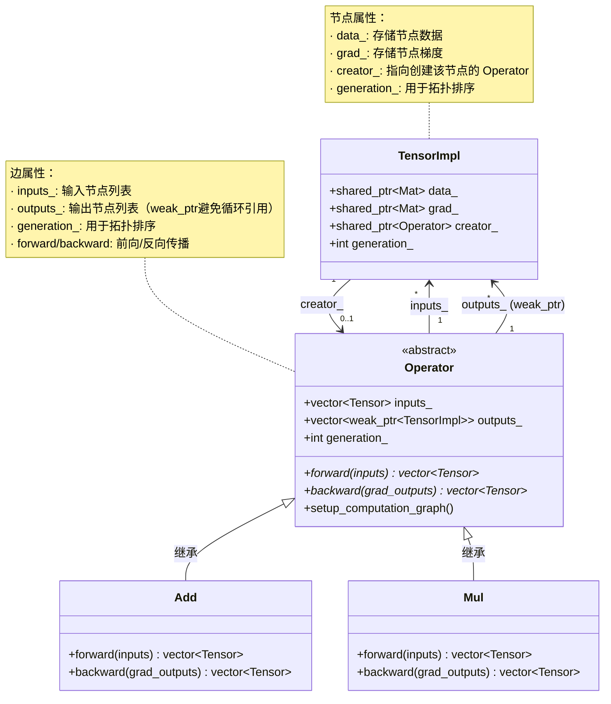
```mermaid
classDiagram
    class TensorImpl {
        +shared_ptr~Mat~ data_
        +shared_ptr~Mat~ grad_
        +shared_ptr~Operator~ creator_
        +int generation_
    }
    
    class Operator {
        <<abstract>>
        +vector~Tensor~ inputs_
        +vector~weak_ptr~TensorImpl~~ outputs_
        +int generation_
        +forward(inputs)* vector~Tensor~
        +backward(grad_outputs)* vector~Tensor~
        +setup_computation_graph()
    }
    
    class Add {
        +forward(inputs) vector~Tensor~
        +backward(grad_outputs) vector~Tensor~
    }
    
    class Mul {
        +forward(inputs) vector~Tensor~
        +backward(grad_outputs) vector~Tensor~
    }
    
    TensorImpl "1" --> "0..1" Operator : creator_
    Operator "1" --> "*" TensorImpl : inputs_
    Operator "1" --> "*" TensorImpl : outputs_ (weak_ptr)
    Operator <|-- Add : 继承
    Operator <|-- Mul : 继承
    
    note for TensorImpl "节点属性：<br/>· data\_: 存储节点数据<br/>· grad\_: 存储节点梯度<br/>· creator\_: 指向创建该节点的 Operator<br/>· generation\_: 用于拓扑排序"
    note for Operator "边属性：<br/>· inputs\_: 输入节点列表<br/>· outputs\_: 输出节点列表（weak_ptr避免循环引用）<br/>· generation\_: 用于拓扑排序<br/>· forward/backward: 前向/反向传播"
```

**连接关系设计：** Tensor 通过 `creator_` 单向连接到 Operator（用于反向传播时回溯），Operator 通过 `inputs_` 和 `outputs_` 双向观察 Tensor（用于前向和反向传播时访问数据），其中 `outputs_` 使用 `weak_ptr` 避免循环引用，详见 [3.5 `weak_ptr` 设计](#35-weak_ptr-设计避免循环引用)。

## 3.3 前向传播时的自动构建机制

### 3.3.1 构建流程（时序图）

计算图在前向传播时自动构建，用户无需显式创建。当用户执行 `auto y = x * 2;` 时，系统自动完成以下步骤：

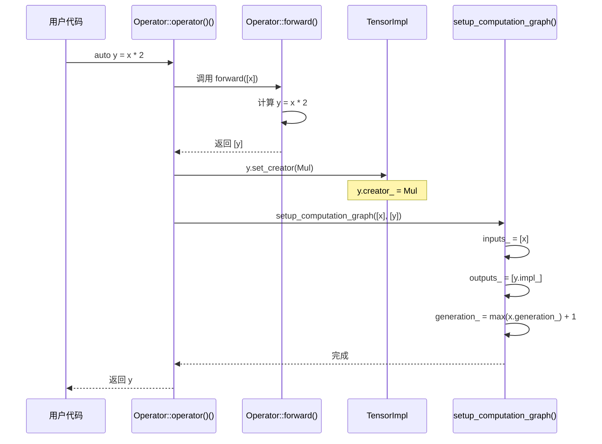
```mermaid
sequenceDiagram
    participant User as 用户代码
    participant Op as Operator::operator()()
    participant Forward as Operator::forward()
    participant Tensor as TensorImpl
    participant Setup as setup_computation_graph()
    
    User->>Op: auto y = x * 2;
    Op->>Forward: 调用 forward([x])
    Forward->>Forward: 计算 y = x * 2
    Forward-->>Op: 返回 [y]
    Op->>Tensor: y.set_creator(Mul)
    Note over Tensor: y.creator_ = Mul
    Op->>Setup: setup_computation_graph([x], [y])
    Setup->>Setup: inputs_ = [x]
    Setup->>Setup: outputs_ = [y.impl_]
    Setup->>Setup: generation_ = max(x.generation_) + 1
    Setup-->>Op: 完成
    Op-->>User: 返回 y
```

**构建流程说明：**

1. **运算符重载**：用户代码 `x * 2` 触发运算符重载，创建 `Mul` 算子
2. **前向计算**：调用 `Mul::forward()` 计算输出 `y`
3. **检查梯度需求**：检查输入是否需要梯度，决定是否建立计算图
4. **建立连接**：调用 `set_creator()` 设置 `y.creator_ = Mul`
5. **保存图结构**：调用 `setup_computation_graph()` 保存 `inputs_` 和 `outputs_`

### 3.3.2 `requires_grad` 的传播机制

**设计原则：** 如果任何一个输入需要梯度，输出也需要梯度。这简化了用户使用，系统自动管理梯度计算。

**传播规则：**

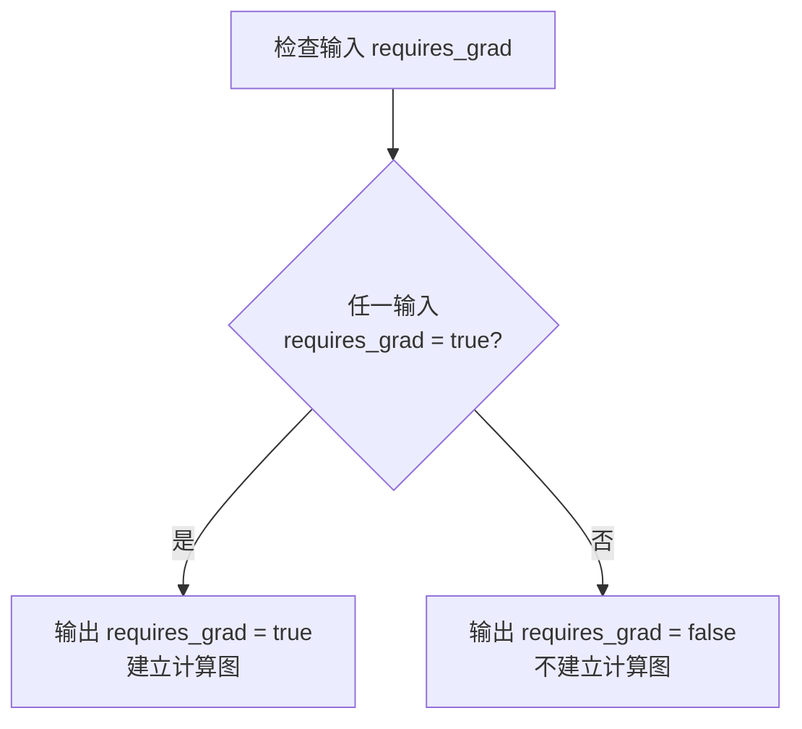
```mermaid
flowchart TD
    Check["检查输入 requires_grad"]
    AnyTrue{"任一输入<br/>requires_grad = true?"}
    SetTrue["输出 requires_grad = true<br/>建立计算图"]
    SetFalse["输出 requires_grad = false<br/>不建立计算图"]
    
    Check --> AnyTrue
    AnyTrue -->|是| SetTrue
    AnyTrue -->|否| SetFalse
```

**设计原因：** 这种设计让用户只需在输入 Tensor 上设置 `requires_grad`，系统自动传播到所有相关输出，无需手动管理每个中间 Tensor 的梯度需求。PyTorch 也采用相同的设计。

### 3.3.3 计算图连接的建立

**`set_creator()` 的作用：** 建立从节点（Tensor）到边（Operator）的单向连接，使得反向传播时可以从输出节点回溯到创建它的算子。

- **记录创建者**：每个 Tensor 通过 `creator_` 记录创建它的 Operator
- **设置代数**：同时设置 `generation_ = creator_->generation_ + 1`
- **使用 `enable_shared_from_this`**：Operator 继承 `enable_shared_from_this`，通过 `shared_from_this()` 获取自身的 `shared_ptr`，避免循环引用

**`setup_computation_graph()` 的作用：** 在 Operator 中保存计算图结构信息。

- **保存输入**：`inputs_ = inputs`（值语义的 Tensor，保存输入引用）
- **保存输出**：`outputs_ = [output.impl_, ...]`（`weak_ptr<TensorImpl>`，避免循环引用）
- **设置代数**：`generation_ = max(inputs.generation_)`

## 3.4 `generation_` 的设计：拓扑排序代数

**拓扑排序简介：** 拓扑排序是对有向无环图（DAG）节点的一种排序方法，使得对于任意边 `u → v`，节点 `u` 在排序中出现在节点 `v` 之前。在计算图的反向传播中，拓扑排序确保梯度计算的正确顺序：必须先计算输出节点的梯度，再计算输入节点的梯度（从输出端到输入端）。

### 3.4.1 `generation_` 的计算规则

`generation_` 是拓扑排序的代数表示，用于确保反向传播时梯度计算的正确顺序。

**计算规则：**

- **输入节点**：`generation_ = 0`（用户创建的 Tensor）
- **Operator**：`generation_ = max(inputs.generation_)`（等于输入的最大代数）
- **输出节点**：`generation_ = creator_->generation_ + 1`（比创建它的 Operator 大 1）

**设计优势：** 这种简单的代数计算避免了复杂的全局拓扑排序，在前向传播时即可确定反向传播的顺序。


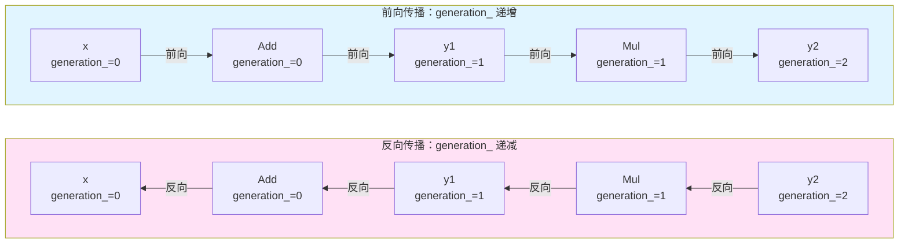
```mermaid
flowchart LR
    subgraph Backward["反向传播：generation_ 递减"]
        direction RL
        X2["x<br/>generation_=0"]
        Add2["Add<br/>generation_=0"]
        Y1_2["y1<br/>generation_=1"]
        Mul2["Mul<br/>generation_=1"]
        Y2_2["y2<br/>generation_=2"]
        
        Y2_2 -->|反向| Mul2
        Mul2 -->|反向| Y1_2
        Y1_2 -->|反向| Add2
        Add2 -->|反向| X2
    end

    subgraph Forward["前向传播：generation_ 递增"]
        direction LR
        X["x<br/>generation_=0"]
        Add["Add<br/>generation_=0"]
        Y1["y1<br/>generation_=1"]
        Mul["Mul<br/>generation_=1"]
        Y2["y2<br/>generation_=2"]
        
        X -->|前向| Add
        Add -->|前向| Y1
        Y1 -->|前向| Mul
        Mul -->|前向| Y2
    end

    style Backward fill:#ffe1f5
    style Forward fill:#e1f5ff
```

### 3.4.2 在不同计算图结构中的应用

`generation_` 的设计能够正确处理各种计算图结构：

**链式结构示例：**

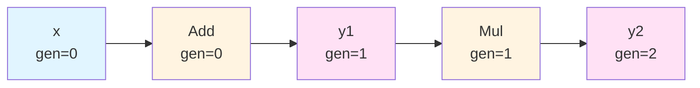
```mermaid
flowchart LR
    X["x<br/>gen=0"] --> Add["Add<br/>gen=0"]
    Add --> Y1["y1<br/>gen=1"]
    Y1 --> Mul["Mul<br/>gen=1"]
    Mul --> Y2["y2<br/>gen=2"]
    
    style X fill:#e1f5ff
    style Add fill:#fff4e1
    style Y1 fill:#ffe1f5
    style Mul fill:#fff4e1
    style Y2 fill:#ffe1f5
```

反向传播顺序：y2 → Mul → y1 → Add → x（按 `generation_` 从大到小）

**分支结构示例：**

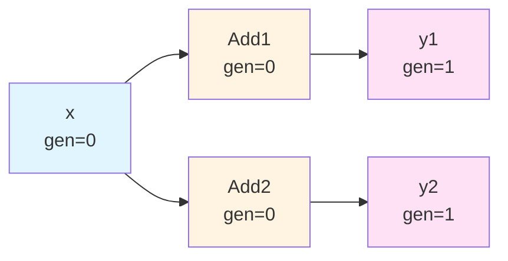
```mermaid
flowchart LR
    X["x<br/>gen=0"] --> Add1["Add1<br/>gen=0"]
    X --> Add2["Add2<br/>gen=0"]
    Add1 --> Y1["y1<br/>gen=1"]
    Add2 --> Y2["y2<br/>gen=1"]
    
    style X fill:#e1f5ff
    style Add1 fill:#fff4e1
    style Add2 fill:#fff4e1
    style Y1 fill:#ffe1f5
    style Y2 fill:#ffe1f5
```

两个分支的 `generation_` 相同，反向传播时按加入队列的顺序处理。

**合并结构示例：**

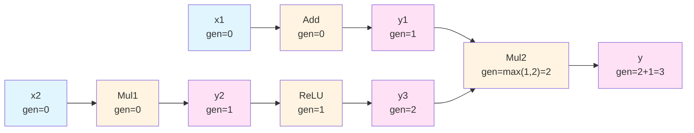
```mermaid
flowchart LR
    X1["x1<br/>gen=0"] --> Add["Add<br/>gen=0"]
    X2["x2<br/>gen=0"] --> Mul1["Mul1<br/>gen=0"]
    Add --> Y1["y1<br/>gen=1"]
    Mul1 --> Y2["y2<br/>gen=1"]
    Y2 --> ReLU["ReLU<br/>gen=1"]
    ReLU --> Y3["y3<br/>gen=2"]
    Y1 --> Mul2["Mul2<br/>gen=max(1,2)=2"]
    Y3 --> Mul2
    Mul2 --> Y["y<br/>gen=2+1=3"]
    
    style X1 fill:#e1f5ff
    style X2 fill:#e1f5ff
    style Add fill:#fff4e1
    style Mul1 fill:#fff4e1
    style Y1 fill:#ffe1f5
    style Y2 fill:#ffe1f5
    style ReLU fill:#fff4e1
    style Y3 fill:#ffe1f5
    style Mul2 fill:#fff4e1
    style Y fill:#ffe1f5
```

合并节点的 `generation_` 计算流程：Mul2 的 `generation_ = max(y1.generation_, y3.generation_) = max(1, 2) = 2`，输出 y 的 `generation_ = Mul2.generation_ + 1 = 3`，确保反向传播时先处理合并节点。

## 3.5 `weak_ptr` 设计：避免循环引用

**循环引用问题：** 如果 `outputs_` 使用 `shared_ptr`，会导致循环引用路径 `Operator → outputs_ → TensorImpl → creator_ → Operator`，造成内存泄漏。Operator 持有 outputs_ 的 `shared_ptr`，TensorImpl 持有 creator_ 的 `shared_ptr`，形成循环，引用计数永远不为 0，无法释放。

**解决方案：** `outputs_` 使用 `weak_ptr<TensorImpl>`，Operator 不拥有输出 Tensor，只持有弱引用。Operator 通过弱引用访问输出 Tensor，不控制其生命周期。

**生命周期管理：** 前向传播时，`outputs_` 存储 `weak_ptr<TensorImpl>`，不增加引用计数，避免循环引用。反向传播时，通过 `weak_ptr.lock()` 转换为 `shared_ptr`（如果有效），确保在计算期间 Tensor 不会被释放。如果 `weak_ptr` 失效（用户代码中的 Tensor 已超出作用域），跳过该输出，这是正常的行为，不影响其他路径的梯度计算。

**设计权衡：** 使用 `weak_ptr` 牺牲了少量性能（`lock()` 的开销），但换来了内存安全和自动管理，避免了复杂的手动生命周期管理。

# 4. 反向传播实现

## 4.1 反向传播的架构设计

反向传播是自动求导系统的核心，通过遍历计算图从输出端向输入端传播梯度。OriginDL 的反向传播设计遵循以下理念：

**自动化设计：** 用户只需调用 `backward()`，系统自动处理所有细节，包括梯度计算顺序、多路径梯度累积、内存管理等。

**正确性保证：** 通过拓扑排序确保梯度计算顺序正确，支持各种计算图结构（链式、分支、合并等）。

**反向传播的整体流程：**

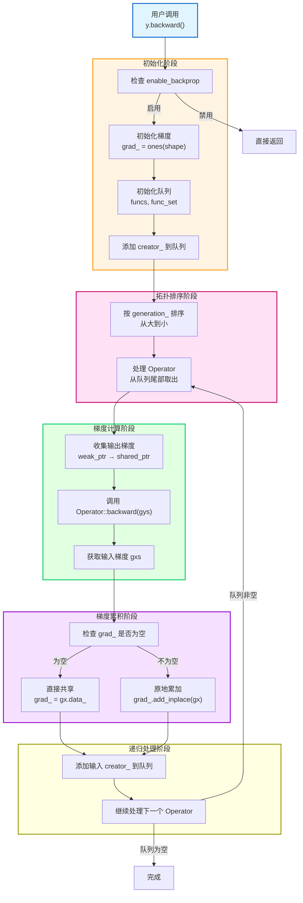
```mermaid
flowchart TD
    Start["用户调用<br/>y.backward()"]
    
    subgraph Init["初始化阶段"]
        Check["检查 enable_backprop"]
        InitGrad["初始化梯度<br/>grad_ = ones(shape)"]
        InitQueue["初始化队列<br/>funcs, func_set"]
        AddCreator["添加 creator_ 到队列"]
    end
    
    subgraph TopoSort["拓扑排序阶段"]
        Sort["按 generation_ 排序<br/>从大到小"]
        Process["处理 Operator<br/>从队列尾部取出"]
    end
    
    subgraph GradCalc["梯度计算阶段"]
        CollectGrad["收集输出梯度<br/>weak_ptr → shared_ptr"]
        CallBackward["调用 Operator::backward(gys)"]
        GetInputGrad["获取输入梯度 gxs"]
    end
    
    subgraph Accumulate["梯度累积阶段"]
        CheckGrad["检查 grad_ 是否为空"]
        DirectShare["直接共享<br/>grad_ = gx.data_"]
        InplaceAdd["原地累加<br/>grad_.add_inplace(gx)"]
    end
    
    subgraph Recursive["递归处理阶段"]
        AddInputCreator["添加输入 creator_ 到队列"]
        Continue["继续处理下一个 Operator"]
    end
    
    Start --> Check
    Check -->|启用| InitGrad
    Check -->|禁用| End1["直接返回"]
    InitGrad --> InitQueue
    InitQueue --> AddCreator
    AddCreator --> Sort
    Sort --> Process
    Process --> CollectGrad
    CollectGrad --> CallBackward
    CallBackward --> GetInputGrad
    GetInputGrad --> CheckGrad
    CheckGrad -->|为空| DirectShare
    CheckGrad -->|不为空| InplaceAdd
    DirectShare --> AddInputCreator
    InplaceAdd --> AddInputCreator
    AddInputCreator --> Continue
    Continue -->|队列非空| Process
    Continue -->|队列为空| End2["完成"]
    
    style Start fill:#e1f5ff,stroke:#0066cc,stroke-width:2px
    style Init fill:#fff4e1,stroke:#ff9900,stroke-width:2px
    style TopoSort fill:#ffe1f5,stroke:#cc0066,stroke-width:2px
    style GradCalc fill:#e1ffe1,stroke:#00cc66,stroke-width:2px
    style Accumulate fill:#f5e1ff,stroke:#9900cc,stroke-width:2px
    style Recursive fill:#ffffe1,stroke:#999900,stroke-width:2px
```

**流程说明：**

1. **初始化阶段**：检查 `enable_backprop` 和 `requires_grad_`，初始化输出梯度为全 1，初始化拓扑排序队列
2. **拓扑排序阶段**：按 `generation_` 从大到小排序，从队列尾部取出 Operator
3. **梯度计算阶段**：收集输出梯度（`weak_ptr` → `shared_ptr`），调用 `Operator::backward()` 计算输入梯度
4. **梯度累积阶段**：根据 `grad_` 是否为空，选择直接共享或原地累加策略
5. **递归处理阶段**：添加输入的 `creator_` 到队列，继续处理下一个 Operator

## 4.2 拓扑排序算法设计

反向传播需要按照正确的顺序计算梯度：必须先计算输出节点的梯度，再计算输入节点的梯度。拓扑排序算法确保了这个顺序的正确性。OriginDL 使用 `generation_` 作为拓扑排序的代数表示，在前向传播时即可确定反向传播的顺序，避免了复杂的全局拓扑排序算法。

拓扑排序的核心是递归处理：从输出 Tensor 的 `creator_` 开始，递归添加所有输入的 `creator_` 到队列，按 `generation_` 排序后处理。

**数据结构选择：**

- **`list<shared_ptr<Operator>> funcs`**：用于存储待处理的 Operator，支持排序和从尾部取出
- **`set<shared_ptr<Operator>> func_set`**：用于去重，避免重复处理同一个 Operator

**设计原因：** `list` 支持高效的排序和尾部操作，`set` 提供 O(log n) 的查找和去重。

**排序策略：**

- **排序依据**：按 `generation_` 从小到大排序（`generation_` 小的在前）
- **处理顺序**：从队列尾部取出（`generation_` 最大的先处理）
- **排序时机**：每次添加新 Operator 后重新排序，确保队列始终有序

**去重机制：** 使用 `func_set` 检查 Operator 是否已加入队列，避免重复处理。

**终止条件：** 队列为空时，所有相关 Operator 都已处理完毕。

**设计优势：** 这种设计确保了反向传播时从输出端到输入端的正确顺序，同时避免了复杂的全局拓扑排序。

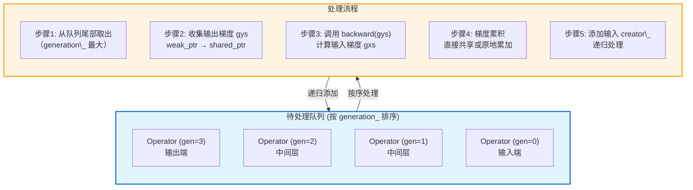
```mermaid
flowchart TB
    subgraph Queue["待处理队列 (按 generation_ 排序)"]
        direction TB
        Op3["Operator (gen=3)<br/>输出端"]
        Op2["Operator (gen=2)<br/>中间层"]
        Op1["Operator (gen=1)<br/>中间层"]
        Op0["Operator (gen=0)<br/>输入端"]
    end
    
    subgraph Process["处理流程"]
        direction TB
        Step1["步骤1: 从队列尾部取出<br/>（generation\_ 最大）"]
        Step2["步骤2: 收集输出梯度 gys<br/>weak_ptr → shared_ptr"]
        Step3["步骤3: 调用 backward(gys)<br/>计算输入梯度 gxs"]
        Step4["步骤4: 梯度累积<br/>直接共享或原地累加"]
        Step5["步骤5: 添加输入 creator\_<br/>递归处理"]
    end
    
    Queue -->|按序处理| Process
    Process -->|递归添加| Queue
    
    style Queue fill:#e1f5ff,stroke:#0066cc,stroke-width:2px
    style Process fill:#fff4e1,stroke:#ff9900,stroke-width:2px
```

## 4.3 `weak_ptr` 转换机制

**转换时机：** 在反向传播的梯度计算阶段，需要访问输出 Tensor 的梯度时，将 `weak_ptr` 转换为 `shared_ptr`。

**转换机制：** `weak_ptr.lock()` 尝试将 `weak_ptr` 转换为 `shared_ptr`，如果有效则返回 `shared_ptr`，否则返回 `nullptr`。将转换后的 `shared_ptr` 临时保存在 `valid_outputs` 中，确保在 `backward()` 调用期间 Tensor 不会被释放。

**设计原因：** 这种设计确保了在梯度计算期间 Tensor 的生命周期，同时避免了循环引用。

**失效处理：** 如果 `weak_ptr` 失效（用户代码中的 Tensor 已超出作用域），跳过该输出，这是正常的行为，不影响其他路径的梯度计算。

**边界情况：** 如果所有 `weak_ptr` 都失效，跳过该 Operator，继续处理下一个。

## 4.4 梯度计算与累积

### 4.4.1 梯度计算流程（时序图）

**梯度计算步骤：**

1. **收集输出梯度**：从 `outputs_` 中收集所有输出 Tensor 的梯度（`weak_ptr` → `shared_ptr`）
2. **调用 `backward()`**：调用 `Operator::backward(gys)`，子类实现具体的梯度计算逻辑
3. **获取输入梯度**：`backward()` 返回输入梯度 `gxs`
4. **错误检查**：检查 `gxs.size() == inputs_.size()`，确保梯度数量匹配

### 4.4.2 梯度累积的两种策略

梯度累积处理多路径梯度传播的情况。当一个 Tensor 被多个 Operator 使用时，需要将所有路径的梯度累加。

**策略选择：**

| 条件 | 策略 | 实现 | 优势 |
|------|------|------|------|
| `grad_` 为空 | 直接共享 | `grad_ = gx.data_` | 避免内存分配和拷贝 |
| `grad_` 不为空 | 原地累加 | `grad_->add_inplace(gx.data_)` | 避免创建新对象，减少内存分配 |

**设计原因：** 两种策略针对不同场景优化内存使用，直接共享避免首次分配，原地累加避免重复分配。

梯度累积处理多路径梯度传播的情况。当一个 Tensor 被多个 Operator 使用时，需要将所有路径的梯度累加。

```mermaid
flowchart TD
    subgraph MultiPath["多路径梯度场景"]
        direction LR
        X["x (generation_=0)"]
        Mul["Mul"]
        Y1["y1"]
        Add1["Add"]
        Add2["Add"]
        Y2["y2"]
        Final["y (generation_=2)"]
        
        X -->|路径1| Mul
        Mul -->|路径1| Y1
        Y1 -->|路径1| Add1
        X -->|路径2| Add2
        Add2 -->|路径2| Y2
        Y1 -->|合并| Final
        Y2 -->|合并| Final
    end
    
    subgraph Accumulate["梯度累积过程"]
        direction TB
        Step1["步骤1: 路径1计算<br/>gx1 = backward(y → y1 → x)"]
        Step2["步骤2: 第一次累积<br/>x.grad\_ = gx1 (直接共享)"]
        Step3["步骤3: 路径2计算<br/>gx2 = backward(y → y2 → x)"]
        Step4["步骤4: 第二次累积<br/>x.grad\_.add_inplace(gx2)"]
        Step5["步骤5: 最终结果<br/>x.grad\_ = gx1 + gx2"]
    end
    
    MultiPath -->|反向传播| Accumulate
    
    style MultiPath fill:#e1f5ff,stroke:#0066cc,stroke-width:2px
    style Accumulate fill:#ffe1f5,stroke:#cc0066,stroke-width:2px
```

### 4.4.3 多路径梯度传播

多路径梯度传播是计算图中的常见场景，需要将所有路径的梯度累加。梯度累积策略能够正确处理这种情况。

**示例：** 一个 Tensor `x` 通过两条路径到达输出 `y`：
- 路径1：`x → Mul → y1 → Add → y`
- 路径2：`x → Add → y2 → Add → y`

反向传播时，`x` 会收到两条路径的梯度，需要累加：`x.grad_ = gx1 + gx2`

## 4.5 递归处理与终止

反向传播采用递归处理机制：处理完一个 Operator 后，将其输入的 `creator_` 添加到队列，继续处理下一个 Operator。

**递归流程：**

1. 从队列中取出 Operator（`generation_` 最大）
2. 计算梯度并累积到输入 Tensor
3. 将输入的 `creator_` 添加到队列（如果存在）
4. 继续处理下一个 Operator

**设计优势：** 这种递归设计自然地处理了复杂的计算图结构，无需显式的递归调用栈。

**终止条件：** 队列为空时，所有相关 Operator 都已处理完毕，反向传播完成。

**终止保证：** 由于 `generation_` 的设计，从输出端到输入端的路径是有限的，队列最终会为空。

```mermaid
flowchart TD
    Input["输入梯度 gx"]
    Check{"检查 x.grad_<br/>是否为空？"}
    Empty["grad_ 为空"]
    NotEmpty["grad_ 不为空"]
    
    DirectShare["直接共享<br/>x.grad_ = gx.data_<br/>避免拷贝"]
    InplaceAdd["原地累加<br/>x.grad_.add_inplace(gx.data_)<br/>避免分配新内存"]
    
    Result["梯度累积完成"]
    
    Input --> Check
    Check -->|是| Empty
    Check -->|否| NotEmpty
    Empty --> DirectShare
    NotEmpty --> InplaceAdd
    DirectShare --> Result
    InplaceAdd --> Result
    
    style Empty fill:#e1ffe1,stroke:#00cc66,stroke-width:2px
    style NotEmpty fill:#ffe1f5,stroke:#cc0066,stroke-width:2px
    style DirectShare fill:#e1f5ff,stroke:#0066cc,stroke-width:2px
    style InplaceAdd fill:#fff4e1,stroke:#ff9900,stroke-width:2px
```

## 4.6 边界情况处理

### 4.6.1 主要边界情况与处理策略

反向传播需要处理多种边界情况，确保系统的健壮性：

| 边界情况 | 处理策略 | 设计原因 |
|---------|---------|---------|
| `outputs_` 为空 | 跳过该 Operator | 可能是不需要梯度的中间节点 |
| 所有 `weak_ptr` 失效 | 跳过该 Operator | 用户代码中的 Tensor 已超出作用域，这是正常行为 |
| `gxs.size() != inputs_.size()` | 抛出错误 | 确保梯度数量与输入数量匹配 |
| `enable_backprop` 为 false | 直接返回 | 禁用梯度计算时跳过反向传播 |
| `requires_grad_` 为 false | 抛出错误 | 与 PyTorch 一致，明确提示用户错误 |

**设计原则：** 提前检查、优雅降级、清晰的错误信息，确保系统在各种情况下都能正确运行。

## 4.7 性能优化设计

### 4.7.1 内存优化（原地操作、延迟分配）

**原地操作：** 使用 `add_inplace()` 原地累加梯度，避免创建新对象，减少内存分配。

**延迟分配：** `grad_` 初始为 `nullptr`，仅在需要时分配，避免不必要的内存占用。

**直接共享：** 首次梯度累积时直接共享梯度数据，避免拷贝。

### 4.7.2 计算优化

**拓扑排序效率：** 使用 `generation_` 的简单代数计算，避免复杂的全局拓扑排序。

**去重机制：** 使用 `set` 提供 O(log n) 的查找，避免重复处理。

## 4.8 反向传播示例

### 4.8.1 链式结构的反向传播

```mermaid
sequenceDiagram
    participant User as 用户
    participant Y as Tensor y
    participant Backward as backward()
    participant Queue as 拓扑排序队列
    participant Op as Operator
    participant X as Tensor x
    
    User->>Y: y.backward()
    Y->>Backward: TensorImpl::backward()
    Backward->>Backward: 初始化 grad_ = ones()
    Backward->>Queue: 添加 creator_ 到队列
    loop 遍历计算图
        Queue->>Op: 取出 Operator (gen最大)
        Op->>Op: 收集输出梯度 gys
        Op->>Op: backward(gys) 计算输入梯度
        Op->>X: 梯度累积到 x.grad_
        Op->>Queue: 添加 x.creator_ 到队列
    end
    Backward-->>User: 完成
```

**链式结构示例：** `x → Add → y1 → Mul → y2`

反向传播流程：
1. 初始化：`y2.grad_ = ones(shape)`
2. 处理 Mul：计算 `y1.grad_`，添加到队列
3. 处理 Add：计算 `x.grad_`，完成

# 5. 算子系统架构

算子系统是 OriginDL 的核心计算组件，负责实现各种数学运算、激活函数、卷积等操作。详细的算子设计理论请参见 [算子系统设计理论](operators_theory.md) 文档。

## 5.1 Operator 基类设计

Operator 是计算图的边，连接输入/输出 Tensor，子类实现 `forward`/`backward`，基类负责调用与计算图维护。

**核心接口：**

| 接口 | 说明 |
|------|------|
| `operator()(inputs)` | 入口：调用 `forward` → 设置 `creator_` → `setup_computation_graph` |
| `forward(inputs)` | 纯虚，前向计算 |
| `backward(grad_outputs)` | 纯虚，反向梯度 |
| `forward_inplace(input0, input1)` | 可选原地前向，默认抛异常 |

**设计要点：**

- `enable_shared_from_this`：用于设置输出的 `creator_`
- `outputs_` 用 `weak_ptr<TensorImpl>` 避免 Operator ↔ TensorImpl 循环引用
- `kNullTensor_`：区分一元/二元原地操作（`input1 == kNullTensor_` 表示一元）

**调用流程：**

```mermaid
sequenceDiagram
    participant User as 用户代码
    participant Op as Operator::operator()()
    participant Fwd as forward()
    participant Impl as TensorImpl

    User->>Op: operator()(xs)
    Op->>Fwd: forward(xs)
    Fwd->>Fwd: Mat 计算
    Fwd-->>Op: outputs
    Op->>Impl: set_creator(Op)
    Op->>Op: setup_computation_graph(xs, outputs)
    Op-->>User: outputs
```

## 5.2 类型提升

算子层统一通过 `TypePromotion` 处理不同 dtype 的运算，以 Add 为例。

**规则：** 优先级 float64 > float32 > int64 > int32 > int8 > uint8，取两者中更高精度。

**类型提升原则：**
- 低精度 → 高精度：自动提升
- 高精度 → 低精度：需显式调用 `to()`（可能丢失精度）
- 相同类型：无需转换

**Add forward：**
```cpp
auto [x0, x1] = TypePromotion::promote_tensors_maybe_owned(xs[0], xs[1]);
auto result = mat(x0) + mat(x1);
```
**Add backward：** 梯度与 forward 输出类型一致，无需再提升，直接传递 `gys[0]`。

**forward_inplace：** 需原地修改 `input0`，先 `input0.to(promoted_type)`，再对 `input1` 用 `to_type_maybe_owned` 转换后执行 `add_inplace()`。

**示例：**
```cpp
auto x = Tensor::zeros({2, 3}, dtype("float32"));
auto y = x.to(dtype("float64"));  // float32 → float64 自动提升
```

**MaybeOwned 设计：** 参考 PyTorch c10::MaybeOwned，用于类型提升的零开销优化。两种模式：`borrowed` 只存指针不增加引用计数；`owned` 持有 `unique_ptr` 拥有新对象。类型匹配时借用，不匹配时仅对需转换的 Tensor 创建新对象。支持隐式转换为 `T&`，便于 `mat()` 等用法。

```mermaid
flowchart TB
    Check{"a.dtype() == b.dtype()?"}
    Same["borrowed(a), borrowed(b)<br/>零开销"]
    Diff["promoted = promote_types(a, b)"]
    ToBoth["对 a、b 分别调用 to_type_maybe_owned"]
    Match{"tensor.dtype() == target?"}
    Borrow["borrowed: 借用引用"]
    Own["owned: 创建新对象"]

    Check -->|是| Same
    Check -->|否| Diff
    Diff --> ToBoth
    ToBoth --> Match
    Match -->|是| Borrow
    Match -->|否| Own
```

```mermaid
flowchart LR
    subgraph Borrowed["borrowed 模式"]
        direction TB
        B_ptr["ptr_ 指向原对象"]
        B_owned["is_owned_ = false"]
        B_note["不增加引用计数"]
    end

    subgraph Owned["owned 模式"]
        direction TB
        O_ptr["owned_ptr_ 持有 unique_ptr"]
        O_get["ptr_ = owned_ptr_.get()"]
        O_owned["is_owned_ = true"]
    end
```

# 6. 神经网络模块架构

OriginDL 的神经网络模块架构采用分层设计，核心类之间的关系如下：

```mermaid
classDiagram
    class Module {
        <<抽象基类>>
        #parameters_ map~string,Parameter*~
        #modules_ map~string,unique_ptr~Module~~
        +forward(input)* Tensor
        +parameters() vector~Parameter*~
        +register_parameter(name, param) void
        +register_module(name, module) void
        +to(device) void
        +zero_grad() void
        +state_dict() StateDict
    }
    
    class Layer {
        <<继承自Module>>
        +层的统一抽象
    }
    
    class Sequential {
        <<继承自Module>>
        -modules_ vector~unique_ptr~Module~~
        +forward(input) Tensor
        +add(module) void
    }
    
    class Linear {
        <<nn::Linear>>
        <<继承自Layer>>
        -weight_ Parameter
        -bias_ Parameter
        +forward(input) Tensor
    }
    
    class Conv2d {
        <<nn::Conv2d>>
        <<继承自Layer>>
        -weight_ Parameter
        -bias_ Parameter
        +forward(input) Tensor
    }
    
    class BatchNorm {
        <<nn::BatchNorm1d/2d>>
        <<继承自Layer>>
        -gamma_ Parameter
        -beta_ Parameter
        +forward(input) Tensor
    }
    
    class ReLU {
        <<nn::ReLU>>
        <<继承自Layer>>
        +forward(input) Tensor
    }
    
    class Parameter {
        <<继承自Tensor>>
        +标识可训练参数
    }
    
    class Optimizer {
        <<抽象基类>>
        #target_ Module*
        #parameters_ vector~Parameter*~
        #hooks_ vector~function~
        +step() void
        +zero_grad() void
        +register_hook(hook) void
        #step_one(param)* void
    }
    
    class SGD {
        <<继承自Optimizer>>
        -lr_ float
        -momentum_ float
        -momentum_buffers_ map
        #step_one(param) void
    }
    
    class Adam {
        <<继承自Optimizer>>
        -lr_ float
        -beta1_ float
        -beta2_ float
        -m_buffers_ map
        -v_buffers_ map
        #step_one(param) void
    }
    
    Module <|-- Layer : 继承
    Module <|-- Sequential : 继承
    Layer <|-- Linear : 继承
    Layer <|-- Conv2d : 继承
    Layer <|-- BatchNorm : 继承
    Layer <|-- ReLU : 继承
    Optimizer <|-- SGD : 继承
    Optimizer <|-- Adam : 继承
    
    Module "1" --> "*" Parameter : 管理(parameters_)
    Module "1" --> "*" Module : 管理(modules_)
    Sequential "1" --> "*" Module : 包含(modules_)
    Linear --> Parameter : 持有(weight_, bias_)
    Conv2d --> Parameter : 持有(weight_, bias_)
    BatchNorm --> Parameter : 持有(gamma_, beta_)
    Optimizer --> Module : 持有引用(target_)
    Optimizer --> Parameter : 收集(parameters_)
```

**核心关系说明：**

- **继承关系**：
  - `Layer` 继承自 `Module`，作为层的统一抽象
  - `nn::Linear`、`nn::Conv2d`、`nn::BatchNorm`、`nn::ReLU` 等具体层继承自 `Layer`
  - `Sequential` 继承自 `Module`，作为容器模块
  - `SGD`、`Adam` 继承自 `Optimizer`，实现不同的优化算法

- **组合关系**：
  - `Module` 通过 `parameters_` 管理 `Parameter*` 指针（不拥有所有权）
  - `Module` 通过 `modules_` 管理子模块（拥有所有权，`unique_ptr`）
  - `Sequential` 通过 `modules_` 顺序存储子模块
  - `Linear`、`Conv2d`、`BatchNorm` 等有参数层持有 `Parameter` 成员（如 `weight_`、`bias_`）

- **使用关系**：
  - `Optimizer` 持有 `Module*` 引用，通过 `Module::parameters()` 收集参数
  - `Optimizer` 通过 `Parameter*` 直接修改参数值，实现零拷贝更新
  - `Module` 的递归设计使得所有操作（参数收集、设备迁移、梯度清零）自动处理子模块

## 6.1 Module 基类的架构设计

### 6.1.1 设计理念与职责分离

Module 是 OriginDL 神经网络模块的统一抽象基类，提供参数管理、子模块管理、状态管理、设备管理等核心功能。设计目标是：**上层只关心「把算子组装成模块」与「如何组合模块」，参数生命周期和设备迁移全部交给 Module 框架统一管理**。

**核心设计理念：**

- **职责分离**：Module 负责参数和子模块的管理，Layer 负责具体计算逻辑
- **递归设计**：所有操作（参数收集、设备迁移、梯度清零）都递归处理子模块
- **统一接口**：提供与 PyTorch 一致的 API，降低学习成本

### 6.1.2 参数管理架构

Module 的参数管理采用**注册-收集**架构：参数通过 `register_parameter()` 注册到模块，通过 `parameters()` 递归收集。这种设计实现了参数所有权的分离：参数对象由 Layer 成员变量拥有，Module 仅保存指针用于管理。

**架构特点：**

- **所有权分离**：参数对象由 Layer 拥有（如 `Parameter weight_;`），Module 仅保存指针
- **递归收集**：`parameters()` 递归收集当前模块和所有子模块的参数
- **命名参数**：`named_parameters()` 提供带模块路径的参数视图，支持模型序列化

```mermaid
flowchart TB
    subgraph Layer["Layer (如 Linear)"]
        W["weight_ Parameter<br/>所有权"]
        B["bias_ Parameter<br/>所有权"]
    end
    
    subgraph Module["Module"]
        PM["parameters_<br/>map~string, Parameter*~<br/>仅保存指针"]
    end
    
    subgraph Collect["参数收集"]
        P1["parameters()<br/>递归收集"]
        P2["named_parameters()<br/>带路径名称"]
    end
    
    W -->|注册| PM
    B -->|注册| PM
    PM -->|收集| P1
    PM -->|收集| P2
```

### 6.1.3 子模块管理架构

Module 通过 `register_module()` 管理子模块，形成**模块树结构**。所有操作（参数收集、设备迁移、梯度清零、状态管理）都递归处理子模块，实现统一的模块管理。

**架构特点：**

- **树形结构**：Module 通过 `modules_` 管理子模块，形成树形结构
- **递归操作**：所有操作自动递归处理子模块，无需手动管理
- **所有权管理**：Module 通过 `unique_ptr` 拥有子模块的所有权

```mermaid
flowchart TB
    subgraph Model["Model (Module)"]
        M1["Module 1"]
        M2["Module 2"]
        M3["Module 3"]
    end
    
    subgraph Sub1["Module 1"]
        L1["Layer 1"]
        L2["Layer 2"]
    end
    
    Model -->|拥有| M1
    Model -->|拥有| M2
    Model -->|拥有| M3
    M1 -->|拥有| L1
    M1 -->|拥有| L2
    
    style Model fill:#e1f5ff
    style M1 fill:#fff4e1
    style M2 fill:#fff4e1
    style M3 fill:#fff4e1
```

### 6.1.4 状态管理架构

Module 通过 `training_` 标志管理训练/评估模式，并通过递归传播确保整个模型处于一致的状态。这种设计使得某些层（如 Dropout、BatchNorm）可以根据模式切换行为。

**架构特点：**

- **统一标志**：所有模块共享 `training_` 标志
- **递归传播**：`train()` / `eval()` 递归设置所有子模块的模式
- **行为切换**：某些层根据模式切换行为（如 Dropout 在训练时随机丢弃，评估时不变）

### 6.1.5 设备管理架构

Module 的设备管理采用递归迁移架构：`to(device)` 递归迁移所有参数和子模块到指定设备。这种设计使得用户只需调用一次 `model.to(device)`，整个模型都会迁移到指定设备。

**架构特点：**

- **递归迁移**：`to(device)` 递归迁移所有参数和子模块
- **统一接口**：支持 `to(Device)` 和 `to(TensorOptions)` 两种接口
- **零拷贝更新**：参数迁移通过直接修改 `data_` 实现，避免不必要的拷贝

### 6.1.6 StateDict 架构

StateDict 机制提供模型参数的序列化接口，支持模型保存与加载。参数名称包含模块路径（如 `"0.weight"`、`"1.bias"`），实现参数的唯一标识。

**架构特点：**

- **路径命名**：参数名称包含模块路径，实现唯一标识
- **严格模式**：`load_state_dict()` 支持严格模式检查，确保参数匹配
- **断点续训**：StateDict 机制支持模型检查点的保存与加载

## 6.2 Layer 层的架构设计

### 6.2.1 Layer 的定位与设计理念

Layer 继承自 Module，作为「一层网络」的统一抽象。Layer 本身是空实现，主要作用是提供类型标识，区分「层」和「容器模块」（如 Sequential）。

**设计理念：** 这种设计将「算子级别的张量运算」与「网络结构级别的模块组合」解耦：算子层关注数学运算，Layer/Module 关注结构和参数管理。

### 6.2.2 有参数层与无参数层的架构区别

Layer 分为两类：**有参数层**和**无参数层**。有参数层持有 `Parameter` 成员并注册到 Module，无参数层仅实现 `forward` 方法，是对算子的轻量封装。

**架构对比：**

| 类型 | 参数管理 | forward 实现 | 典型示例 |
|------|----------|--------------|----------|
| 有参数层 | 持有 `Parameter` 成员，注册到 Module | 调用 functional 算子 | Linear, Conv2d, BatchNorm |
| 无参数层 | 无参数 | 直接委托给算子 | ReLU, MaxPool2d, Flatten, Dropout |

```mermaid
flowchart TB
    subgraph ParamLayer["有参数层 (Linear)"]
        W["weight_ Parameter"]
        B["bias_ Parameter"]
        Reg["register_parameter()"]
        Fwd["forward()<br/>调用 functional::mat_mul"]
    end
    
    subgraph NoParamLayer["无参数层 (ReLU)"]
        Fwd2["forward()<br/>调用 functional::relu"]
    end
    
    W --> Reg
    B --> Reg
    Reg --> Fwd
    
    style ParamLayer fill:#e1f5ff
    style NoParamLayer fill:#fff4e1
```

## 6.3 Sequential 容器的架构设计

### 6.3.1 Sequential 的职责与设计理念

Sequential 是顺序容器，用 `vector<unique_ptr<Module>>` 顺序存储子模块，是最简单的「层堆叠」容器。Sequential 对应「经典的串联网络（MLP、简单 CNN head）」场景，复杂拓扑可以通过自定义 Module 来实现。

**核心职责：**
- **顺序执行**：按顺序执行所有子模块的前向传播
- **参数聚合**：递归收集所有子模块的参数，供 Optimizer 使用
- **统一管理**：统一管理所有子模块的设备迁移、梯度清零等操作

### 6.3.2 前向传播架构

Sequential 的前向传播采用**顺序执行**架构：从第 0 个模块开始，依次执行 `x = modules_[i]->forward(x)`，最后返回输出。这种设计实现了最简单的模块组合方式。

```mermaid
sequenceDiagram
    participant User as 用户代码
    participant Seq as Sequential
    participant M0 as Module[0]
    participant M1 as Module[1]
    participant M2 as Module[2]
    
    User->>Seq: y = model(x)
    Seq->>M0: forward(x)
    M0-->>Seq: x1
    Seq->>M1: forward(x1)
    M1-->>Seq: x2
    Seq->>M2: forward(x2)
    M2-->>Seq: y
    Seq-->>User: y
```

## 6.4 Parameter 的架构设计

### 6.4.1 Parameter 的定位与设计理念

Parameter 继承自 Tensor，仅比 Tensor 多一个「这是可训练参数」的语义标识。这种设计实现了**类型标识**与**功能复用**的统一：Parameter 可以像 Tensor 一样参与计算、建立计算图、计算梯度，同时提供了类型标识，便于 Optimizer 识别和管理可训练参数。

**设计优势：**
- **功能复用**：Parameter 完全继承 Tensor 的所有功能，无需重复实现
- **类型标识**：通过类型系统区分可训练参数和普通 Tensor
- **零开销抽象**：Parameter 仅增加语义标识，不增加运行时开销

### 6.4.2 Parameter 与 Tensor 的关系

Parameter 与 Tensor 的关系是**继承关系**：Parameter 是 Tensor 的特化，用于标识可训练参数。这种设计使得 Parameter 可以无缝参与计算图的构建，同时为 Optimizer 提供了类型安全的参数收集机制。

```mermaid
classDiagram
    class Tensor {
        <<核心类>>
        +data_ TensorImpl*
        +grad_ TensorImpl*
        +shape() Shape
        +dtype() DataType
        +参与计算图构建
        +计算梯度
    }
    
    class Parameter {
        <<继承自Tensor>>
        +标识可训练参数
        +继承Tensor所有功能
        +用于Optimizer收集
        +用于state_dict序列化
    }
    
    Tensor <|-- Parameter : 继承
    
    note for Parameter "Parameter是Tensor的特化\n仅增加语义标识\n零开销抽象"
```

**关系说明：**

- **继承关系**：Parameter 继承自 Tensor，是 Tensor 的特化类型
- **功能复用**：Parameter 完全继承 Tensor 的所有功能（计算图构建、梯度计算等）
- **语义标识**：Parameter 通过类型系统标识可训练参数，便于 Optimizer 识别
- **零开销**：Parameter 仅增加编译期的类型标识，不增加运行时开销

## 6.5 Module-Optimizer 协作架构

### 6.5.1 职责分离设计

Module 和 Optimizer 采用**职责分离**的架构设计：Module 负责参数管理和前向计算，Optimizer 负责参数更新策略。这种设计实现了关注点分离，使得两者可以独立演进。

**架构特点：**
- **Module 管理参数**：参数的所有权由 Module 管理，Optimizer 仅保存指针
- **Optimizer 更新参数**：Optimizer 通过指针直接修改参数值，实现零拷贝更新
- **统一接口**：所有优化器（SGD、Adam）都通过相同的接口与 Module 协作

```mermaid
classDiagram
    class Module {
        +parameters() vector~Parameter*~
        +zero_grad() void
    }
    
    class Optimizer {
        #target_ Module*
        #parameters_ vector~Parameter*~
        +step() void
        +zero_grad() void
    }
    
    class SGD {
        #step_one(param) void
    }
    
    class Adam {
        #step_one(param) void
    }
    
    Optimizer -->|持有引用| Module
    Optimizer -->|收集| Parameter
    Optimizer <|-- SGD
    Optimizer <|-- Adam
```

### 6.5.2 参数收集机制

Optimizer 通过 `Module::parameters()` 递归收集所有参数指针，保存到 `parameters_` 列表中。这种设计实现了**零拷贝参数访问**：Optimizer 仅保存指针，不拥有参数所有权，通过指针直接修改参数值。

**架构特点：**
- **递归收集**：通过 `Module::parameters()` 递归收集所有参数
- **指针管理**：Optimizer 仅保存 `Parameter*` 指针，不拥有所有权
- **零拷贝更新**：通过指针直接修改参数值，避免不必要的拷贝

### 6.5.3 梯度管理协作

Optimizer 的 `zero_grad()` 委托给 `Module::zero_grad()`，由 Module 递归清零所有参数的梯度。这种设计保持了职责分离：Module 负责梯度管理，Optimizer 负责参数更新。

**架构特点：**
- **委托机制**：Optimizer 的 `zero_grad()` 委托给 Module
- **统一管理**：梯度管理由 Module 统一负责，确保一致性
- **职责清晰**：Module 管理梯度，Optimizer 管理更新策略

## 6.6 递归设计的架构优势

Module 的递归设计实现了**统一的模块管理**：所有操作（参数收集、设备迁移、梯度清零、状态管理）都递归处理子模块，使得复杂的模块结构可以自动处理，无需手动管理。

**架构优势：**

- **统一性**：所有操作采用相同的递归模式，降低复杂度
- **扩展性**：支持任意复杂的模块结构（Sequential、自定义 Module）
- **易用性**：用户只需调用顶层接口，无需关心子模块细节

```mermaid
flowchart TB
    subgraph User["用户接口"]
        P["model.parameters()"]
        T["model.to(device)"]
        Z["model.zero_grad()"]
        S["model.state_dict()"]
    end
    
    subgraph Recursive["递归处理"]
        R1["递归收集参数"]
        R2["递归迁移设备"]
        R3["递归清零梯度"]
        R4["递归序列化"]
    end
    
    subgraph Module["模块树"]
        M1["Module 1"]
        M2["Module 2"]
        M3["Module 3"]
        L1["Layer 1"]
        L2["Layer 2"]
    end
    
    P --> R1
    T --> R2
    Z --> R3
    S --> R4
    
    R1 --> Module
    R2 --> Module
    R3 --> Module
    R4 --> Module
    
    style User fill:#e1f5ff
    style Recursive fill:#fff4e1
    style Module fill:#ffe1f5
```

# 7. 优化器架构

## 7.1 Optimizer 基类设计

Optimizer 是优化器的统一抽象基类，持有 Module 引用，负责参数收集和更新。设计理念是：**Optimizer 专注于参数更新策略，Module 专注于参数管理和前向计算**。

**核心设计：**
- **持有 Module 引用**：Optimizer 持有 `Module* target_`，不拥有所有权
- **参数收集**：构造时通过 `collect_parameters()` 递归收集所有参数指针，保存到 `parameters_` 列表中
- **统一接口**：所有优化器（SGD、Adam）都通过相同的接口与 Module 协作

**参数收集机制：** Optimizer 构造时调用 `collect_parameters()`，通过 `target_->parameters()` 递归收集所有参数指针。Optimizer 仅保存参数指针，不拥有参数所有权。参数的所有权由 Module 管理，Optimizer 通过指针直接修改参数值，实现零拷贝更新。

**step() 流程：** `step()` 方法的流程包括：1) 过滤有梯度的参数；2) 执行 hooks（如 WeightDecay）；3) 对每个有梯度的参数调用 `step_one()`，子类实现具体的更新逻辑。

**zero_grad() 委托机制：** `zero_grad()` 方法委托给 `target_->zero_grad()`，由 Module 递归清零所有参数的梯度。这种设计保持了职责分离：Module 负责梯度管理，Optimizer 负责参数更新。

```mermaid
flowchart TB
    Step["step()"]
    Filter["过滤有梯度的参数"]
    Hooks["执行 hooks\_"]
    StepOne["对每个 param 调用 step\_one()"]

    Step --> Filter --> Hooks --> StepOne
```

```mermaid
classDiagram
    class Optimizer {
        <<abstract>>
        #target_ Module*
        #hooks_ vector~function~
        #parameters_ vector~Parameter*~
        +Optimizer(target) 
        +step() void
        +zero_grad() void
        +register_hook(hook) void
        #step_one(param)* void
    }
    
    class Module {
        +zero_grad() void
        +parameters() vector~Parameter*~
    }
    
    Optimizer --> Module : 持有引用
    Optimizer ..> Module : zero_grad()委托
```

## 7.2 Hook 机制设计

Hook 机制允许在 `step()` 执行前对参数列表做统一处理。Hook 在过滤有梯度参数之后、调用 `step_one()` 之前执行，可以对参数或梯度进行修改（如 WeightDecay、梯度裁剪）。

**设计理念：** Hook 提供了一种可组合的扩展机制，使得优化器可以支持额外的功能（如 L2 正则化、梯度裁剪），而不需要修改优化器本身的代码。

**执行时机与签名：** Hook 在 `step()` 中，过滤有梯度的参数之后、调用 `step_one()` 之前执行。Hook 的签名为 `void(std::vector<Parameter*>&)`，接收参数指针列表的引用，可以直接修改参数或梯度。

**WeightDecay Hook：** WeightDecay Hook 实现 L2 正则化，在梯度中添加权重衰减项：`grad = grad + rate * param`。这等价于在损失函数中添加 L2 正则化项：`loss = loss + 0.5 * rate * ||param||^2`。WeightDecay 作为 Hook 实现，可以应用于任何优化器（SGD、Adam），提供了灵活的正则化机制。

## 7.3 SGD 优化器实现

SGD 优化器支持标准 SGD、momentum、weight_decay 和 nesterov 动量。SGD 在 `step_one()` 中实现这些功能，而不是完全依赖 Hook，主要考虑：1) 与 PyTorch 的 `torch.optim.SGD` 接口对齐；2) momentum 和 nesterov 逻辑依赖内部状态（`momentum_buffers_`），天然属于优化器实现的一部分；3) Hook 提供额外的、可组合的修改通道，而 SGD 内置的 weight_decay 对应标准实现。

| 参数 | 默认 | 说明 |
|------|------|------|
| lr | - | 学习率 |
| momentum | 0 | 动量 |
| weight_decay | 0 | L2 正则 |
| nesterov | false | Nesterov 动量 |

**状态管理：** SGD 使用 `momentum_buffers_` 维护每个参数的动量状态。当使用 momentum 时，SGD 会为每个参数维护一个动量缓冲区，用于存储历史梯度信息。`momentum_buffers_` 使用 `unordered_map<Parameter*, Tensor>` 存储，键为参数指针，值为动量缓冲区。状态字典的保存和加载通过 `state_dict()` 和 `load_state_dict()` 实现。

**step_one() 实现：** SGD 的 `step_one()` 实现包括：1) 获取梯度；2) 应用 weight_decay（如果启用）：`grad = grad + weight_decay * param`；3) 更新动量（如果启用）：`buffer = momentum * buffer + grad`；4) 应用 nesterov（如果启用）：`grad = grad + momentum * buffer`；5) 更新参数：`param = param - lr * grad`。

```mermaid
classDiagram
    class Optimizer {
        <<abstract>>
    }
    class SGD {
        -lr_ float
        -momentum_ float
        -weight_decay_ float
        -nesterov_ bool
        -momentum_buffers_ map
        #step_one(param) void
    }
    Optimizer <|-- SGD
```

## 7.4 Adam 优化器实现

Adam 优化器实现自适应矩估计算法，维护一阶矩估计（梯度均值）和二阶矩估计（梯度平方的均值），并使用偏差修正来补偿初始化的偏差。

**Adam 算法公式：**
- `m = β1·m + (1-β1)·g`（一阶矩估计）
- `v = β2·v + (1-β2)·g²`（二阶矩估计）
- `m̂ = m/(1-β1^t)`（偏差修正）
- `v̂ = v/(1-β2^t)`（偏差修正）
- `param = param - lr·m̂/(√v̂+ε)`（参数更新）

```mermaid
flowchart LR
    subgraph Adam公式
        M["m = β1·m + (1-β1)·g"]
        V["v = β2·v + (1-β2)·g²"]
        Mh["m̂ = m/(1-β1^t)"]
        Vh["v̂ = v/(1-β2^t)"]
        P["param -= lr·m̂/(√v̂+ε)"]
    end
    M --> Mh
    V --> Vh
    Mh --> P
    Vh --> P
```

**状态缓冲区管理：** Adam 维护三个状态缓冲区：`m_buffers_`（一阶矩估计）、`v_buffers_`（二阶矩估计）、`step_counts_`（每个参数的步数计数）。状态缓冲区在首次使用时初始化，通过 `state_dict()` 和 `load_state_dict()` 支持保存和加载。

**step_one() 实现：** Adam 的 `step_one()` 实现包括：1) 获取梯度；2) 初始化或获取状态缓冲区（m、v、step_count）；3) 增加步数计数；4) 更新一阶矩估计：`m = beta1 * m + (1 - beta1) * grad`；5) 更新二阶矩估计：`v = beta2 * v + (1 - beta2) * grad^2`；6) 计算偏差修正：`m_hat = m / (1 - beta1^t)`，`v_hat = v / (1 - beta2^t)`；7) 更新参数：`param = param - lr * m_hat / (sqrt(v_hat) + eps)`。

```mermaid
classDiagram
    class Optimizer {
        <<abstract>>
    }
    class Adam {
        -lr_ float
        -beta1_ float
        -beta2_ float
        -eps_ float
        -m_buffers_ map
        -v_buffers_ map
        -step_counts_ map
        #step_one(param) void
    }
    Optimizer <|-- Adam
```

## 7.5 优化器状态管理

优化器的 StateDict 包含：1) **优化器配置**：学习率、beta1、beta2 等超参数；2) **状态缓冲区**：momentum_buffers（SGD）、m_buffers/v_buffers（Adam）等；3) **步数计数**：step_counts（Adam）。

**序列化与反序列化：** 优化器的 `state_dict()` 将状态缓冲区转换为字典格式，键为参数名称（如 `"momentum_weight"`、`"m_bias"`），值为状态张量。`load_state_dict()` 从字典恢复状态缓冲区，通过参数名称映射找到对应的参数指针。

**设计原因：** StateDict 机制使得优化器状态可以保存和加载，支持断点续训。

## 7.6 Module 与 Optimizer 的协作架构

**参数所有权设计：** Module 拥有参数对象（如 `Linear.weight_`、`Linear.bias_`），Optimizer 仅持有参数指针引用。这种设计确保了生命周期的清晰：参数的生命周期由 Module 管理，Optimizer 通过指针访问和修改参数。

**零拷贝更新：** Optimizer 通过指针直接修改 Module 中的参数值，避免了参数拷贝的开销。这种设计在训练循环中特别重要，因为参数更新是高频操作，零拷贝可以显著提升性能。

**协作流程：** Module 与 Optimizer 的协作流程包括参数注册、参数收集、梯度清零、前向传播、反向传播、参数更新等完整流程，已在 [11.1 线性回归示例](#111-线性回归示例) 中详细展示。

# 8. 数据处理架构

数据处理模块负责数据的加载、批处理和迭代，为训练提供数据流。采用 Dataset + DataLoader 设计，与 PyTorch 风格一致。

## 8.1 Dataset 接口设计

Dataset 是数据集的抽象基类，定义统一的样本访问接口。

```mermaid
classDiagram
    class Dataset {
        <<abstract>>
        +get_item(index) pair~Tensor,Tensor~
        +size() size_t
        +valid_index(index) bool
    }
    
    class MNIST {
        -vector~vector~float~~ images_
        -vector~int32_t~ labels_
        -bool train_
        -string root_
        +get_item(index) pair~Tensor,Tensor~
        +size() size_t
    }
    
    Dataset <|-- MNIST
```

**核心接口：**

| 方法 | 说明 |
|------|------|
| get_item(index) | 获取单个样本，返回 (input, target) 对 |
| size() | 返回数据集样本数量 |
| valid_index(index) | 检查索引是否有效 |

**MNIST 实现：** 继承 Dataset，从 MNIST 二进制格式（images/train-images-idx3-ubyte, labels/train-labels-idx1-ubyte）加载图像和标签，像素归一化到 [0, 1]，返回 (image_tensor, label_tensor)。

## 8.2 DataLoader 实现

DataLoader 对 Dataset 进行批处理、打乱和迭代封装。

```mermaid
flowchart LR
    subgraph DataFlow["数据流"]
        Dataset["Dataset<br/>get_item(), size()"]
        DataLoader["DataLoader<br/>next(), has_next()"]
        Batch["Batch<br/>(inputs, targets)"]
        Dataset --> DataLoader
        DataLoader --> Batch
    end
    
    subgraph DataLoaderInternals["DataLoader 内部"]
        indices["indices_<br/>索引列表"]
        shuffle["shuffle<br/>打乱"]
        batch["batch_size_<br/>批大小"]
        indices --> shuffle
        shuffle --> batch
    end
```

**核心成员：**

| 成员 | 说明 |
|------|------|
| dataset_ | 数据集指针（不拥有所有权） |
| batch_size_ | 批大小 |
| shuffle_ | 是否随机打乱 |
| indices_ | 索引列表，reset 时根据 shuffle 打乱 |
| current_index_ | 当前迭代位置 |

**核心方法：**

| 方法 | 说明 |
|------|------|
| next() | 返回下一批 (inputs, targets)，末尾返回空批次 |
| has_next() | 是否还有更多批次 |
| reset() | 重置迭代，重新打乱（若 shuffle=true） |

## 8.3 数据预处理机制

**MNIST 预处理：** 图像像素除以 255.0 归一化到 [0, 1]，标签保持 int32 标量。如需更复杂预处理（如标准化、增强），可在 `get_item()` 或 DataLoader 包装层扩展。

# 9. IO 模块架构

IO 模块负责模型参数和训练 checkpoint 的保存与加载，支持 .odl（StateDict）和 .ckpt（Checkpoint）两种格式。

## 9.1 Checkpoint 机制

Checkpoint 用于保存完整训练状态，便于断点续训。

```mermaid
classDiagram
    class Checkpoint {
        +StateDict model_state_dict
        +map~string,map~string,any~~ optimizer_state_dict
        +int epoch
        +int step
        +float loss
        +string optimizer_type
        +map~string,float~ optimizer_config
    }
    
    class StateDict {
        map~string,Tensor~
    }
    
    Checkpoint --> StateDict : model_state_dict
```

**Checkpoint 结构：**

| 字段 | 说明 |
|------|------|
| model_state_dict | 模型参数 StateDict |
| optimizer_state_dict | 优化器状态（如 Adam 的 m/v） |
| epoch, step, loss | 训练进度信息 |
| optimizer_type | 优化器类型（"Adam", "SGD"） |
| optimizer_config | 学习率等配置 |

**接口：** `save(checkpoint, filepath)` 和 `load_checkpoint(filepath)`，.ckpt 实际保存为目录结构。

## 9.2 Model IO 设计

Model IO 提供 StateDict 级别的保存与加载。

| 接口 | 说明 |
|------|------|
| save(state_dict, filepath) | 保存 StateDict 到 .odl 文件 |
| load(filepath) | 根据扩展名加载：.odl 返回 StateDict |

**StateDict：** `unordered_map<string, Tensor>`，键为参数名（如 "0.weight", "1.bias"），与 Module::state_dict() 一致。

**与 Module 的关系：** `model.state_dict()` 收集参数 → `save()` 写入；`load()` 读取 → `model.load_state_dict()` 加载。

## 9.3 模型保存与加载

```mermaid
sequenceDiagram
    participant User as 用户
    participant Model as Module
    participant IO as Model IO
    
    Note over User,IO: 保存
    User->>Model: state_dict()
    Model-->>User: StateDict
    User->>IO: save(state_dict, path)
    IO-->>User: 写入 .odl
    
    Note over User,IO: 加载
    User->>IO: load(path)
    IO-->>User: StateDict
    User->>Model: load_state_dict(state_dict)
    Model-->>User: 完成
```

**典型用法：** 只保存参数用 `save(model.state_dict(), "model.odl")`；断点续训用 `save_checkpoint(checkpoint, "checkpoint.ckpt")` 和 `load_checkpoint("checkpoint.ckpt")`。

# 10. PNNX 推理架构

## 10.1 类关系总览

OriginDL 的 PNNX 推理架构采用静态图设计，核心类之间的关系如下：

```mermaid
classDiagram
    class PNNXParser {
        <<静态方法>>
        +parse(param_path, bin_path) vector~PNNXNode~
        -parse_param_file() void
        -load_weights() void
    }
    
    class PNNXGraph {
        -nodes_ vector~shared_ptr~PNNXNode~~
        -node_map_ map~string,shared_ptr~PNNXNode~~
        -graph_state_ GraphState
        +build() void
        +set_inputs(name, inputs) void
        +forward(debug) void
        +get_outputs(name) vector~Tensor~
        -init() bool
        -create_node_relations() void
        -topological_sort() void
    }
    
    class PNNXNode {
        +name string
        +type string
        +op shared_ptr~Operator~
        +input_names vector~string~
        +output_names vector~string~
        +params map~string,Parameter~
        +attributes map~string,Attribute~
        +input_tensors map~string,Tensor~
        +output_tensors vector~Tensor~
        +execution_order int
    }
    
    class OperatorMapper {
        <<静态方法>>
        +create_operator(node) shared_ptr~Operator~
        -create_conv2d() shared_ptr~Operator~
        -create_linear() shared_ptr~Operator~
        -load_weight_tensor() Tensor
    }
    
    class Operator {
        <<抽象基类>>
        +forward(inputs) vector~Tensor~
    }
    
    PNNXParser --> PNNXNode : 创建
    PNNXGraph "1" *-- "*" PNNXNode : 管理(nodes_)
    PNNXGraph --> OperatorMapper : 使用
    OperatorMapper --> Operator : 创建
    PNNXNode --> Operator : 持有(op)
```

**核心关系说明：**

- **解析关系**：`PNNXParser` 解析 `.param` 和 `.bin` 文件，创建 `PNNXNode` 列表
- **管理关系**：`PNNXGraph` 管理所有 `PNNXNode`，维护节点映射和连接关系
- **映射关系**：`OperatorMapper` 将 PNNX 算子类型映射到 OriginDL `Operator`
- **执行关系**：`PNNXNode` 持有 `Operator` 引用，执行推理时调用 `Operator::forward()`

## 10.2 PNNX 格式与静态图架构

PNNX 是 PyTorch 的模型导出格式，采用静态图设计，将模型结构（`.param`）和权重数据（`.bin`）分离存储。这种设计实现了**模型结构序列化**与**权重数据分离**的架构优势。

**静态图与动态图的架构对比：**

| 特性 | 动态图（OriginDL 训练） | 静态图（PNNX 推理） |
|------|----------------------|-------------------|
| **图构建时机** | 运行时动态构建 | 导出时预构建 |
| **图结构** | 每次前向传播重新构建 | 固定结构，一次构建 |
| **拓扑排序** | 每次反向传播都需要 | 构建时完成，推理时直接使用 |
| **内存开销** | 需要维护计算图元数据 | 仅维护节点连接关系 |
| **适用场景** | 训练（灵活、易调试） | 推理（高效、易部署） |

**设计优势：**
- **性能优势**：推理时无需构建计算图，拓扑排序一次完成，执行效率高
- **部署优势**：模型结构序列化，支持跨平台推理，无需 Python 环境
- **内存优势**：静态图结构固定，内存占用可预测，适合资源受限场景

## 10.3 PNNXGraph 的架构设计

PNNXGraph 是 PNNX 推理的核心类，采用**解析-构建-推理分离**的架构设计。图状态管理确保推理流程的正确性：`NeedInit` → `NeedBuild` → `Complete`。

**设计理念：**
- **状态管理**：通过 `GraphState` 枚举管理图的生命周期，确保操作顺序正确
- **延迟构建**：`build()` 方法延迟到首次推理前执行，支持多次推理复用
- **拓扑排序**：构建时完成拓扑排序，确定节点执行顺序，推理时直接按序执行

**推理流程架构：**

```mermaid
sequenceDiagram
    participant User as 用户代码
    participant Graph as PNNXGraph
    participant Parser as PNNXParser
    participant Mapper as OperatorMapper
    participant Node as PNNXNode
    participant Op as Operator
    
    User->>Graph: new PNNXGraph(param, bin)
    User->>Graph: build()
    Graph->>Parser: parse(param, bin)
    Parser-->>Graph: nodes_
    Graph->>Graph: create_node_relations()
    Graph->>Graph: topological_sort()
    Graph->>Mapper: create_operator(node)
    Mapper-->>Graph: op
    Graph->>Node: node->op = op
    
    User->>Graph: set_inputs(name, inputs)
    Graph->>Node: 设置 input_tensors
    
    User->>Graph: forward()
    loop 按 execution_order 执行
        Graph->>Node: 收集 input_tensors
        Node->>Op: forward(inputs)
        Op-->>Node: outputs
        Node->>Graph: 设置 output_tensors
        Graph->>Graph: propagate_outputs()
    end
    
    User->>Graph: get_outputs(name)
    Graph-->>User: output_tensors
```

## 10.4 PNNXNode 的架构设计

PNNXNode 是静态图的基本单元，封装了算子信息、连接关系、参数权重和运行时数据。这种设计实现了**结构信息**与**运行时数据**的分离。

**节点职责：**
- **算子封装**：通过 `type` 标识算子类型，通过 `op` 持有 OriginDL Operator
- **连接管理**：通过 `input_names` 和 `output_names` 描述节点间的连接关系
- **参数管理**：通过 `params` 存储算子参数（如 stride、padding），通过 `attributes` 存储权重数据
- **运行时数据**：通过 `input_tensors` 和 `output_tensors` 存储推理时的 Tensor

**节点与 Operator 的关系：** PNNXNode 持有 `Operator` 的 `shared_ptr` 引用，在推理时调用 `Operator::forward()` 执行计算。这种设计实现了 PNNX 格式与 OriginDL 算子的解耦：PNNXNode 负责结构管理，Operator 负责计算逻辑。

```mermaid
flowchart TB
    subgraph PNNXNode["PNNXNode"]
        Type["type: 算子类型<br/>nn.Conv2d, nn.Linear"]
        Params["params: 算子参数<br/>stride, padding"]
        Attrs["attributes: 权重数据<br/>weight, bias"]
        Op["op: Operator 引用"]
    end
    
    subgraph Operator["Operator"]
        Forward["forward(inputs)"]
    end
    
    Type --> Mapper["OperatorMapper"]
    Params --> Mapper
    Attrs --> Mapper
    Mapper --> Op
    Op --> Forward
```

## 10.5 算子映射架构

OperatorMapper 将 PNNX 算子类型映射到 OriginDL Operator，实现了**格式转换**与**参数适配**的统一。映射机制采用工厂模式，根据算子类型创建对应的 Operator。

**映射机制：**

| PNNX 算子 | OriginDL Operator | 参数转换 |
|-----------|-------------------|----------|
| nn.Conv2d | Conv2d | stride, padding → Conv2dOp |
| nn.SiLU | SiLU | 无参数 |
| nn.ReLU | ReLU | 无参数 |
| nn.AdaptiveAvgPool2d | AdaptiveAvgPool2d | output_size → AdaptiveAvgPool2dOp |
| torch.flatten | Flatten | start_dim, end_dim → FlattenOp |
| nn.Linear | Linear (custom) | weight, bias → LinearOp |
| nn.Upsample | Upsample | scale_factor, mode → UpsampleOp |
| nn.MaxPool2d | MaxPool2d | kernel_size, stride → MaxPool2dOp |
| pnnx.Expression | Add, Mul 等 | expression → 对应 Operator |
| torch.cat | Cat | dim → CatOp |
| models.yolo.Detect | YOLO Detect | 自定义参数 → YOLO DetectOp |

**权重加载机制：** OperatorMapper 从 `Attribute` 中读取权重数据（shape 和 data），构造 OriginDL Tensor，并注册到 Operator。这种设计实现了权重数据的格式转换：PNNX 的 float 数组 → OriginDL Tensor。

**设计优势：**
- **类型安全**：通过类型映射确保算子类型正确
- **参数适配**：自动转换 PNNX 参数格式到 OriginDL Operator 参数
- **扩展性**：新增算子只需添加映射函数，无需修改核心逻辑

# 11. 应用示例

本章介绍 OriginDL 在实际场景中的使用示例，涵盖线性回归、MNIST 训练、ResNet 推理和 YOLOv5 目标检测。

## 11.1 线性回归示例

**场景：** 使用神经网络模块（Sequential + Linear）和 SGD 优化器进行线性回归训练，展示 Module 与 Optimizer 的协作机制。

**核心协作关系：** Module 负责参数管理和前向计算，Optimizer 负责参数收集和更新，两者通过参数指针和梯度管理实现协作。

**Module 与 Optimizer 协作时序图：**

```mermaid
sequenceDiagram
    participant User as 用户代码
    participant Sequential as Sequential
    participant Linear as Linear
    participant Weight as Parameter<br/>(weight_)
    participant Bias as Parameter<br/>(bias_)
    participant SGD as SGD Optimizer
    participant Graph as 计算图<br/>(backward)
    
    Note over User,Graph: 初始化阶段：参数注册与收集
    User->>Sequential: Sequential model
    User->>Linear: model.add(Linear(1, 1, true))
    Linear->>Weight: 创建 weight_ (Parameter)
    Linear->>Bias: 创建 bias_ (Parameter)
    Linear->>Linear: register_parameter("weight", &weight_)
    Linear->>Linear: register_parameter("bias", &bias_)
    Sequential->>Sequential: register_module("0", Linear)
    
    User->>SGD: SGD optimizer(model, lr=0.1)
    SGD->>Sequential: collect_parameters()<br/>调用 target_->parameters()
    Sequential->>Linear: parameters()<br/>递归收集子模块参数
    Linear-->>Sequential: 返回 [&weight_, &bias_]
    Sequential-->>SGD: 返回 [&weight_, &bias_]
    Note over SGD: 保存到 parameters_<br/>parameters_[0] = &weight_<br/>parameters_[1] = &bias_
    
    Note over User,Graph: 训练循环：梯度清零
    User->>SGD: optimizer.zero_grad()
    SGD->>Sequential: target_->zero_grad()
    Sequential->>Linear: zero_grad()<br/>递归调用子模块
    Linear->>Weight: weight_.zero_grad()<br/>清零 grad_
    Linear->>Bias: bias_.zero_grad()<br/>清零 grad_
    
    Note over User,Graph: 前向传播：建立计算图
    User->>Sequential: y_pred = model(x)
    Sequential->>Linear: forward(x)
    Linear->>Weight: 使用 weight_ 计算
    Linear->>Bias: 使用 bias_ 计算
    Linear-->>Sequential: y_pred (建立计算图)
    Sequential-->>User: y_pred
    
    Note over User,Graph: 损失计算与反向传播
    User->>User: loss = MSE(y_pred, y)
    User->>Graph: loss.backward()
    Graph->>Graph: 遍历计算图<br/>计算梯度
    Graph->>Weight: 写入 weight_.grad_
    Graph->>Bias: 写入 bias_.grad_
    
    Note over User,Graph: 参数更新：优化器修改参数
    User->>SGD: optimizer.step()
    SGD->>SGD: 过滤有梯度的参数<br/>[&weight_, &bias_]
    loop 遍历每个参数
        SGD->>Weight: step_one(weight_)
        Weight->>Weight: 获取 weight_.grad()
        SGD->>Weight: weight_ = weight_ - lr * grad<br/>直接修改参数值
        SGD->>Bias: step_one(bias_)
        Bias->>Bias: 获取 bias_.grad()
        SGD->>Bias: bias_ = bias_ - lr * grad<br/>直接修改参数值
    end
    
    Note over User,Graph: 继续下一轮迭代...
```

**协作机制说明：**

时序图展示了 Module 与 Optimizer 在训练过程中的完整交互流程：

1. **初始化阶段**：
   - Linear 层创建 `weight_` 和 `bias_` 参数，并通过 `register_parameter()` 注册
   - Sequential 通过 `register_module()` 管理 Linear 子模块
   - SGD 优化器构造时调用 `collect_parameters()`，通过 `target_->parameters()` 递归收集所有参数指针
   - Optimizer 保存参数指针列表，**不拥有参数所有权**，仅持有引用

2. **梯度清零阶段**：
   - `optimizer.zero_grad()` 委托给 `target_->zero_grad()`
   - Module 递归调用子模块的 `zero_grad()`
   - 最终清零所有 `Parameter.grad_`

3. **前向传播阶段**：
   - `model(x)` 触发 Sequential 的 `forward()`
   - Sequential 调用 Linear 的 `forward()`
   - Linear 使用 `weight_` 和 `bias_` 进行计算，自动建立计算图

4. **反向传播阶段**：
   - `loss.backward()` 触发计算图的反向传播
   - 计算图自动计算梯度并写入 `Parameter.grad_`

5. **参数更新阶段**：
   - `optimizer.step()` 遍历 `parameters_` 列表
   - 对每个有梯度的参数调用 `step_one()`
   - **直接修改参数值**：`param = param - lr * grad`，无需拷贝

**关键设计特点：**

| 设计特点 | 实现方式 | 优势 |
|---------|---------|------|
| **参数所有权** | Module 拥有参数对象，Optimizer 持有指针 | 生命周期清晰，避免重复管理 |
| **递归收集** | `parameters()` 递归遍历所有子模块 | 自动处理复杂模块结构 |
| **委托机制** | `zero_grad()` 委托给 Module | 统一接口，职责清晰 |
| **零拷贝更新** | 通过指针直接修改参数 | 高效，无额外内存开销 |
| **统一接口** | 所有优化器使用相同的协作方式 | 易于扩展新的优化器 |

## 11.2 MNIST 训练示例

### 11.2.1 MLP 模型训练

**场景：** MNIST 手写数字分类，使用 MLP（全连接）模型。

**流程：** MNIST 数据集 + DataLoader(batch_size=256, shuffle=true) → nn::MLP(784, hidden, 10) → Adam 优化器 → 训练循环：`model.train()`、`optimizer.zero_grad()`、前向、`softmax_cross_entropy` 损失、`loss.backward()`、`optimizer.step()`。

**关键组件：** MNIST、DataLoader、nn::MLP、Adam、WeightDecay Hook。

### 11.2.2 CNN 模型训练

**场景：** MNIST 分类，使用 CNN 模型（Conv2d + ReLU + MaxPool2d + Flatten + Linear）。

**流程：** 与 MLP 类似，数据需 reshape 为 (N, 1, 28, 28)；模型为 Sequential(Conv2d, ReLU, MaxPool2d, Flatten, Linear)。

## 11.3 ResNet 分类推理

**场景：** 使用 PNNX 导出的 ResNet 模型进行图像分类推理。

**流程：** PNNXGraph(param_path, bin_path) → build() → 预处理输入图像 → set_inputs() → forward() → get_outputs() → 后处理（argmax 得到类别）。

## 11.4 YOLOv5 目标检测推理

**场景：** 使用 PNNX 导出的 YOLOv5 模型进行目标检测。

**流程：** 加载 PNNXGraph → 读取图像目录 → 预处理（resize、归一化、NCHW）→ set_inputs → forward → get_outputs → YOLO 后处理（NMS、置信度过滤）→ 绘制框并保存。支持命令行指定 param/bin、输入输出目录、置信度/IOU 阈值等。
